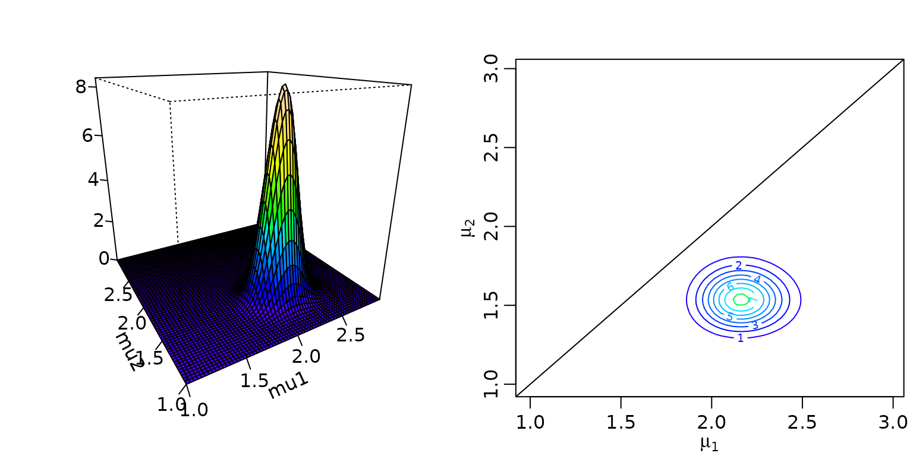
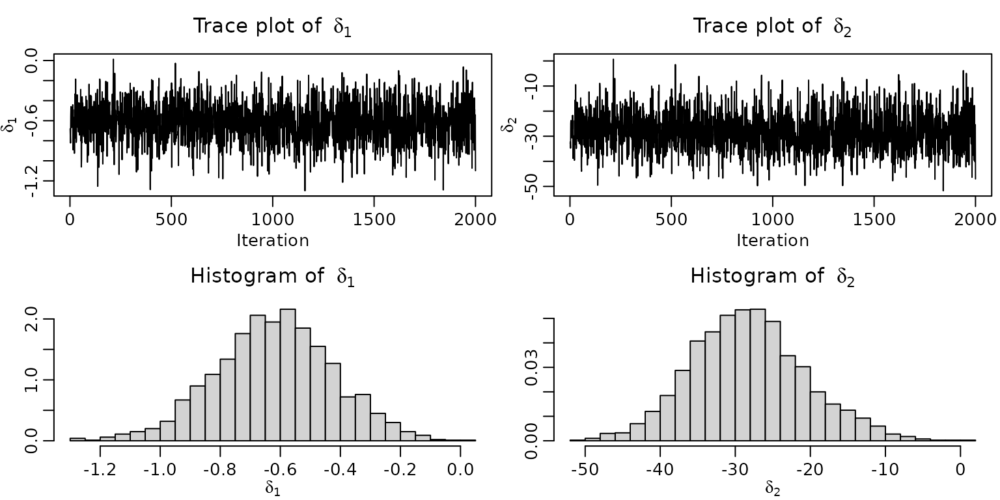

# Chapter 2: A First Bayesian Analysis of Count Data

## Section 2.1

### Example 2.2: Road Safety Data

Let us first take a look at the data.

``` r
data("accidents", package = "BayesianLearningCode")
summary(accidents)
#>  children_accidents children_exposure seniors_accidents seniors_exposure
#>  Min.   :0.000      Min.   :8171      Min.   : 0.00     Min.   :42854   
#>  1st Qu.:1.000      1st Qu.:8678      1st Qu.: 3.00     1st Qu.:43574   
#>  Median :2.000      Median :8900      Median : 5.00     Median :44097   
#>  Mean   :1.839      Mean   :8856      Mean   : 5.25     Mean   :43890   
#>  3rd Qu.:3.000      3rd Qu.:9103      3rd Qu.: 7.00     3rd Qu.:44264   
#>  Max.   :5.000      Max.   :9204      Max.   :15.00     Max.   :44671
plot(accidents[, c("children_accidents", "children_exposure")],
     mar = c(0, 0, 0, 0), oma = c(3, 3, 1.5, .1),
     main = "", xlab = "", ylab = "", ann = FALSE)
title("Road accidents involving pedestrian children", line = 1.7)
mtext(c("Accidents", "Exposure"), side = 2, line = 1.5, adj = c(0.77, 0.29))
mtext("Time", side = 1, line = 1.5, at = 1995.6)
```


``` r

plot(accidents[, c("seniors_accidents", "seniors_exposure")],
     mar = c(0, 0, 0, 0), oma = c(3, 3, 1.5, .1),
     main = "", xlab = "", ylab = "", ann = FALSE)
title("Road accidents involving pedestrian seniors", line = 1.7)
mtext(c("Accidents", "Exposure"), side = 2, line = 1.5, adj = c(0.77, 0.29))
mtext("Time", side = 1, line = 1.5, at = 1995.6)
```


### Example 2.3: Posterior inference for the Road Safety Data (flat prior)

The posterior under a flat prior is
$$\mu|\mathbf{y} \sim \mathcal{G}\left( N\bar{y} + 1,N \right),$$ which
we visualize for the seniors, along with the 0.025-, the 0.5-, and the
0.975-quantile.

``` r
y <- accidents[, "seniors_accidents"]
aN <- sum(y) + 1
bN <- length(y)

mu <- seq(4.5, 6, by = 0.01)
plot(mu, dgamma(mu, aN, bN), type = "l", xlab = expression(mu), ylab = "",
     main = "Posterior density and quantiles")
abline(h = 0, lty = 3)

probs <- c(0.025, .5, .975)
qs <- qgamma(probs, aN, bN)
round(qs, digits = 3)
#> [1] 4.936 5.253 5.584
ds <- dgamma(qs, aN, bN)

for (i in seq_along(probs)) {
  lines(c(qs[i], qs[i]), c(0, ds[i]), lty = 2, col = "dimgrey")
}
mtext(round(qs, 3), side = 1, at = qs, line = -1, cex = 0.8, col = "dimgrey")

plot(mu, pgamma(mu, aN, bN), type = "l", xlab = expression(mu), ylab = "",
     main = "Posterior cdf and quantiles")
abline(h = c(0, 1), lty = 3)
mtext(round(probs, 3), side = 2, at = probs, adj = c(0, .5, 1), cex = .8, col = "dimgrey")
mtext(round(qs, 3), side = 1, at = qs, line = -1, cex = 0.8, col = "dimgrey")

for (i in seq_along(probs)) {
  lines(c(.9 * min(mu), qs[i]), c(probs[i], probs[i]), lty = 2, col = "dimgrey")
  lines(c(qs[i], qs[i]), c(probs[i], 0), lty = 2, col = "dimgrey")
}
```


### Example 2.4: Posterior inference for the Road Safety Data (gamma prior)

We choose several values for $m_{0}$ and $a_{0}$. Note that, formally,
choosing $m_{0} = \infty$ and $a_{0} = 1$ gives the improper prior from
above.

``` r
m0 <- c(Inf, mean(y), mean(y), mean(y), 0.5, 3, 10)
a0 <- c(1, 0.5, 2, 10, 3, 3, 3)
plot(mu, dgamma(mu, a0[1] + sum(y), a0[1]/m0[1] + length(y)), type = "l",
     xlab = expression(mu), ylab = "", main = "Posterior density")
for (i in 2:4) {
  lines(mu, dgamma(mu, a0[i] + sum(y), a0[i]/m0[i] + length(y)),
        col = i, lty = i)
}
legend("topright", legend = c(paste0("a0 = ", a0[2:4]), "improper"),
       col = c(2:4, 1), lty = c(2:4, 1))

plot(mu, dgamma(mu, a0[1] + sum(y), a0[1]/m0[1] + length(y)), type = "l",
     xlab = expression(mu), ylab = "", main = "Posterior density")
for (i in 5:7) {
  lines(mu, dgamma(mu, a0[i] + sum(y), a0[i]/m0[i] + length(y)),
        col = i - 3, lty = i - 3)
}
legend("topright", legend = c(paste0("m0 = ", m0[5:7]), "improper"),
       col = c(5:7 - 3, 1), lty = c(5:7 - 3, 1))
```


``` r
b0 <- a0 / m0
aN <- a0 + sum(y)
bN <- b0 + length(y)
res <- cbind(a0 = a0, b0 = b0, m0 = m0,
             postmean = aN / bN,
             postSD = sqrt(aN / bN^2),
             leftpostquant = qgamma(0.025, aN, bN),
             rightpostquant = qgamma(0.975, aN, bN))
knitr::kable(round(res, 3))
```

|   a0 |    b0 |    m0 | postmean | postSD | leftpostquant | rightpostquant |
|-----:|------:|------:|---------:|-------:|--------------:|---------------:|
|  1.0 | 0.000 |   Inf |    5.255 |  0.165 |         4.936 |          5.584 |
|  0.5 | 0.095 |  5.25 |    5.250 |  0.165 |         4.931 |          5.579 |
|  2.0 | 0.381 |  5.25 |    5.250 |  0.165 |         4.931 |          5.579 |
| 10.0 | 1.905 |  5.25 |    5.250 |  0.165 |         4.932 |          5.577 |
|  3.0 | 6.000 |  0.50 |    5.106 |  0.161 |         4.796 |          5.426 |
|  3.0 | 1.000 |  3.00 |    5.238 |  0.165 |         4.920 |          5.566 |
|  3.0 | 0.300 | 10.00 |    5.257 |  0.165 |         4.938 |          5.586 |

## Section 2.2

### Example 2.8: Including exposures for the Road Safety Data

We now include the exposure at time $i$, $e_{i}$, to estimate the
monthly risk $\lambda$ of children to be killed or seriously injured via
the following likelihood assumption:

$$y_{i} \sim \mathcal{P}\left( \lambda e_{i} \right),\quad i = 1,\ldots,N.$$
Note that we still assume that the data is independently (but not
identically!) distributed. We proceed by computing and visualizing the
posterior for different prior hyperparameter choices.

``` r
y <- accidents[, "children_accidents"]
exp <- accidents[, "children_exposure"]
lambdahat <- mean(y)/mean(exp)
a0 <- c(1, 0.5, 1, 2)
b0 <- c(0, a0[-1]/lambdahat)
aN <- a0 + sum(y)
bN <- b0 + sum(exp)

lambda <- seq(0.00016, 0.00026, by = .000001)
plot(lambda, dgamma(lambda, aN[1], bN[1]), type = "l",
     xlab = expression(lambda), ylab = "",
     main = "Posterior densities for various priors")
for (i in 2:length(aN)) lines(lambda, dgamma(lambda, aN[i], bN[i]), lty = i, col = i)

hyperparams <- paste0("a0 = ", formatC(a0, 1, format = "f"),
                      ", ", "b0 = ", round(b0))

legend("topright", hyperparams, lty = 1:4, col = 1:4)
```


For all our data-driven priors, we get the same posterior mean. The
credible intervals differ slightly.

``` r
postmean <- aN/bN
leftpostquant <- qgamma(.025, aN, bN)
rightpostquant <- qgamma(.975, aN, bN)
res <- cbind(leftpostquant, postmean, rightpostquant)
rownames(res) <- hyperparams
res
#>                     leftpostquant     postmean rightpostquant
#> a0 = 1.0, b0 = 0     0.0001870605 0.0002081851   0.0002304234
#> a0 = 0.5, b0 = 2409  0.0001865176 0.0002075970   0.0002297886
#> a0 = 1.0, b0 = 4817  0.0001865321 0.0002075970   0.0002297725
#> a0 = 2.0, b0 = 9634  0.0001865610 0.0002075970   0.0002297405
```

### Example 2.9: Including a structural break for the Road Safety Data

We now continue with a Poisson model with a (known) structural break at
$i = 94$ (that is, in October 1994). Because the data is stored as a
time series (ts) object, we can use the window function to conveniently
extract the two time frames.

``` r
accidents1 <- window(accidents, end = c(1994, 9))
accidents2 <- window(accidents, start = c(1994, 10))

a01 <- a02 <- 1
b01 <- b02 <- 0

aN1 <- a01 + sum(accidents1[, "children_accidents"])
aN2 <- a02 + sum(accidents2[, "children_accidents"])
bN1 <- b01 + length(accidents1[, "children_accidents"])
bN2 <- b02 + length(accidents2[, "children_accidents"])

post <- function(x1, x2, aN1, aN2, bN1, bN2) {
  dgamma(x1, aN1, bN1) * dgamma(x2, aN2, bN2)
}

mu1 <- seq(1, 3, by = 0.03)
mu2 <- mu1
z <- outer(mu1, mu2, post, aN1 = aN1, aN2 = aN2, bN1 = bN1, bN2 = bN2)

nrz <- nrow(z)
ncz <- ncol(z)

# Generate the desired number of colors from this palette
nbcol <- 20
color <- topo.colors(nbcol)

# Compute the z-value at the facet centres

zfacet <- z[-1, -1] + z[-1, -ncz] + z[-nrz, -1] + z[-nrz, -ncz]
# Recode facet z-values into color indices
facetcol <- cut(zfacet, nbcol)

persp(mu1, mu2, z, col = color[facetcol], ticktype = "detailed", zlab = "",
      xlab = "mu1", ylab = "mu2",
      phi = 20, theta = -30)

contour(mu1, mu2, z, col = color, xlab = bquote(mu[1]), ylab = bquote(mu[2]))
abline(0,1)
```



### Example 2.10: Obtaining posterior draws for the Road Safety Data

We now proceed with simple Monte Carlo approximation of (nonlinear)
functionals of the posterior.

``` r
set.seed(1)

nsamp <- 2000
mu1 <- rgamma(nsamp, aN1, bN1)
mu2 <- rgamma(nsamp, aN2, bN2)
delta1 <- mu2 - mu1
delta2 <- 100 * (mu2 - mu1) / mu1


ts.plot(delta1, main = bquote("Trace plot of " ~ delta[1]),
        ylab = expression(delta[1]), xlab = "Iteration")
ts.plot(delta2, main = bquote("Trace plot of " ~ delta[2]),
        ylab = expression(delta[2]), xlab = "Iteration")
hist(delta1, breaks = 20, prob = TRUE, xlab = expression(delta[1]), ylab = "",
     main = bquote("Histogram of " ~ delta[1]))
hist(delta2, breaks = 20, prob = TRUE, xlab = expression(delta[2]), ylab = "",
     main = bquote("Histogram of " ~ delta[2]))
```


