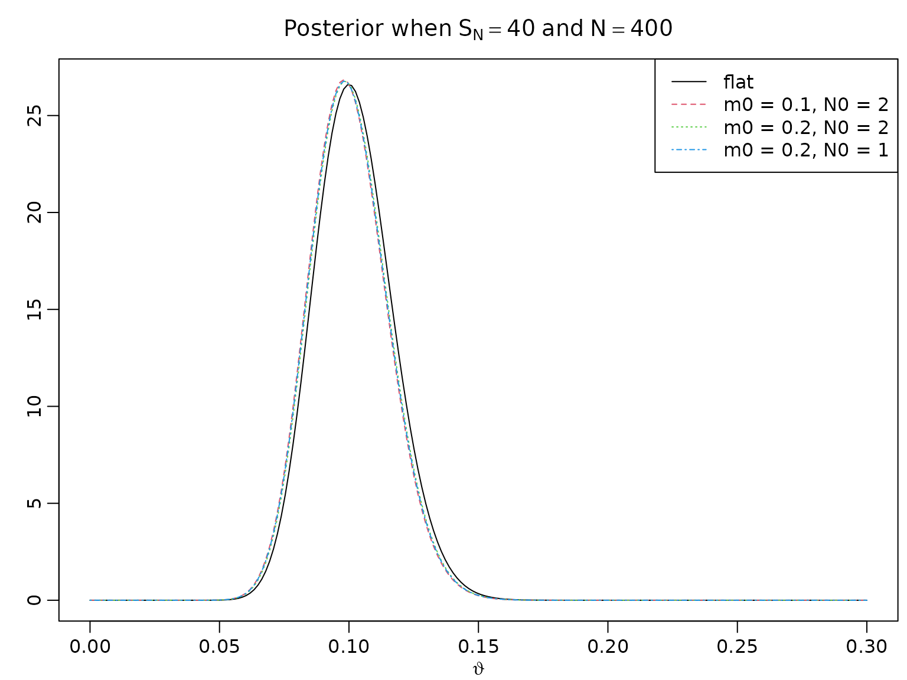
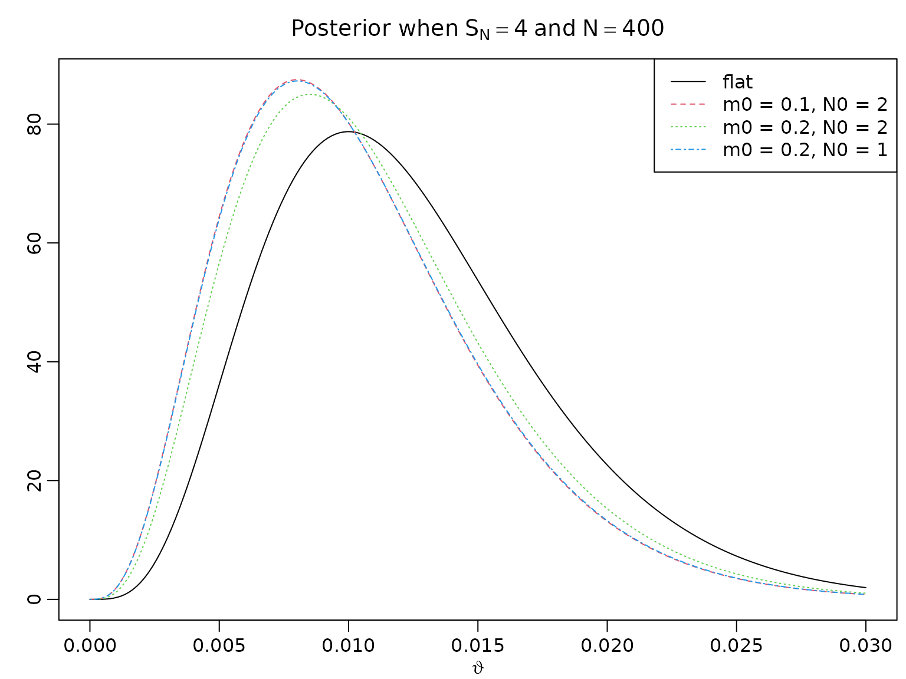
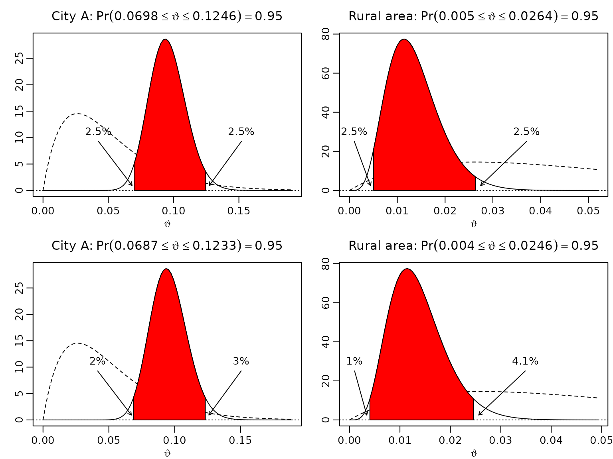
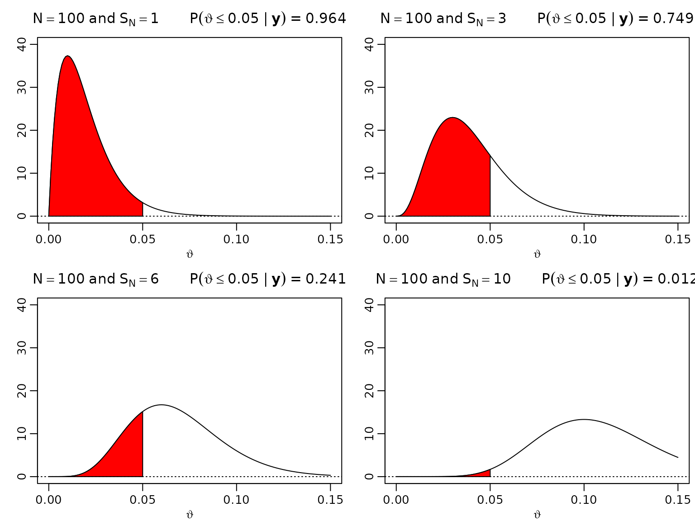
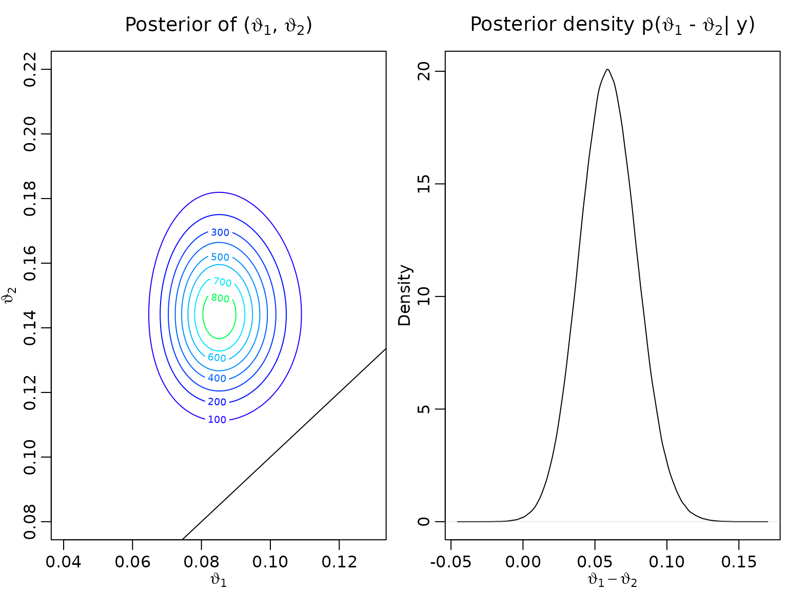
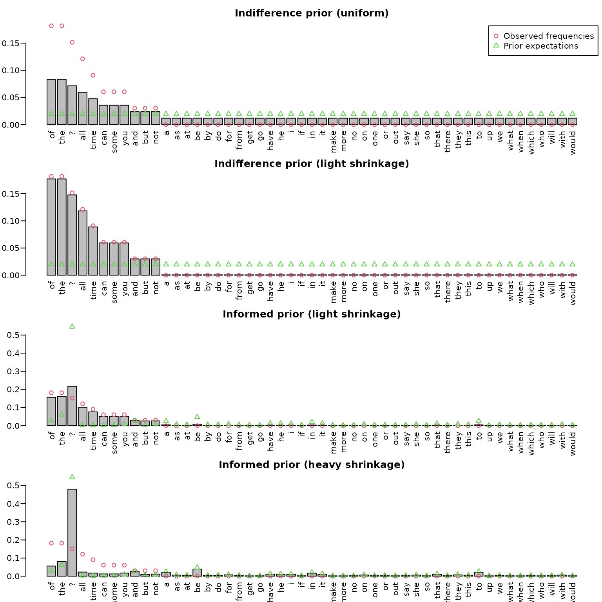

# Chapter 3: A First Bayesian Analysis of Unknown Probabilities

## Section 3.1: Data arising from a homogeneous population: The beta-binomial model

### Figure 3.1: Posteriors under the beta-binomial model

To reproduce the posteriors in this figure, we simply need to plug in
the respective counts into the expression for the posterior density and
visualize it accordingly.

``` r
trueprop <- c(0, .1, .5)
N <- c(100, 400)
theta <- seq(0, 1, .001)

for (p in trueprop) {
  for (n in N) {
    aN <- n * p + 1
    bN <- n - n * p + 1
    plot(theta, dbeta(theta, aN, bN), type = "l", xlab = expression(vartheta),
         ylab = "", main = bquote(N == .(n) ~ "and" ~ S[N] == .(n * p)))
  }
}
```


### Calibrating the Beta prior

Let $m_{0} = \frac{a_{0}}{a_{0} + b_{0}}$ denote the prior mean and
$N_{0} = a_{0} + b_{0}$ the strength of the prior information.

``` r
m0 <- c(.5, .1, .2, .2)
N0 <- c(2, 2, 2, 1)
a <- N0 * m0
b <- N0 * (1 - m0)
N <- 400
SN <- c(40, 4)

for (i in seq_along(SN)) {
  aN <- SN[i] + a
  bN <- N - SN[i] + b
  theta <- seq(0, 3 * SN[i] / N, length.out = 200)
  plot(theta, dbeta(theta, aN[1], bN[1]), type = "l", ylab = "",
       xlab = expression(vartheta), ylim = range(dbeta(theta, aN, bN)),
       main = bquote("Posterior when" ~ S[N] == .(SN[i]) ~ "and" ~ N == .(N)))
  for (j in 2:4) {
    lines(theta, dbeta(theta, aN[j], bN[j]), col = j, lty = j)
  }
  legend("topright", c("flat", paste(paste0("m0 = ", m0[2:4]),
                                     paste0(" N0 = ", N0[2:4]), sep = ",")),
         lty = 1:4, col = 1:4)
}
```



### Example 3.1 / Figure 3.2: Uncertainty quantification for market shares

In city A, 40 out of 400 questioned people would purchase a certain
product, in a rural community, only 4 out of 400. Assuming a uniform
prior, we now compute equal-tailed intervals and highest posterior
density (HPD) intervals. Note that R is (generally) vectorized, so we
can compute the equal-tailed intervals without using a loop.

``` r
m0 <- 0.05
N0 <- 40
a <- N0 * m0
b <- N0 * (1 - m0)
N <- 400
SN <- c("City A" = 40, "Rural area" = 4)
aN <- SN + a
bN <- N - SN + b

gamma <- .95
alpha <- 1 - gamma

# Equal-tailed credible intervals
leftET <- qbeta(alpha/2, aN, bN)
rightET <- qbeta(1 - alpha/2, aN, bN)

# HPD intervals
resolution <- 10000
grid <- seq(0, 1, length.out = resolution + 1)
dist <- gamma * resolution

leftHPD <- rightHPD <- rep(NA_real_, length(aN))
for (i in seq_along(aN)) {
  qs <- qbeta(grid, aN[i], bN[i])
  minimizer <- which.min(diff(qs, lag = dist))
  leftHPD[i] <- qs[minimizer]
  rightHPD[i] <- qs[minimizer + dist]
}
```

Now we visualize our findings.

``` r
left <- cbind(leftET, leftHPD)
right <- cbind(rightET, rightHPD)

for (i in seq_along(aN)) {
  for (j in seq_len(ncol(left))) {
    len <- right[i,j] - left[i,j]
    theta <- seq(0, right[i,j] + 1.2 * len, length.out = 100)
  
    plot(theta, dbeta(theta, aN[i], bN[i]), type = "l",
         xlab = expression(vartheta), ylab = "",
         main = bquote(.(names(aN[i])) * ":" ~ Pr(.(round(left[i,j], 4)) <=
                       {vartheta <= .(round(right[i,j], 4))}) == .(gamma)))
    lines(theta, dbeta(theta, a, b), lty = 2)
    abline(h = 0, lty = 3)
  
    polygon(c(left[i,j], left[i,j],
              theta[theta > left[i,j] & theta < right[i,j]],
              right[i,j], right[i,j]),
            c(0, dbeta(left[i,j], aN[i], bN[i]),
              dbeta(theta[theta >= left[i,j] & theta <= right[i,j]], aN[i], bN[i]),
              dbeta(right[i,j], aN[i], bN[i]), 0),
          col = "red")
    arrows(x0 <- max(left[i,j] - .5 * len, 0.001),
           y0 <- .3 * diff(par("usr")[3:4]),
           x1 <- left[i,j] - .03 * len,
           y1 <- .03 * diff(par("usr")[3:4]),
           length = .05)
    text(x0, y0, paste0(round(100 * pbeta(left[i,j], aN[i], bN[i]), 1), "%"),
         pos = 3)
    
    arrows(x0 <- right[i,j] + .5 * len,
           y0 <- .3 * diff(par("usr")[3:4]),
           x1 <- right[i,j] + .05 * len,
           y1 <- .03 * diff(par("usr")[3:4]),
           length = .05)
    text(x0, y0, paste0(round(100 * (1 - pbeta(right[i,j], aN[i], bN[i])), 1), "%"),
         pos = 3)
  }
}
```



### Example 3.2 / Table 3.1: Posterior credible intervals under the beta-binomial model

We now proceed to computing credible intervals for the synthetic
example.

``` r
Ns <- rep(N, each = length(trueprop))
SNs <- Ns * rep(trueprop, length(N))

aN <- SNs + 1    
bN <- Ns - SNs + 1
    
# Equal-tails credible intervals
leftET <- qbeta(alpha/2, aN, bN)
rightET <- qbeta(1 - alpha/2, aN, bN)

# HPD intervals
resolution <- 10000
grid <- seq(0, 1, length.out = resolution + 1)
dist <- gamma * resolution

leftHPD <- rightHPD <- rep(NA_real_, length(aN))
for (i in seq_along(aN)) {
  qs <- qbeta(grid, aN[i], bN[i])
  minimizer <- which.min(diff(qs, lag = dist))
  leftHPD[i] <- qs[minimizer]
  rightHPD[i] <- qs[minimizer + dist]
}

res <- cbind(leftET, rightET, leftHPD, rightHPD)
```

All the desired intervals are now stored and can be displayed.

``` r
knitr::kable(round(res, 4))
```

| leftET | rightET | leftHPD | rightHPD |
|-------:|--------:|--------:|---------:|
| 0.0001 |  0.0092 |  0.0000 |   0.0074 |
| 0.0744 |  0.1334 |  0.0732 |   0.1319 |
| 0.4512 |  0.5488 |  0.4512 |   0.5488 |

We can also compare their lengths.

``` r
res <- cbind(lengthET = rightET - leftET, lengthHPD = rightHPD - leftHPD)
knitr::kable(round(res, 4))
```

| lengthET | lengthHPD |
|---------:|----------:|
|   0.0091 |    0.0074 |
|   0.0590 |    0.0587 |
|   0.0976 |    0.0976 |

### Figure 3.3: One-sided hypothesis testing

We now move forward to assessing visualizing the posterior probability
of $\vartheta$ (the proportion of defective items) being less than
$1/20 = 0.05$ for $N = 100$ and $S_{N} \in \{ 1,3,6,10\}$.

``` r
theta <- seq(0, .15, .001)
N <- 100
SN <- c(1, 3, 6, 10)
aN <- SN + 1
bN <- N - SN + 1
for (i in seq_along(SN)) {
  plot(theta, dbeta(theta, aN[i], bN[i]), type = "l", ylim = c(0, 40),
       xlab = expression(vartheta), ylab = "",
       main = bquote(N == 100 ~ "and" ~ S[N] == .(SN[i]) ~ "     " ~
                       P(vartheta <= 0.05 ~ "|" ~ bold(y)) ~ "=" ~
                       .(round(pbeta(0.05, aN[i], bN[i]), 3))))
  abline(h = 0, lty = 3)
  polygon(c(theta[theta <= 0.05], 0.05),
          c(dbeta(theta[theta <= 0.05], aN[i], bN[i]), 0), col = "red")
}
```



### Example 3.4: Labor market data

We load the dataset from the package and extract the data needed for the
anlaysis:

``` r
data("labor", package = "BayesianLearningCode")
labor <- subset(labor,
                income_1997 != "zero" & female,
                c(income_1998, wcollar_1986))
labor <- with(labor,
              data.frame(unemployed = income_1998 == "zero",
                         wcollar = wcollar_1986))
```

Cross-tabuling being unemployed (i.e., having no income) and being a
white collar work gives:

``` r
table(labor)
#>           wcollar
#> unemployed FALSE TRUE
#>      FALSE   368  634
#>      TRUE     62   59
```

We estimate the risk for a woman who had a positive income, to have no
income in the next year and assume that this risk is different for
white- and blue-collar workers.

The four relevant data summaries are given by:

``` r
(N1 <- with(labor, sum(wcollar)))
#> [1] 693
(S_N1 <- with(labor, sum(wcollar & unemployed)))
#> [1] 59
(N2 <- with(labor, sum(!wcollar)))
#> [1] 430
(S_N2 <- with(labor, sum(!wcollar & unemployed)))
#> [1] 62
```

Under a uniform prior, the parameters of the posterior distribution are
given by:

``` r
aN1 <- 1 + S_N1
bN1 <- 1 + N1 - S_N1
aN2 <- 1 + S_N2
bN2 <- 1 + N2 - S_N2
```

The posterior expectations are given by

``` r
aN1 / (aN1 + bN1)
#> [1] 0.08633094
aN2 / (aN2 + bN2)
#> [1] 0.1458333
```

We visualize the joint posterior of
$\left( \vartheta_{1},\vartheta_{2} \right)$ using a contour plot as
well as a density estimate of the difference
$\vartheta_{1} - \vartheta_{2}$.

``` r
if (pdfplots) {
  pdf("3-2_1.pdf", width = 8, height = 5)
  par(mgp = c(1, .5, 0), mar = c(2.2, 1.5, 2, .2), lwd = 2)
}
par(mfrow = c(1, 2))
post <- function(x1, x2, aN1, aN2, bN1, bN2) {
  dbeta(x1, aN1, bN1) * dbeta(x2, aN2, bN2)
}

vartheta1 <- seq(0.04, 0.13, length.out = 100)
vartheta2 <- seq(0.08, 0.22, length.out = 100)
z <- outer(vartheta1, vartheta2, post, aN1 = aN1, aN2 = aN2, bN1 = bN1, bN2 = bN2)

nrz <- nrow(z)
ncz <- ncol(z)

# Generate the desired number of colors from this palette
nbcol <- 20
color <- topo.colors(nbcol)

# Compute the z-value at the facet centres

zfacet <- z[-1, -1] + z[-1, -ncz] + z[-nrz, -1] + z[-nrz, -ncz]
# Recode facet z-values into color indices
facetcol <- cut(zfacet, nbcol)

contour(vartheta1, vartheta2, z, col = color,
        xlab = bquote(vartheta[1]), ylab = bquote(vartheta[2]),
        main = expression(paste("Posterior of (", vartheta[1],
                                ", ", vartheta[2], ")")))
abline(0,1)
postdraws <- data.frame(vartheta1 = rbeta(10^6, aN1, bN1),
                        vartheta2 = rbeta(10^6, aN2, bN2))
postdraws$diff <- with(postdraws, vartheta2 - vartheta1)
plot(density(postdraws$diff),
     xlab = bquote(vartheta[1] - vartheta[2]),
     main = expression(paste("Posterior density p(", vartheta[1],
                                " - ", vartheta[2], "| y)")))
```



``` r
if (pdfplots) {
  pdf("3-2_1.pdf", width = 8, height = 5)
  par(mgp = c(1, .5, 0), mar = c(2.2, 1.5, 2, .2), lwd = 2)
}
par(mfrow = c(1, 3))
labels <- c(bquote(vartheta[1]),
            bquote(vartheta[2]),
            bquote(vartheta[2] - vartheta[1]))
for (i in 1:3) {
    plot(postdraws[1:1000, i], type = "l", ylim = c(0, 0.25),
         xlab = "draw", ylab = labels[i])
}
```


### Example 3.5: Bag of words

#### Preparing the data

After reading in the quote, we do some simple manipulation such as
converting to lower case, getting rid of newlines, and splitting the
string into individual words. Finally, we remove potential empty words
and display the resulting frequencies.

``` r
string <- "You can fool some of the people all of the time,
and all of the people some of the time,
but you can not fool all of the people all of the time."

tmp <- tolower(string)                  ## convert to lower case
tmp <- gsub("\n", " ", tmp)             ## replace newlines with spaces
tmp <- unlist(strsplit(tmp, " |,|\\.")) ## split at spaces, commas, or stops
dat <- tmp[tmp != ""]                   ## remove empty words
tab <- table(dat)
knitr::kable(t(tab))
```

| all | and | but | can | fool | not |  of | people | some | the | time | you |
|----:|----:|----:|----:|-----:|----:|----:|-------:|-----:|----:|-----:|----:|
|   4 |   1 |   1 |   2 |    2 |   1 |   6 |      3 |    2 |   6 |    3 |   2 |

To define our universe of possible words, we first look at the *words*
dataset (shipped with this package). It contains 1000 most common
English words, alongside their frequency of usage among a total of 100
million occurrences
(cf. <https://www.eapfoundation.com/vocab/general/bnccoca/>).

``` r
data("words", package = "BayesianLearningCode")
head(words)
#>       word frequency
#> 1        a   2525253
#> 2     able     47760
#> 3    about    192168
#> 4    above     25370
#> 5 absolute      9284
#> 6   accept     29026
```

For illustration purposes, we only use the top 50 words and augment
those with a question mark for all other words. This leaves us with 51
possible outcomes (our *universe*).

``` r
top50 <- tail(words[order(words$frequency),], 50)
universe <- c("?", sort(top50$word))
freq <- c(10^8 - sum(top50$frequency), top50$frequency[order(top50$word)])
universe
#>  [1] "?"     "a"     "all"   "and"   "as"    "at"    "be"    "but"   "by"   
#> [10] "can"   "do"    "for"   "from"  "get"   "go"    "have"  "he"    "i"    
#> [19] "if"    "in"    "it"    "make"  "more"  "no"    "not"   "of"    "on"   
#> [28] "one"   "or"    "out"   "say"   "she"   "so"    "some"  "that"  "the"  
#> [37] "there" "they"  "this"  "time"  "to"    "up"    "we"    "what"  "when" 
#> [46] "which" "who"   "will"  "with"  "would" "you"
```

Now, we check if there are any words in our data set which are not
included in our universe (here, only *fool* and *people*) and replace
these with a question mark.

``` r
dat[!(dat %in% universe)] <- "?"
knitr::kable(t(table(dat)))
```

|   ? | all | and | but | can | not |  of | some | the | time | you |
|----:|----:|----:|----:|----:|----:|----:|-----:|----:|-----:|----:|
|   5 |   4 |   1 |   1 |   2 |   1 |   6 |    2 |   6 |    3 |   2 |

#### Computing the posterior under the uniform prior

Under a uniform prior (i.e., all 51 elements of our universe receive one
pseudo-count), the posterior mean for each word occurrence probability
is given by
$$E\left( \eta_{k}|\mathbf{y} \right) = \frac{1 + N_{k}}{51 + N},\quad k = 1,\ldots,51,$$
where $N_{k}$ stands for the number of data occurrences of the $k$th
word in the universe, and $N$ is the sum of all $N_{k}$s. This can be
very easily implemented by merging the universe and the data, and simply
counting the resulting frequencies.

``` r
merged <- c(universe, dat)
counts <- table(merged) - 1L
post_uniform_unnormalized <- 1 + counts
post_uniform <- post_uniform_unnormalized / sum(post_uniform_unnormalized)
```

#### Computing the posterior under a less informative indifference prior

Note that the above strategy implicitly assumes that we have exactly 51
pseudo-observations. To render the prior less influential, we can
rescale it to, e.g., 1 pseudo-observation. Then, the posterior
expectation is
$$E\left( \eta_{k}|\mathbf{y} \right) = \frac{1/51 + N_{k}}{1 + N},\quad k = 1,\ldots,51.$$
To compute this expectation we simply add counts and the new
pseudo-counts
$\gamma_{0,1}, = \gamma_{0,2} = \ldots = \gamma_{0,K} = 1/K$.

``` r
K <- length(universe)
N0 <- 1
gamma0 <- rep(N0 / K, length(universe))
post_lessinformative_unnormalized <-  gamma0 + counts
post_lessinformative <-
  post_lessinformative_unnormalized / sum(post_lessinformative_unnormalized)
```

Alternatively, we could use a loop.

``` r
post_lessinformative_unnormalized2 <- rep(NA_real_, length(universe))
for (i in seq_along(universe)) {
  Nk <- sum(dat == universe[i])
  post_lessinformative_unnormalized2[i] <- gamma0[i] + Nk
}
post_lessinformative2 <-
  post_lessinformative_unnormalized2 / sum(post_lessinformative_unnormalized2)
```

The results must be numerically equivalent, and we can verify this
easily.

``` r
all(abs(post_lessinformative - post_lessinformative2) < 1e-10)
#> [1] TRUE
```

Summing up what we have so far.

``` r
dirichlet_sd <- function(gamma) {
  mean <- gamma / sum(gamma)
  sd <- sqrt((mean * (1 - mean)) / (sum(gamma) + 1))
  sd
}

resfull <- cbind(prior_mean = rep(1/K, K),
                 prior_sd_uniform = dirichlet_sd(rep(1, K)),
                 prior_sd_lessinformative = dirichlet_sd(rep(1/K, K)),
                 rel_freq = counts / sum(counts),
                 posterior_mean_uniform = post_uniform,
                 posterior_sd_uniform = dirichlet_sd(post_uniform),
                 posterior_mean_lessinformative = post_lessinformative,
                 posterior_sd_lessinformative = dirichlet_sd(post_lessinformative))

unseen <- counts == 0L
res <- rbind(resfull[!unseen,], UNSEEN = resfull[which(unseen)[1],])
knitr::kable(t(round(res, 4)))
```

|                                |      ? |    all |    and |    but |    can |    not |     of |   some |    the |   time |    you | UNSEEN |
|:-------------------------------|-------:|-------:|-------:|-------:|-------:|-------:|-------:|-------:|-------:|-------:|-------:|-------:|
| prior_mean                     | 0.0196 | 0.0196 | 0.0196 | 0.0196 | 0.0196 | 0.0196 | 0.0196 | 0.0196 | 0.0196 | 0.0196 | 0.0196 | 0.0196 |
| prior_sd_uniform               | 0.0192 | 0.0192 | 0.0192 | 0.0192 | 0.0192 | 0.0192 | 0.0192 | 0.0192 | 0.0192 | 0.0192 | 0.0192 | 0.0192 |
| prior_sd_lessinformative       | 0.0980 | 0.0980 | 0.0980 | 0.0980 | 0.0980 | 0.0980 | 0.0980 | 0.0980 | 0.0980 | 0.0980 | 0.0980 | 0.0980 |
| rel_freq                       | 0.1515 | 0.1212 | 0.0303 | 0.0303 | 0.0606 | 0.0303 | 0.1818 | 0.0606 | 0.1818 | 0.0909 | 0.0606 | 0.0000 |
| posterior_mean_uniform         | 0.0714 | 0.0595 | 0.0238 | 0.0238 | 0.0357 | 0.0238 | 0.0833 | 0.0357 | 0.0833 | 0.0476 | 0.0357 | 0.0119 |
| posterior_sd_uniform           | 0.1821 | 0.1673 | 0.1078 | 0.1078 | 0.1312 | 0.1078 | 0.1954 | 0.1312 | 0.1954 | 0.1506 | 0.1312 | 0.0767 |
| posterior_mean_lessinformative | 0.1476 | 0.1182 | 0.0300 | 0.0300 | 0.0594 | 0.0300 | 0.1770 | 0.0594 | 0.1770 | 0.0888 | 0.0594 | 0.0006 |
| posterior_sd_lessinformative   | 0.2508 | 0.2283 | 0.1206 | 0.1206 | 0.1671 | 0.1206 | 0.2699 | 0.1671 | 0.2699 | 0.2012 | 0.1671 | 0.0170 |

#### Computing the posterior under an informed prior

One might consider using yet another prior (which we label *informed*).
For instance, we might want to fix the total number of pseudo-counts
$N_{0}$ to, say, one fifth of the number of observations $N$ (this
implies a data to prior ratio of 5 to 1). Each word in the universe is
then weighted according to its frequency of appearance in the English
language. Remember that the prior probability for a word outside of the
top 50 English words is $10^{8}$ (the total number of words in the
corpus) minus the sum of the top 50 counts. To compute the posterior, we
can again add the actual counts and the new pseudo-counts.

``` r
N <- length(dat)
N0 <- N/5
gamma0 <- N0 * freq / 10^8

post_informed_unnormalized <- gamma0 + counts
post_informed <- post_informed_unnormalized / sum(post_informed_unnormalized)
```

Alternatively, we might want to prefer heavier shrinkage with respect to
the base rate (here, the overall word distribution in the English
language). This can simply be accomplished by increasing the total
number of pseudo-counts $N_{0}$.

``` r
N0 <- 5*N
gamma0 <- N0 * freq / 10^8

post_informed_unnormalized2 <- counts + gamma0
post_informed2 <- post_informed_unnormalized2 / sum(post_informed_unnormalized2)
```

#### Visualizing the results

To display the results, we use bar plots. We also add the prior
probabilities of each word via green triangles and the observed relative
frequencies via red circles. Sorting is done via frequency counts.

``` r
ord <- order(counts, decreasing = TRUE)
midpts <- barplot(post_uniform[ord], las = 2,
                  ylim = c(0, max(counts/N, post_uniform)))
points(midpts, counts[ord]/N, col = 2, pch = 1)
points(midpts, rep(1/51, length(midpts)), col = 3, pch = 2)
title("Indifference prior (uniform)")
legend("topright", c("Observed frequencies", "Prior expectations"),
       col = 2:3, pch = 1:2)

midpts <- barplot(post_lessinformative[ord], las = 2,
                  ylim = c(0, max(counts/N, post_lessinformative)))
points(midpts, counts[ord]/N, col = 2, pch = 1)
points(midpts, rep(1/51, length(midpts)), col = 3, pch = 2)
title("Indifference prior (light shrinkage)")

midpts <- barplot(post_informed[ord], las = 2,
                   ylim = c(0, max(counts/N, post_informed, freq/10^8)))
points(midpts, counts[ord]/N, col = 2, pch = 1)
points(midpts, freq[ord] / 10^8, col = 3, pch = 2)
title("Informed prior (light shrinkage)")

midpts <- barplot(post_informed2[ord], las = 2,
                   ylim = c(0, max(counts/N, post_informed2, freq/10^8)))
points(midpts, counts[ord]/N, col = 2, pch = 1)
points(midpts, freq[ord] /10^8, col = 3, pch = 2)
title("Informed prior (heavy shrinkage)")
```



In the top panel (based on the uniform prior), we can nicely see the
*add-one smoothing* effect, i.e., strong shrinkage towards the uniform
prior, whereas the second panel shows almost no smoothing/shrinkage, and
unseen words are estimated to be extremely unlikely. The two bottom
panels show the posteriors under the informed priors, one with light and
one with heavy shrinkage towards the prior.
