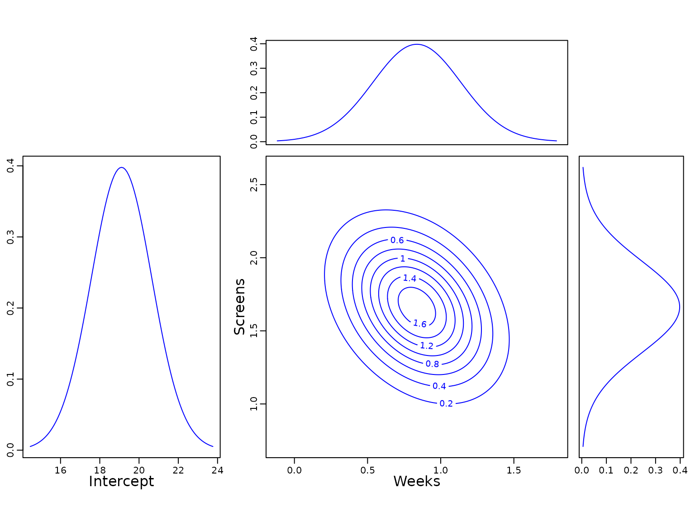
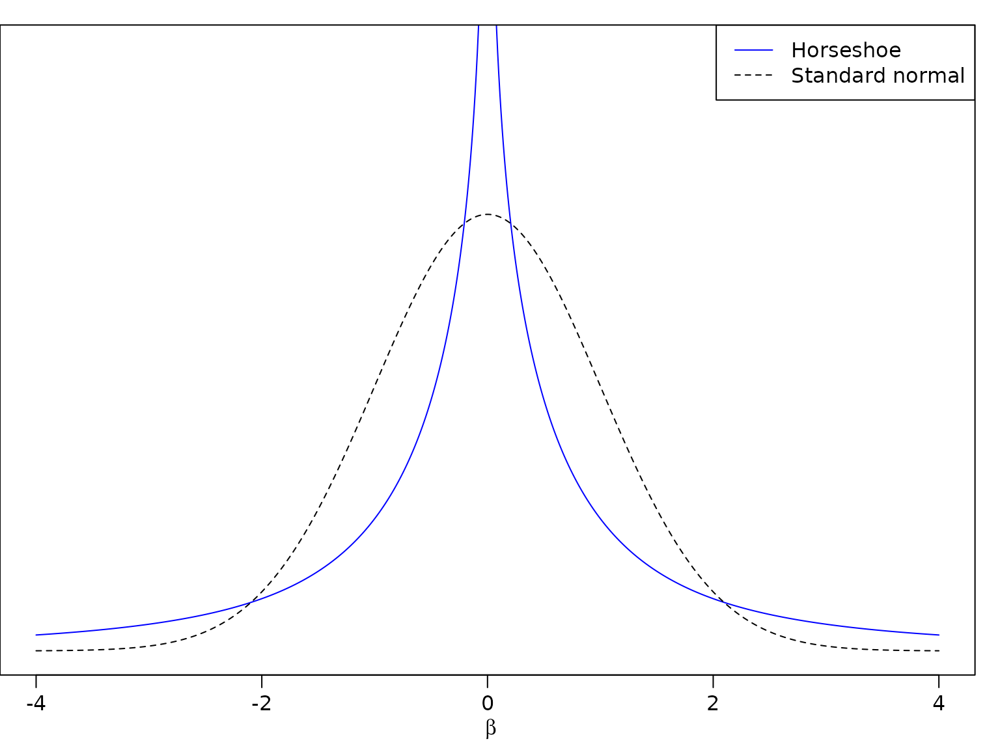
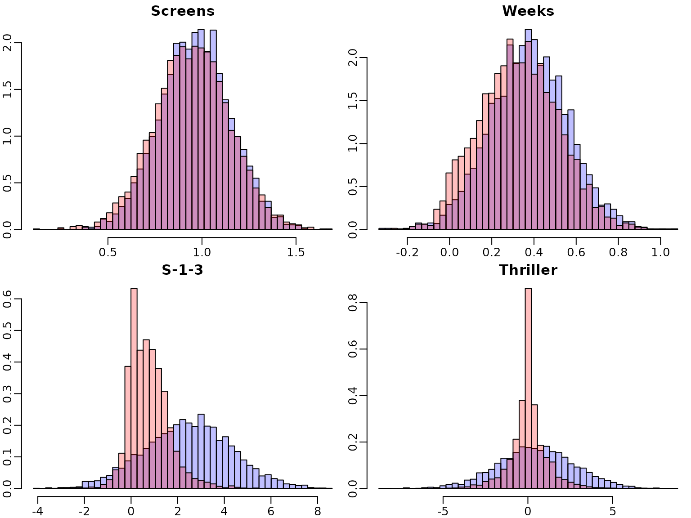
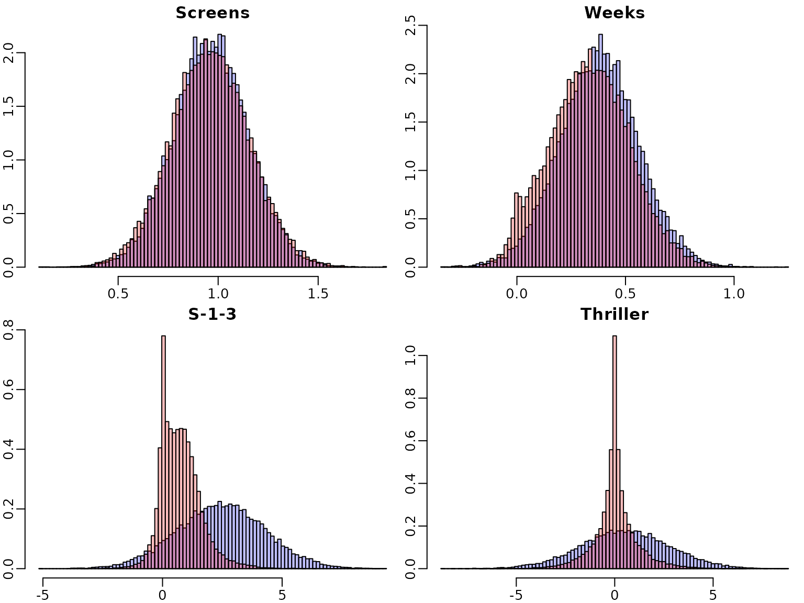
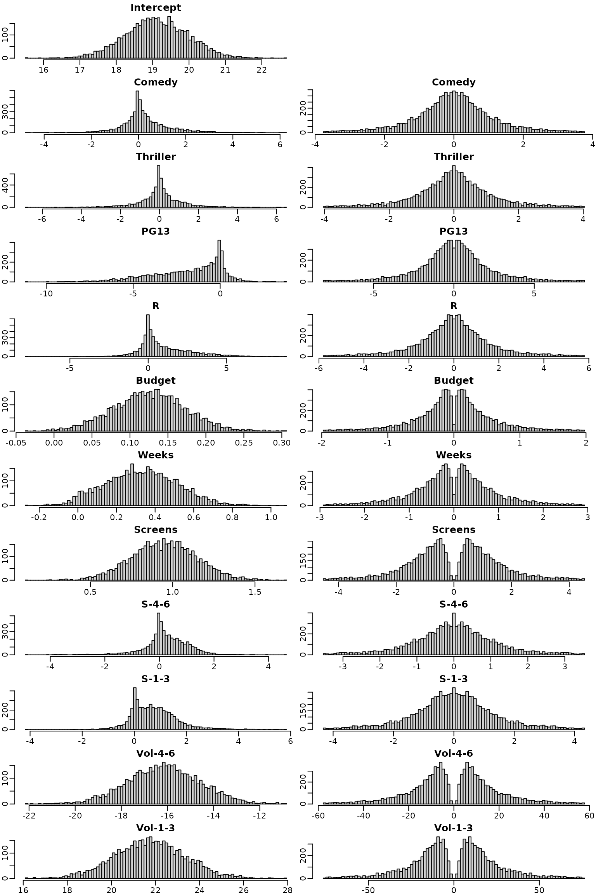

# Chapter 6: The Bayesian Approach to Standard Regression Analysis

## Section 6.2 Bayesian Learning for a Standard Linear Regression Model

#### Example 6.1: Movie data

We use movie data provided within the package to illustrate Bayesian
analysis of a regression model. The data set is a preprocessed version
of the one provided by Lehrer and Xi (2017).

``` r
library("BayesianLearningCode")
data("movies", package = "BayesianLearningCode")
```

### Section 6.2.1 Bayesian Learning Under Improper Priors

#### Example 6.2: Movie data

Next, we prepare the variables for regression analysis. We define the
response variable `OpenBoxOffice` as `y` and use as covariates effects
of the predetermined number of weeks (Weeks) and screens (Screens) the
film studio forecast six weeks prior to opening that the specific film
will be in theaters. For better interpretation we center the covariates
at their means. Hence the intercept is the sales on the opening weekend
box office for a film with a mean value weeks and screens the film is
forecasted to be in the theaters.

``` r
y <- movies[, "OpenBoxOffice"]
covs <- c("Weeks", "Screens")
covs.cen <- scale(movies[, covs], scale = FALSE) # center the covariates

N <- length(y)  # number of observations

X <- as.matrix(cbind("Intercept" = rep(1, N), covs.cen)) # regressor matrix
d <- dim(X)[2] # number regression effects
```

Next we compute the parameters of the posterior of the regression
effects under the improper prior
$p\left( \beta,\sigma^{2} \right) \propto \frac{1}{\sigma^{2}}$. The
posterior means are given together with the equal-tailed 95% credibility
interval in the following table.

``` r
BN <- solve(crossprod(X))
Xy <- crossprod(X, y)
beta.hat <- BN %*% Xy

SSR <- as.numeric(crossprod(y - X %*% beta.hat))

cN <- (N - d) / 2
CN <- SSR / 2

post.var <- (CN / cN) * BN
post.sd = sqrt(diag(post.var))

knitr::kable(round(cbind(qt(0.025,df = 2 * cN) * post.sd + beta.hat, beta.hat,
                         qt(0.975,df = 2 * cN) * post.sd + beta.hat), 3),
             col.names = c("2.5% quantile", "posterior mean", "97.5% quantile"))
```

|           | 2.5% quantile | posterior mean | 97.5% quantile |
|:----------|--------------:|---------------:|---------------:|
| Intercept |        16.029 |         19.110 |         22.191 |
| Weeks     |         0.236 |          0.837 |          1.439 |
| Screens   |         1.032 |          1.663 |          2.295 |

Next, we plot the (univariate) marginal posterior distribution of the
intercept and the univariate and bivariate marginal posterior
distribution(s) of the covariate effects.

``` r
curve(dt((x - beta.hat[1]) / post.sd[1], df = 2 * cN),
      from = beta.hat[1] - 3 * post.sd[1],
      to = beta.hat[1] + 3 * post.sd[1],
      ylab = "", xlab = "", main = "", col = "blue")
mtext("Intercept", 1, line = 1.7)

f <- function(x1, x2) {
  mvtnorm::dmvt(cbind(x1 - beta.hat[2], x2 - beta.hat[3]),
                sigma = post.var[2:3, 2:3], df = 2 * cN, log = FALSE)
}

lim <- 3 * max(post.sd[-1])
xx1 <- seq(-lim, lim, length = 201) + beta.hat[2]
xx2 <- seq(-lim, lim, length = 201) + beta.hat[3]
z <- outer(xx1, xx2, f)

par(mar = c(3, 3, 1, 1))
contour(xx1, xx2, z, col = "blue", add = FALSE)
mtext(rownames(beta.hat)[2], 1, line = 1.7)
mtext(rownames(beta.hat)[3], 2, line = 1.7)

par(mar = c(0, 3, 1, 1))
mar.x1 <- dt((xx1 - beta.hat[2]) / post.sd[2], df = 2 * cN, log = FALSE)
plot(xx1, mar.x1, col = "blue", type = "l", xaxt = "n", ylab = "")

par(mar = c(3, 0, 1, 1))
mar.x2 <- dt((xx2 - beta.hat[3]) / post.sd[3], df = 2 * cN, log = FALSE)
plot(mar.x2, xx2, col = "blue", type = "l", yaxt = "n", xlab = "")
```



For completeness we report also the posterior mean of the error variance
with the 95% credibility interval.

``` r
sigma2.hat <- CN /(cN-1)
knitr::kable(round(cbind(qinvgamma(0.025,a=cN,b=CN), sigma2.hat,
                     qinvgamma(0.975,a=cN,b=CN)),2),
             col.names = c("2.5% quantile", "posterior mean", "97.5% quantile"))
```

| 2.5% quantile | posterior mean | 97.5% quantile |
|--------------:|---------------:|---------------:|
|        172.51 |         231.21 |         309.43 |

### Section 6.2.2 Bayesian Learning under Conjugate Priors

We now consider regression analysis under a conjugate prior. For this,
we first define a function that yields the parameters of the posterior
distribution.

``` r
regression_conjugate <- function(y, X, b0 = 0, B0 = 10, c0 = 0.01, C0 = 0.01) {
  d <- ncol(X)
  if (length(b0) == 1L)
    b0 <- rep(b0, d)
  
  if (!is.matrix(B0)) {
    if (length(B0) == 1L) {
      B0 <- diag(rep(B0, d))
    } else {
      B0 <- diag(B0)
    }
  }
  
  B0.inv <- solve(B0)
  BN.inv <- B0.inv + crossprod(X)
  
  BN <- solve(BN.inv)
  bN <- BN %*% (B0.inv %*% b0 + crossprod(X, y))
  
  cN <- c0 + N / 2
  SS.eps <- as.numeric(crossprod(y) + t(b0) %*% B0.inv %*% b0 -
                         t(bN) %*% BN.inv %*% bN)
  CN <- C0 + SS.eps / 2
  list(bN = bN, BN = BN, cN = cN, CN = CN)
}
```

To perform the regression analysis under the conjugate prior, we specify
a Normal prior with mean zero and
$\mathbf{B}_{0} = \lambda^{2}\mathbf{I}$ with $\lambda^{2} = 10$ and the
an inverse Gamma prior with $c_{0} = 2.5$ and $C_{0} = 1.5$ on
$\sigma^{2}$. With this choice of the prior parameters $c0$ and $C_{0}$
the prior is rather uninformative but guarantees existence of the
posterior variance.

We report the posterior mean of the regression effects together with the
2.5% and 97.5% quantile of the posterior distribution.

``` r
res_conj1 <- regression_conjugate(y, X, b0 = 0, B0 = 10,c0=2.5,C0=1.5)
post.sd.conj1 = sqrt(diag((res_conj1$CN / res_conj1$cN) * res_conj1$BN))

knitr::kable(round(cbind(
    qt(0.025, df = 2 * res_conj1$cN) * post.sd.conj1 + res_conj1$bN,
    res_conj1$bN,
    qt(0.975, df = 2 * res_conj1$cN) * post.sd.conj1 + res_conj1$bN
  ), 3), col.names = c("2.5 quantile", "posterior mean", "97.5 quantile"))
```

|           | 2.5 quantile | posterior mean | 97.5 quantile |
|:----------|-------------:|---------------:|--------------:|
| Intercept |       16.138 |         19.090 |        22.041 |
| Weeks     |        0.260 |          0.837 |         1.414 |
| Screens   |        1.058 |          1.663 |         2.269 |

To illustrate the effects of a tighter prior on the regression effects
we compute the posterior parameters also for $\lambda^{2} = 1$ and
$\lambda^{2} = 0.1$.

``` r
res_conj2 <- regression_conjugate(y, X, b0 = 0, B0 = 1,c0=2.5,C0=1.5)
post.sd.conj2 = sqrt(diag((res_conj2$CN / res_conj2$cN) * res_conj2$BN))

res_conj3<- regression_conjugate(y, X, b0 = 0, B0 = 0.1,c0=2.5,C0=1.5)
post.sd.conj3 = sqrt(diag((res_conj3$CN / res_conj3$cN) * res_conj3$BN))
```

We plot the marginal posteriors together with those under the improper
prior.

``` r
for (i in seq_len(nrow(beta.hat))) {
  curve(dt((x - beta.hat[i]) / post.sd[i], df = 2 * cN),
    from = beta.hat[i] - 4 * post.sd[i], 
    to  =  beta.hat[i] + 4 * post.sd[i],
    ylab = "", xlab = "" , main = rownames(beta.hat)[i])
  
  curve(dt((x - res_conj1$bN[i]) / post.sd.conj1[i], 
          df = 2 * res_conj1$cN),
    from = res_conj1$bN[i] - 4 * post.sd.conj1[i],
    to  =  res_conj1$bN[i] + 4 * post.sd.conj1[i],
    add = TRUE, col = 2, lty = 2, lwd = 2)
  
  curve(dt((x - res_conj2$bN[i]) / post.sd.conj2[i], 
           df = 2 * res_conj2$cN),
    from = res_conj2$bN[i] - 4 * post.sd.conj2[i],
    to  =  res_conj2$bN[i] + 4 * post.sd.conj2[i], 
    add = TRUE, col = 3,lty = 3, lwd = 2)
  
  curve(dt((x - res_conj3$bN[i]) / post.sd.conj3[i], 
           df = 2 * res_conj3$cN),
    from = res_conj3$bN[i] - 4 * post.sd.conj3[i],
    to  =  res_conj3$bN[i] + 4 * post.sd.conj3[i],
    add = TRUE, col = 4,lty = 4, lwd = 2)
  
  legend("topright", c("improper", 
                       expression(paste(lambda^2,"=", 10)), 
                       expression(paste(lambda^2, "=", 1)),
                       expression(paste(lambda^2,"=", 0.1))),
    col = 1:4, lty = 1:4, lwd = c(1, 2, 2, 2))
}
```


There is little difference to the improper prior for the effects of
Screens and Weeks, however the intercept intercept is shrunk to zero for
$\lambda^{2} = 1$ and even more for $\lambda^{2} = 0.1$.

To illustrate the effect of the prior we compute the the weight matrix
$\textbf{𝐖}$ for the conjugate prior with mean $\textbf{𝟎}$ and
covariance matrix $\lambda^{2}\textbf{𝐈}$ for $\lambda^{2} = 0.1$.

``` r
W <- res_conj3$BN %*% solve(diag(rep(0.1, d)))
print(round(W, 3))
#>            [,1]   [,2]   [,3]
#> Intercept 0.096  0.000  0.000
#> Weeks     0.000  0.004 -0.001
#> Screens   0.000 -0.001  0.004
```

Obviously the weight of the prior mean is much larger for the intercept
than for the effects of the Weeks and Screens. Together with the high
value of the posterior mean of the intercept this explains the
considerable shrinkage to zero of the intercept, whereas the effects of
the two covariates are almost unshrunk.

### 6.3 Regression Analysis under the Semi-Conjugate Prior

We now include all available covariates in the regression analysis. As
there is only one film with MPAA rating
`G'', we merge the two ratings`G’’ and \`\`PG’’ into one category which
we define as our baseline.

``` r
movies["PG"] <- NULL
```

Next, we center all covariates at zero and define the regressor matrix.

``` r
covs <- c("Comedy", "Thriller","PG13", "R", "Budget", "Weeks", "Screens", 
          "S-4-6", "S-1-3", "Vol-4-6", "Vol-1-3")
covs.cen <- scale(movies[, covs], scale = FALSE)

N <- length(y)  # number of observations
X <- cbind("Intercept" = rep(1, N), covs.cen) # regressor matrix

d <- dim(X)[2] # number regression effects 
p <- d - 1 # number of regression effects without intercept
```

To estimate the parameters of the regression model under a rather flat
semi-conjugate prior, we first set up the Gibbs sampler.

``` r
set.seed(1)

reg_semiconj <- function(y, X, b0 = 0, B0 = 10000, c0 = 2.5, C0 = 1.5,
                   burnin = 1000L, M = M) {
    d <- dim(X)[2] 
    B0inv <- diag(rep(1 / B0, d), nrow = d)
    b0 <-  rep(b0, length.out = d)

    # define quantities for the Gibbs sampler
    XX <- crossprod(X)
    Xy <- t(X) %*% y
    cN <- c0 + N / 2
    
    # prepare storing of results
   betas <- matrix(NA_real_, nrow = M, ncol = d)
   colnames(betas) <- colnames(X)

   sigma2s <- rep(NA_real_,  M)

   # starting value for sigma2
   sigma2 <- var(y) / 2

   for (m in 1:(burnin + M)) {
       # sample beta from the full conditional
       BN <- solve(B0inv + XX / sigma2) 
       bN <- BN %*% (B0inv %*% b0 + Xy / sigma2)
       beta <- t(mvtnorm::rmvnorm(1, mean = bN, sigma = BN))
    
       # sample sigma^2 from its full conditional
       eps <- y - X %*% beta
       CN <- C0 + crossprod(eps) / 2
       sigma2 <- rinvgamma(1, cN, CN)
      
       if (m > burnin) {
          betas[m - burnin, ] <- beta
          sigma2s[m - burnin] <- sigma2
       }
   }
   return(post.draws = list(betas = betas, sigma2s = sigma2s))
}                              
```

Next, we define the prior parameters and run the sampler.

``` r
M <- 20000L # number of draws after burn-in
post.draws <- reg_semiconj(y, X, b0 = 0, B0 = 10000, c0 = 2.5, C0 = 1.5,
                   burnin = 1000L, M = M)
```

To summarize the results nicely, we compute equal-tailed 95% confidence
intervals for the regression effects.

``` r
res.mcmc <- function(x, lower = 0.025, upper = 0.975)
  c(quantile(x, lower), mean(x), quantile(x, upper))

beta.sc <- post.draws$betas

res_beta.sc<- t(apply(beta.sc, 2, res.mcmc))
colnames(res_beta.sc) <- c("2.5%", "Mean", "97.5%") 
rownames(res_beta.sc) <- c("Intercept", covs)

knitr::kable(round(res_beta.sc, 3))
```

|           |    2.5% |    Mean |   97.5% |
|:----------|--------:|--------:|--------:|
| Intercept |  17.501 |  19.104 |  20.714 |
| Comedy    |  -2.730 |   1.453 |   5.544 |
| Thriller  |  -3.972 |   0.535 |   4.967 |
| PG13      |  -8.441 |  -2.741 |   3.000 |
| R         |  -3.634 |   2.197 |   8.038 |
| Budget    |   0.040 |   0.128 |   0.215 |
| Weeks     |   0.022 |   0.380 |   0.742 |
| Screens   |   0.596 |   0.964 |   1.332 |
| S-4-6     |  -4.835 |  -1.274 |   2.350 |
| S-1-3     |  -1.202 |   2.449 |   6.117 |
| Vol-4-6   | -19.648 | -16.726 | -13.766 |
| Vol-1-3   |  19.283 |  22.365 |  25.458 |

We do the same for the error variances.

``` r
sigma2.sc<-post.draws$sigma2s
res_sigma2.sc <- res.mcmc(sigma2.sc)
names(res_sigma2.sc) <- colnames(res_beta.sc)
knitr::kable(t(round(res_sigma2.sc, 3)))
```

|   2.5% |   Mean |  97.5% |
|-------:|-------:|-------:|
| 47.415 | 63.815 | 86.276 |

## 6.4 Regression Analysis Based on the Horseshoe Prior

A comparison of the normal and the horseshoe prior shows that the latter
has much more mass close to zero and fatter tails.

``` r
beta <- seq(from = -4, to = 4, by = 0.01)

# Horseshoe prior
# Approximated by the result of Theorem 1 in Carvalho and Polson (2010)
c <-  1 / sqrt(2 * pi^3)
l <- c / 2 * log(1 + 4 / beta^2)
u <- c * log(1 + 2 / beta^2)
par(mfrow = c(1, 1))
plot(beta, (u + l) / 2, type = "l", ylim = c(0, 0.55), xlab = expression(beta),
     ylab = "", lty = 1, col = "blue")
lines(beta, dnorm(beta), lty = 2) # Standard normal prior
legend('topright', legend = c("Horseshoe", "Standard normal"), lty = 1:2,
       col = c("blue", "black"))
```



We now set up the Gibbs sampler of the regression model wIth a proper
Normal prior on the intercept and horseshoe priors on the coviariate
effects.

``` r
reg_hs <- function(y, X,  b0 = 0, B0 = 10000, c0 = 2.5, C0 = 1.5,
                   burnin = 1000L, M) {
   d <- dim(X)[2]
   p <- d - 1
   
   B00inv <- 1 / B0 # prior precision for the intercept
   b0 <-  rep(b0, length.out = d)

   # prepare storing of results
   betas <- matrix(NA_real_, nrow = M, ncol = d)
   colnames(betas) <- colnames(X)
   
   sigma2s<- rep(NA_real_, M)
   tau2s <- matrix(NA_real_, nrow =  M, ncol = p)
   lambda2s <- rep(NA_real_,  M)
   
   # define quantities for the Gibbs sampler
   XX <- crossprod(X)
   Xy <- crossprod(X, y)

   # set starting values 
   sigma2 <- var(y) / 2
   tau2 <- rep(1, p)
   lambda2 <- 1

   for (m in seq_len(burnin + M)) {
       # sample  beta from the full conditional
       B0inv <- diag(c(B00inv, 1 / (lambda2 * tau2)))
       BN <- solve(B0inv + XX / sigma2) 
       bN <- BN %*% (B0inv %*% b0 + Xy / sigma2)
  
       beta <- t(mvtnorm::rmvnorm(1, mean = bN, sigma = BN))
       beta.star <- beta[2:d]
  
       # sample sigma^2 from its full conditional
       eps <- y - X %*% beta
       CN <- C0 + crossprod(eps) / 2
       sigma2 <- rinvgamma(1, cN, CN)
  
      # sample tau^2
      xi  <- rexp(p, rate = 1 + 1 / tau2)
      tau2 <- rinvgamma(p, 1, xi + 0.5 * beta.star^2 / lambda2)
  
      # sample lambda^2
      zeta <- rexp(1, rate = 1 + 1 / lambda2)
      lambda2 <- rinvgamma(1, (p + 1) / 2, zeta + 0.5 * sum(beta.star^2 / tau2))
  
      # store results
      if (m > burnin) {
         betas[m - burnin, ] <- beta
         sigma2s[m - burnin] <- sigma2
         tau2s[m - burnin,] <- tau2
         lambda2s[m - burnin] <- lambda2
      }
   }
   list(betas = betas, sigma2s = sigma2s, tau2s = tau2s, lambda2s = lambda2s)
}    
```

We estimate the parameters in the regression model with the same prior
on intercept and error variance as in the semi-conjugate prior, but a
horseshoe prior on the covariate effects.

``` r
post.draws.hs <- reg_hs(y, X, M = M)
```

Again, we show the posterior mean estimatesof the regression effects
together with their equal-tailed 95% credibility intervals in a table.

``` r
beta.hs <- post.draws.hs$betas
res_beta.hs <- t(apply(beta.hs, 2, res.mcmc))
colnames(res_beta.hs) <- c("2.5%", "Mean", "97.5%")
rownames(res_beta.hs) <- colnames(X)
knitr::kable(round(res_beta.hs, 3))
```

|           |    2.5% |    Mean |   97.5% |
|:----------|--------:|--------:|--------:|
| Intercept |  17.405 |  19.110 |  20.804 |
| Comedy    |  -1.675 |   0.255 |   2.863 |
| Thriller  |  -2.309 |   0.039 |   2.546 |
| PG13      |  -6.504 |  -1.803 |   0.829 |
| R         |  -1.421 |   0.953 |   5.009 |
| Budget    |   0.027 |   0.125 |   0.217 |
| Weeks     |  -0.012 |   0.334 |   0.701 |
| Screens   |   0.576 |   0.959 |   1.344 |
| S-4-6     |  -1.551 |   0.237 |   1.731 |
| S-1-3     |  -0.557 |   0.735 |   2.686 |
| Vol-4-6   | -19.179 | -16.094 | -12.976 |
| Vol-1-3   |  18.503 |  21.702 |  24.871 |

We also report the estimation results for the error variance.

``` r
sigma2.hs<-post.draws.hs$sigma2s

res_sigma2.hs <- res.mcmc(sigma2.hs)
names(res_sigma2.hs) <-c("2.5%", "Mean", "97.5%")

knitr::kable(t(round(res_sigma2.hs, 3)))
```

|   2.5% |   Mean | 97.5% |
|-------:|-------:|------:|
| 51.392 | 70.115 | 95.35 |

Obviously, taking into account more covariates the posterior mean of the
error variance is considerably lower than in the model with only Weeks
and Screens used as covariates.

We next have a look at the posterior distributions. The plots on the
left hand side show the posterior distribution for the regression
effects under the semi-conjugate prior, those on the right hand side the
posterior distributions under the horseshoe prior. Note that the
posterior distributions are symmetric under the semi-conjugate prior,
whereas this is not the case under the horseshoe prior.



For illustration purposes, we overlay four selected marginal posteriors
in order to illustrate the shrinkage effect.

``` r
selection <- c("Screens", "Weeks", "S-1-3", "Thriller")
for (i in selection) {
 breaks <- seq(min(beta.sc[,i], beta.hs[,i]), max(beta.sc[,i], beta.hs[,i]),
                length.out = 100)
 h1 <- hist(beta.sc[,i], breaks = breaks, plot = FALSE)
 h2 <- hist(beta.hs[,i], breaks = breaks, plot = FALSE)
 col <- c(rgb(0, 0, 1, 0.25), rgb(1, 0, 0, 0.25))
 plot(h1, main = i, xlab = "", ylab = "", freq = FALSE,
      ylim = c(0, max(h1$density, h2$density)), col = col[1])
 plot(h2, xlab = "", ylab = "", freq = FALSE, col = col[2], 
      add = TRUE)
}
```



We next investigate the trace plots of the draws from the posterior. As
above, the plots on the left are obtained under the semi-conjugate
prior, those on the right under the horseshoe prior.

``` r
par(mfrow = c(6, 2))
for (i in seq_len(d)) {
  plot(beta.sc[,i], type = "l", xlab = "", ylab = "", main = colnames(beta.sc)[i])
  plot(beta.hs[,i], type = "l", xlab = "", ylab = "", main = colnames(beta.sc)[i])
}
```



To sum up, we visualize the posterior of the effects and corresponding
(square root of the) shrinkage parameters. For visual inspection, we
create a gap plot, where we remove the largest 5% of the local shrinkage
parameter draws and mirror them around 0. That way, we can easily
identify “significant” effects via clear bimodality or even a gap around
zero – hence the name.

``` r
tau2.hs <- post.draws.hs$tau2s
alpha <- 0.05
truncate <- function(x, alpha) x[x <= quantile(x, 1 - alpha)] 
tau2.hs.trunc <- apply(tau2.hs, 2, truncate, alpha = alpha)
tau.hs.trunc.mirrored <- rbind(sqrt(tau2.hs.trunc), -sqrt(tau2.hs.trunc))
```

On the left, we see the posteriors of the regression effects posteriors,
on the right, we visualize the gap plot.

``` r
for (i in seq_len(ncol(beta.hs))) {
  breaks <- seq(min(beta.hs[, i]), max(beta.hs[, i]), length.out = 100)
  hist(beta.hs[, i], breaks = breaks, xlab = "", ylab = "", 
       main = c("Intercept", covs)[i])
  if (i == 1) {
    plot.new()
  } else {
    breaks <- seq(min(tau.hs.trunc.mirrored[, i - 1]),
                      max(tau.hs.trunc.mirrored[, i - 1]), length.out = 100)
    hist(tau.hs.trunc.mirrored[, i - 1], breaks = breaks, xlab = "", ylab = "",
         main = covs[i - 1])
  }
}
```

 We verify
convergence of the sampler by doing a second run of the six block
sampler in Algorithm 6.2. In the Q-Q plot of the draws of the intercept
and the error variance the draws are very close to the identity line and
hence we can conclude that the sampler has converged.

``` r
post.draws.hs2 <- reg_hs(y, X, M = M)

par(mfrow = c(1, 2))
qqplot(post.draws.hs$betas[, 1], post.draws.hs2$betas[, 1], 
       xlim = range(post.draws.hs$betas[, 1], post.draws.hs2$betas[, 1]),
       ylim = range(post.draws.hs$betas[, 1], post.draws.hs2$betas[, 1]),
       main = "Q-Q plot for the intercept", xlab = "", ylab = "" )
abline(a = 0, b = 1)
qqplot(post.draws.hs$sigma2s, post.draws.hs2$sigma2s,
       xlim = range(post.draws.hs$sigma2s, post.draws.hs2$sigma2s),
       ylim = range(post.draws.hs$sigma2s, post.draws.hs2$sigma2s),
       main = "Q-Q plot for the error variance", xlab = "", ylab = "")
abline(a = 0, b = 1)
```

 Next we want to
predict the box office sale for a movie with MPAA rating `G'' or`PG’’,
of genre comedy, with average values of and {Weeks} as well as the
sentiments and volumes of Twitter-posts set, but different values of .

``` r
nf=3
X_new <- cbind(rep(1,nf), matrix(0,nrow=nf,ncol=p))
colnames(X_new)<-colnames(X)
X_new[,"Comedy"]=rep(1,3)
X_new[,"Screens"]=c(0,3,10)

ypred.sc=X_new%*%t(beta.sc)+rnorm(sqrt(sigma2.sc))
pred.int.sc<- apply(ypred.sc,1, quantile, probs=c(0.025,0.5, 0.975))

ypred.hs<-X_new%*%t(beta.hs)+rnorm(sqrt(sigma2.hs))
pred.int.hs<- apply(ypred.hs,1, quantile, probs=c(0.025,0.5, 0.975))
```

plot predicted expectation,the median of the predictive distribution,
together with vertical bars indicating the pointwise equal-tailed
95%-predictive interval
