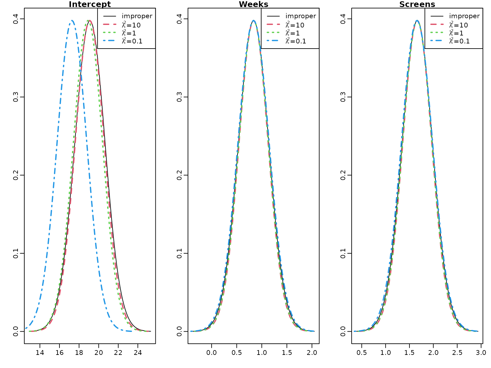
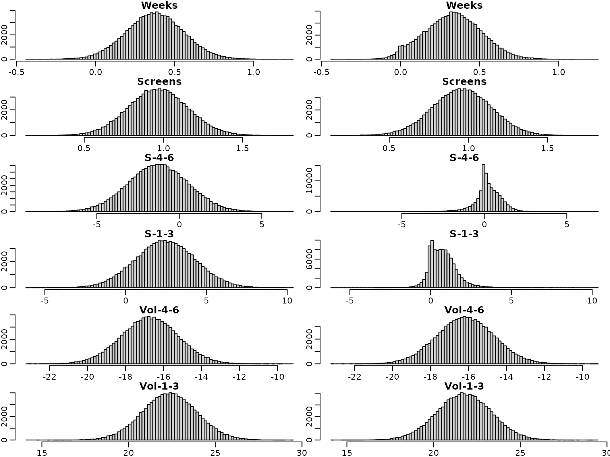
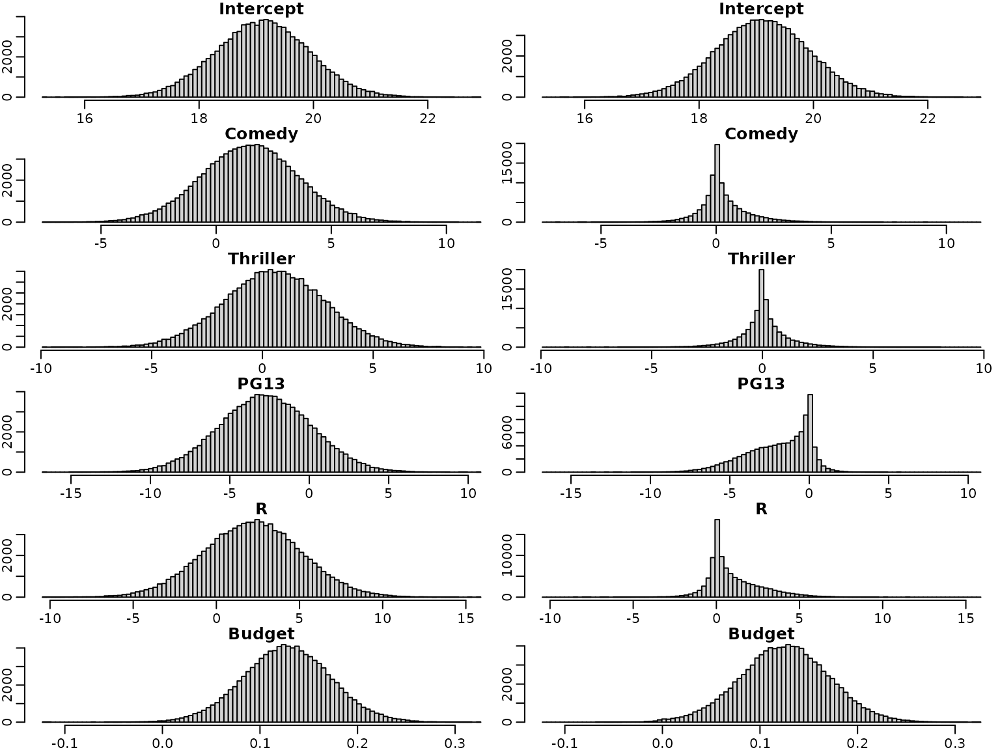

# Chapter 6: The Bayesian Approach to Standard Regression Analysis

## Section 6.2.1

### Example 6.1: Movie data

We use movie data provided within the package to illustrate Bayesian
analysis of a regression model. The data set is a preprocessed version
of the one provided by Lehrer and Xi (2017).

``` r
library("BayesianLearningCode")
data("movies", package = "BayesianLearningCode")
```

First of all, as there is only one film of genre G, we set the baseline
for the categorical covariate genre to G or PG by removing PG from the
data set.

``` r
movies["PG"] <- NULL
```

Next, we prepare the variables for regression analysis. We define the
response variable `OpenBoxOffice` as `y` and use as covariates the
twitter volume scores 4-6 and 1-3 weeks before the film starts.

``` r
y <- movies[, "OpenBoxOffice"]
covs <- c("Vol-4-6", "Vol-1-3")
N <- length(y)  # number of observations

X <- as.matrix(cbind("Intercept" = rep(1, N), movies[,covs])) # regressor matrix
d <- dim(X)[2] # number regression effects
```

Next we compute the parameters of the marginal posterior for the
regression effects under the improper prior
$p\left( \beta,\sigma^{2} \right) \propto \frac{1}{\sigma^{2}}$.

``` r

BN<- solve(crossprod(X))
Xy <- t(X) %*% y
beta.hat <- BN%*%Xy

SSR <- as.numeric(crossprod(y-X%*%beta.hat))

cN <- (N-d)/2
CN <- SSR/2

post.sigma<-(CN/cN)*BN
post.sd=sqrt(diag(post.sigma))

knitr::kable(cbind(beta.hat,post.sd),digits=3,
           col.names=c("posterior mean", "posterior.sd"))
```

|           | posterior mean | posterior.sd |
|:----------|---------------:|-------------:|
| Intercept |         13.617 |        1.221 |
| Vol-4-6   |        -19.720 |        1.874 |
| Vol-1-3   |         25.350 |        1.917 |

We can also plot the marginal posterior distributions.

``` r
if (pdfplots) {
  pdf("6-4_1.pdf", width = 8, height = 5)
  par(mar = c(2.5, 1.5, .1, .1), mgp = c(1.6, .6, 0))
}
par(mfrow = c(1, 3))
for (i in seq_len(nrow(beta.hat))) {
    curve(dt((x-beta.hat[i])/sqrt(post.sd[i]), df=2*cN), 
        from=beta.hat[i]- 4*post.sd[i], to=beta.hat[i]+ 4*post.sd[i], 
        ylab="", xlab="" , main=rownames(beta.hat)[i])
}
```


### Figure 6.1

We start with a visualization of the normal and the horseshoe prior.

``` r
beta <- seq(from = -4, to = 4, by = 0.01)

# Horseshoe prior
# Approximated by the result of Theorem 1 in Carvalho and Polson (2010)
c <-  1 / sqrt(2 * pi^3)
l <- c / 2 * log(1 + 4 / beta^2)
u <- c * log(1 + 2 / beta^2)
par(mfrow = c(1, 1))
plot(beta, (u + l) / 2, type = "l", ylim = c(0, 0.55), xlab = expression(beta),
     ylab = "", lty = 1, col = "blue")
lines(beta, dnorm(beta), lty = 2) # Standard normal prior
legend('topright', legend = c("Horseshoe", "Standard normal"), lty = 1:2,
       col = c("blue", "black"))
```


## Section 6.4

Center the covariates at zero.

``` r
covs <- c("Comedy", "Thriller","PG13", "R", "Budget", "Weeks", "Screens", 
          "S-4-6", "S-1-3", "Vol-4-6", "Vol-1-3")
covs.cen <- scale(movies[, covs], scale = FALSE)


N <- length(y)  # number of observations
X <- cbind("Intercept" = rep(1, N), covs.cen) # regressor matrix

d <- dim(X)[2] # number regression effects 
p <- d - 1 # number of regression effects without intercept
```

We first estimate the parameters of the regression model under a rather
flat semi-conjugate prior.

``` r
set.seed(1)

# define prior parameters of semi-conjugate prior
B0inv <- diag(rep(1 / 10000, d), nrow = d)
b0 <- rep(0, d)

c0 <- 2.5 
C0 <- 1.5

# define quantities for the Gibbs sampler
XX <- crossprod(X)
Xy <- t(X) %*% y
cN <- c0 + N / 2

#define burnin and M
burnin <- 1000
M <- 100000

# prepare storing of results
betas <- matrix(NA_real_, nrow = burnin + M, ncol = d)
sigma2s <- rep(NA_real_, burnin + M)
colnames(betas) <- colnames(X)

# starting value for sigma2
sigma2 <- var(y) / 2

for (m in 1:(burnin + M)) {
    # sample beta from the full conditional
    BN <- solve(B0inv + XX / sigma2) 
    bN <- BN %*% (B0inv %*% b0 + Xy / sigma2)
    beta <- t(mvtnorm::rmvnorm(1, mean = bN, sigma = BN))
    
    # sample sigma^2 from its full conditional
    eps <- y - X %*% beta
    CN <- C0 + crossprod(eps) / 2
    sigma2 <- rinvgamma(1, cN, CN)
    
    betas[m, ] <- beta
    sigma2s[m] <- sigma2
}
```

To summarize the results nicely, we compute equal-tailed 95% confidence
intervals for the regression effects.

``` r
res.mcmc <- function(x, lower = 0.025, upper = 0.975)
  c(quantile(x, lower), mean(x), quantile(x, upper))

beta.sc <- betas[burnin + (1:M), ]

res_beta.sc<- t(apply(beta.sc, 2, res.mcmc))
colnames(res_beta.sc) <- c("2.5%", "Mean", "97.5%") 
rownames(res_beta.sc) <- c("Intercept", covs)

knitr::kable(round(res_beta.sc, 3))
```

|           |    2.5% |    Mean |   97.5% |
|:----------|--------:|--------:|--------:|
| Intercept |  17.500 |  19.110 |  20.725 |
| Comedy    |  -2.680 |   1.457 |   5.570 |
| Thriller  |  -3.923 |   0.545 |   5.012 |
| PG13      |  -8.515 |  -2.759 |   2.959 |
| R         |  -3.638 |   2.181 |   7.974 |
| Budget    |   0.040 |   0.128 |   0.216 |
| Weeks     |   0.021 |   0.376 |   0.734 |
| Screens   |   0.598 |   0.966 |   1.337 |
| S-4-6     |  -4.892 |  -1.277 |   2.313 |
| S-1-3     |  -1.202 |   2.457 |   6.135 |
| Vol-4-6   | -19.705 | -16.733 | -13.775 |
| Vol-1-3   |  19.287 |  22.370 |  25.485 |

We do the same for the error variances.

``` r
res_sigma2.sc <- res.mcmc(sigma2s[burnin + (1:M)])
names(res_sigma2.sc) <- colnames(res_beta.sc)
knitr::kable(t(round(res_sigma2.sc, 3)))
```

|   2.5% |   Mean | 97.5% |
|-------:|-------:|------:|
| 47.439 | 63.938 | 86.25 |

Next we use the horseshoe prior to analyze the data. We use the same
prior on the intercept and the error variance as above but specify a
horseshoe prior on the regression effects. The prior variance of the
intercept is set to the same value as in the semi-conjugate prior.

``` r
B00inv <- 1 / 10000 # prior precision for the intercept

# prepare storing of results
betas.hs <- matrix(NA_real_, nrow = burnin + M, ncol = d)
colnames(betas.hs) <- colnames(X)
sigma2s.hs <- rep(NA_real_, burnin + M)
tau2s.hs <- matrix(NA_real_, nrow = burnin + M, ncol = p)
lambda2s.hs <- rep(NA_real_, burnin + M)

# set starting values 
sigma2 <- var(y) / 2
tau2 <- rep(1, p)
lambda2 <- 1

for (m in seq_len(burnin + M)) {
  # sample  beta from the full conditional
  B0inv <- diag(c(B00inv, 1 / (lambda2 * tau2)))
  BN <- solve(B0inv + XX / sigma2) 
  bN <- BN %*% (B0inv %*% b0 + Xy / sigma2)
  
  beta <- t(mvtnorm::rmvnorm(1, mean = bN, sigma = BN))
  beta.star <- beta[2:d]
  
  # sample sigma^2 from its full conditional
  eps <- y - X %*% beta
  CN <- C0 + crossprod(eps) / 2
  sigma2 <- rinvgamma(1, cN, CN)
  
  # sample tau^2
  xi  <- rexp(p, rate = 1 + 1 / tau2)
  tau2 <- rinvgamma(p, 1, xi + 0.5 * beta.star^2 / lambda2)
  
  # sample lambda^2
  zeta <- rexp(1, rate = 1 + 1 / lambda2)
  lambda2 <- rinvgamma(1, (p + 1) / 2, zeta + 0.5 * sum(beta.star^2 / tau2))
  
  # store results
  betas.hs[m,] <- beta
  sigma2s.hs[m] <- sigma2
  tau2s.hs[m,] <- tau2
  lambda2s.hs[m] <- lambda2
}
```

Again, we show the posterior mean estimates and equal-tailed 95%
credibility intervals in a table. First, for the regressions effects.

``` r
beta.hs <- betas.hs[burnin + (1:M),] 
res_beta.hs <- t(apply(beta.hs, 2, res.mcmc))
colnames(res_beta.hs) <- c("2.5%", "Mean", "97.5%")
rownames(res_beta.hs) <- colnames(X)
knitr::kable(round(res_beta.hs, 3))
```

|           |    2.5% |    Mean |   97.5% |
|:----------|--------:|--------:|--------:|
| Intercept |  17.488 |  19.110 |  20.734 |
| Comedy    |  -1.602 |   0.275 |   2.845 |
| Thriller  |  -2.267 |   0.042 |   2.497 |
| PG13      |  -6.368 |  -1.915 |   0.744 |
| R         |  -1.388 |   0.964 |   4.972 |
| Budget    |   0.035 |   0.125 |   0.214 |
| Weeks     |  -0.004 |   0.332 |   0.684 |
| Screens   |   0.590 |   0.959 |   1.325 |
| S-4-6     |  -1.549 |   0.228 |   1.686 |
| S-1-3     |  -0.542 |   0.759 |   2.694 |
| Vol-4-6   | -19.128 | -16.158 | -13.168 |
| Vol-1-3   |  18.663 |  21.761 |  24.836 |

And for the variance.

``` r
res_sigma2.hs <- res.mcmc(sigma2s.hs[burnin + (1:M)])
names(res_sigma2.hs) <- colnames(res_beta.hs)
knitr::kable(t(round(res_sigma2.hs, 3)))
```

|   2.5% |   Mean |  97.5% |
|-------:|-------:|-------:|
| 47.209 | 63.592 | 85.511 |

We next have a look at the posterior distributions. First under the
semi-conjugate priors and then under the horseshoe prior.Note that the
posterior distributions are symmetric under the semi-conjugate prior,
whereas this is not the case under the horseshoe prior.

``` r
for (i in seq_len(d)) {
  breaks <- seq(min(beta.sc[,i], beta.hs[,i]), max(beta.sc[,i], beta.hs[,i]),
                length.out = 100)
  hist(beta.sc[,i], main = colnames(X)[i], breaks = breaks, xlab = "", ylab = "")
  hist(beta.hs[,i], main = colnames(X)[i], breaks = breaks, xlab = "", ylab = "")
}
```



For illustration purposes, we overlay four selected marginal posteriors
in order to illustrate the shrinkage effect.

``` r
selection <- c("Screens", "Weeks", "S-1-3", "Thriller")
for (i in selection) {
 breaks <- seq(min(beta.sc[,i], beta.hs[,i]), max(beta.sc[,i], beta.hs[,i]),
                length.out = 50)
 h1 <- hist(beta.sc[,i], breaks = breaks, plot = FALSE)
 h2 <- hist(beta.hs[,i], breaks = breaks, plot = FALSE)
 col <- c(rgb(0, 0, 1, 0.25), rgb(1, 0, 0, 0.25))
 plot(h1, main = i, xlab = "", ylab = "", freq = FALSE,
      ylim = c(0, max(h1$density, h2$density)), col = col[1])
 plot(h2, xlab = "", ylab = "", freq = FALSE, col = col[2], 
      add = TRUE)
}
```


We next investigate the trace plots.

``` r
par(mfrow = c(6, 2))
for (i in seq_len(d)) {
  plot(beta.sc[,i], type = "l", xlab = "", ylab = "", main = colnames(beta.sc)[i])
  plot(beta.hs[,i], type = "l", xlab = "", ylab = "", main = colnames(beta.sc)[i])
}
```


To sum up, we visualize the posterior of the effects and corresponding
(square root of the) shrinkage parameters. For visual inspection, we
create a gap plot, where we remove the largest 5% of the local shrinkage
parameter draws and mirror them around 0. That way, we can easily
identify \`\`significant’’ effects via clear bimodality or even a gap
around zero – hence the name.

``` r
tau2.hs <- tau2s.hs[burnin + (1:M), ]
alpha <- 0.05
truncate <- function(x, alpha) x[x <= quantile(x, 1 - alpha)] 
tau2.hs.trunc <- apply(tau2.hs, 2, truncate, alpha = alpha)
tau.hs.trunc.mirrored <- rbind(sqrt(tau2.hs.trunc), -sqrt(tau2.hs.trunc))
```

On the left, we see the regression effects posteriors. On the right, we
visualize the gap plot.

``` r
for (i in seq_len(ncol(beta.hs))) {
  breaks <- seq(min(beta.hs[, i]), max(beta.hs[, i]), length.out = 100)
  hist(beta.hs[, i], breaks = breaks, xlab = "", ylab = "", 
       main = c("Intercept", covs)[i])
  if (i == 1) {
    plot.new()
  } else {
    breaks <- seq(min(tau.hs.trunc.mirrored[, i - 1]),
                      max(tau.hs.trunc.mirrored[, i - 1]), length.out = 100)
    hist(tau.hs.trunc.mirrored[, i - 1], breaks = breaks, xlab = "", ylab = "",
         main = covs[i - 1])
  }
}
```


