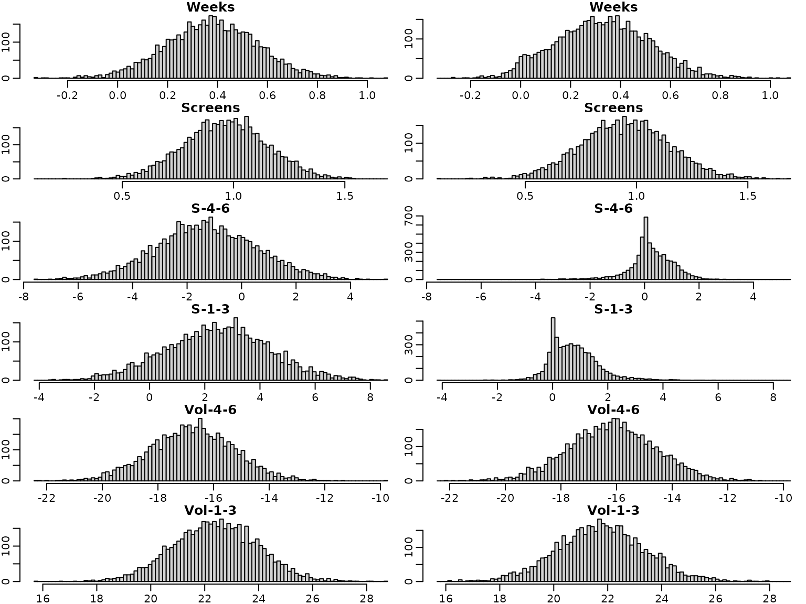
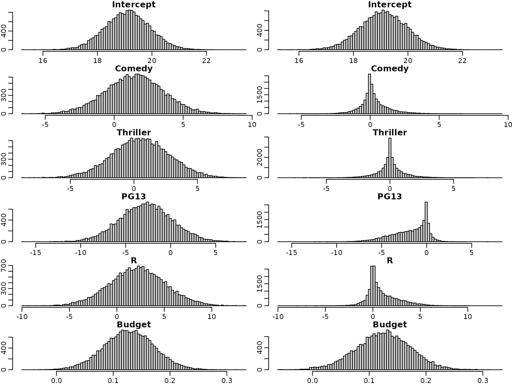

# Chapter 6: The Bayesian Approach to Standard Regression Analysis

## Section 6.2 Bayesian Learning for a Standard Linear Regression Model

#### Example 6.1: Movie data

We use movie data provided within the package to illustrate Bayesian
analysis of a regression model. The data set is a preprocessed version
of the one provided by Lehrer and Xi (2017).

``` r
library("BayesianLearningCode")
data("movies", package = "BayesianLearningCode")
```

### Section 6.2.1 Bayesian Learning Under Improper Priors

#### Example 6.2: Movie data

Next, we prepare the variables for regression analysis. We define the
response variable `OpenBoxOffice` as `y` and use as covariates the
twitter volume scores 4-6 and 1-3 weeks before the film starts. For
better interpretation we center the covariates at their means. Hence the
intercept is the sales on the opening weekend box office for a film with
a mean value score of twitter post in weeks 4-6 and 1-3 before its
start.

``` r
y <- movies[, "OpenBoxOffice"]
#covs <- c("Vol-4-6", "Vol-1-3")
covs <- c("Weeks", "Screens")
covs.cen <- scale(movies[, covs], scale = FALSE)

N <- length(y)  # number of observations

X <- as.matrix(cbind("Intercept" = rep(1, N), covs.cen)) # regressor matrix
d <- dim(X)[2] # number regression effects
```

Next we compute the parameters of the posterior of the regression
effects under the improper prior
$p\left( \beta,\sigma^{2} \right) \propto \frac{1}{\sigma^{2}}$.

``` r
BN <- solve(crossprod(X))
Xy <- t(X) %*% y
beta.hat <- BN%*%Xy

SSR <- as.numeric(crossprod(y-X%*%beta.hat))

cN <- (N-d)/2
CN <- SSR/2

post.sigma<-(CN/cN)*BN
post.sd=sqrt(diag(post.sigma))

knitr::kable(round(cbind(qt(0.025,df=2*cN)*post.sd+beta.hat, beta.hat,
                         qt(0.975,df=2*cN)*post.sd+beta.hat),3),
             col.names=c("2.5 quantile","posterior mean","97.5 quantile"))
```

|           | 2.5 quantile | posterior mean | 97.5 quantile |
|:----------|-------------:|---------------:|--------------:|
| Intercept |       16.029 |         19.110 |        22.191 |
| Weeks     |        0.236 |          0.837 |         1.439 |
| Screens   |        1.032 |          1.663 |         2.295 |

We first plot the marginal posterior distribution of the intercept.

``` r
if (pdfplots) {
  pdf("6-4_1.pdf", width = 8, height = 3)
  par(mar = c(2.5, 1.5, 1.5, .1), mgp = c(1.6, .6, 0))
}
par(mfrow = c(1, 1))
curve(dt((x-beta.hat[1])/post.sd[1], df=2*cN), 
        from=beta.hat[1]- 3*post.sd[1], to=beta.hat[1]+ 3*post.sd[1], 
        ylab="", xlab="" , main=rownames(beta.hat)[1])
```

 Next we plot the
marginals of the covariate effects

``` r
if (pdfplots) {
  pdf("6-4_1a.pdf", width = 8, height = 4)
  par(mar = c(2.5, 1.5, 1.5, .1), mgp = c(1.6, .6, 0))
}
require(mvtnorm)
#> Loading required package: mvtnorm

f=function(x1,x2) dmvt(cbind(x1-beta.hat[2],x2-beta.hat[3]),
                     sigma=post.sigma[2:3,2:3], df=2*cN, log=FALSE)
c=3*max(post.sd[-1])
xx1 <- seq(-c,c,length=201)+beta.hat[2]
xx2 <-  seq(-c,c,length=201)+beta.hat[3]
z=outer(xx1,xx2,f)

nf <- layout(matrix(c(2,0,1,3),2,2,byrow=TRUE), c(3,1), c(1,3), TRUE)
par(mar=c(3,3,1,1))
contour(xx1,xx2,z,col="blue",add=FALSE)
mtext(rownames(beta.hat)[2],1, line=2)
mtext(rownames(beta.hat)[3],2, line=2)

par(mar=c(0,3,1,1))
mar.x1=dt((xx1-beta.hat[2])/post.sd[2], df=2*cN, log=FALSE)
plot(xx1,mar.x1,col="blue", type="l",xaxt="n",ylab="")

par(mar=c(3,0,1,1))
mar.x2=dt((xx2-beta.hat[3])/post.sd[3], df=2*cN, log=FALSE)
plot(mar.x2,xx2,col="blue", type="l",yaxt="n",xlab="")
```


#### 6.2.2 Bayesian Learning under Conjugate Priors

Next we consider regression analysis under a conjugate prior. For this
we define a function that yields the parameters of the posterior
distribution.

``` r
regression_conjugate <- function(y, X, b0 = 0, B0 = 1,
                                 c0 = 0.01, C0 = 0.01) {
  
   d <- ncol(X)
  
   if (length(b0) == 1L) b0 <- rep(b0, d)
  
  if (!is.matrix(B0)) {
    if (length(B0) == 1L) {
      B0 <- diag(rep(B0, d))
    } else {
      B0 <- diag(B0)
    }
  }
     B0.inv <- solve(B0)
     BN.inv <- solve(B0)+crossprod(X)
     
     BN <- solve(BN.inv)
     bN <- BN%*% (B0.inv%*%b0+ t(X) %*% y)

     cN <- c0+N/2
     SS.eps <- as.numeric(crossprod(y) + t(b0)%*%B0.inv%*%b0 - 
                        t(bN)%*%BN.inv%*%bN)
     CN <- C0+SS.eps/2
 list(bN=bN,BN=BN,cN=cN, CN=CN)
}
```

We perform the regression analysis and report the posterior mean with
the 2.5% and 97.5% quantile of the posterior distribution.

``` r
res_conj1<-regression_conjugate(y,X,b0=0, B0=10)
post.sd.conj1=sqrt(diag((res_conj1$CN/res_conj1$cN)*res_conj1$BN))

res_conj2<-regression_conjugate(y,X,b0=0, B0=1)
post.sd.conj2=sqrt(diag((res_conj2$CN/res_conj2$cN)*res_conj2$BN))

knitr::kable(round(cbind(qt(0.025,df=2*res_conj1$cN)*post.sd.conj1+res_conj1$bN, 
                         res_conj1$bN,
                         qt(0.975,df=2*res_conj1$cN)*post.sd.conj1+ res_conj1$bN),3),
              col.names=c("2.5 quantile","posterior mean","97.5 quantile"))
```

|           | 2.5 quantile | posterior mean | 97.5 quantile |
|:----------|-------------:|---------------:|--------------:|
| Intercept |       16.059 |         19.090 |        22.120 |
| Weeks     |        0.245 |          0.837 |         1.429 |
| Screens   |        1.041 |          1.663 |         2.285 |

We plot the marginal posteriors (in blue) together with those under the
improper prior.

``` r
if (pdfplots) {
  pdf("6-4_2.pdf", width = 8, height = 3)
  par(mar = c(2.5, 1.5, 1.5, .1), mgp = c(1.6, .6, 0))
}
par(mfrow = c(1, 3))
for (i in seq_len(nrow(beta.hat))) {
     curve(dt((x-beta.hat[i])/post.sd[i], df=2*cN), 
        from=beta.hat[i]- 4*post.sd[i], to=beta.hat[i]+ 4*post.sd[i], 
        ylab="", xlab="" , main=rownames(beta.hat)[i])
    curve(dt((x- res_conj1$bN[i])/post.sd.conj1[i], df=2* res_conj1$cN), 
        from= res_conj1$bN[i]- 4*post.sd.conj1[i], 
        to= res_conj1$bN[i]+ 4*post.sd.conj1[i], 
        add=TRUE, col=2,lty=2,lwd=2)
    curve(dt((x- res_conj2$bN[i])/post.sd.conj2[i], df=2* res_conj2$cN), 
        from= res_conj2$bN[i]- 4*post.sd.conj2[i], 
        to= res_conj2$bN[i]+ 4*post.sd.conj2[i], 
        add=TRUE, col=3,lty=4,lwd=2)
    legend("topright", c("improper", "B0=10", "B0=1"),
         col = 1:3, lty = c(1,2,4),lwd=c(1,2,2))
}
```

 There is little
difference to the improper prior for $B_{0} = 10\textbf{𝐈}$, however we
see shrinkage to zero for $B_{0} = \textbf{𝐈}$. The effect of the prior
is given by the weight matrix $\textbf{𝐖}$, which is computed for the
prior \$\Normal\\\textbf{0}, \textbf{I}\\\$ below.

``` r
W=res_conj2$BN%*%solve(diag(rep(1,d)))
print(round(W,3))
#>            [,1] [,2] [,3]
#> Intercept 0.011    0    0
#> Weeks     0.000    0    0
#> Screens   0.000    0    0
```

We see that weight of the prior mean is much smaller for the intercept
than for the effects of the two covariates.

### 6.3 Regression Analysis under the Semi-Conjugate Prior

We now include not only the volume scores from twitter posts 4-6 and 1-3
weeks before starting of the film, but use also the information on the
sentiments in these time periods, the genres and , the MPAA ratings, the
budget, the number of weeks as well as screens the film was planned to
be shown. There is only one film with MPAA rating
`G'', hence we merge the two ratings`G’’ and \`\`PG’’ into one category
which we define as our baseline. Additionally we center all covariates
at zero.

``` r
movies["PG"] <- NULL
```

Next, we center all covariates at zero and define the regressor matrix.

``` r
covs <- c("Comedy", "Thriller","PG13", "R", "Budget", "Weeks", "Screens", 
          "S-4-6", "S-1-3", "Vol-4-6", "Vol-1-3")
covs.cen <- scale(movies[, covs], scale = FALSE)


N <- length(y)  # number of observations
X <- cbind("Intercept" = rep(1, N), covs.cen) # regressor matrix

d <- dim(X)[2] # number regression effects 
p <- d - 1 # number of regression effects without intercept
```

To estimate the parameters of the regression model under a rather flat
semi-conjugate prior we set up the Gibbs sampler.

``` r
set.seed(1)

reg_semiconj <- function(y, X, b0 = 0, B0 = 10000, c0 = 2.5, C0 = 1.5,
                   burnin = 1000L, M = 5000L) {
    d <- dim(X)[2] 
    B0inv <- diag(rep(1 / B0, d), nrow = d)
    b0 <-  rep(b0, length.out = d)

    # define quantities for the Gibbs sampler
    XX <- crossprod(X)
    Xy <- t(X) %*% y
    cN <- c0 + N / 2
    
    # prepare storing of results
   betas <- matrix(NA_real_, nrow = M, ncol = d)
   colnames(betas) <- colnames(X)

   sigma2s <- rep(NA_real_,  M)

   # starting value for sigma2
   sigma2 <- var(y) / 2

   for (m in 1:(burnin + M)) {
       # sample beta from the full conditional
       BN <- solve(B0inv + XX / sigma2) 
       bN <- BN %*% (B0inv %*% b0 + Xy / sigma2)
       beta <- t(mvtnorm::rmvnorm(1, mean = bN, sigma = BN))
    
       # sample sigma^2 from its full conditional
       eps <- y - X %*% beta
       CN <- C0 + crossprod(eps) / 2
       sigma2 <- rinvgamma(1, cN, CN)
      
       if (m > burnin) {
          betas[m - burnin, ] <- beta
          sigma2s[m- burnin] <- sigma2
       }
   }
   return(post.draws=list(betas = betas, sigma2s=sigma2s) )
}                              
```

We define the prior parameters and rum the sampler for 10000 iterations
after a burnin of 1000.

``` r
post.draws <- reg_semiconj(y,X,b0 = 0, B0 = 10000, c0 = 2.5, C0 = 1.5,
                   burnin = 1000L, M = 5000L)
```

To summarize the results nicely, we compute equal-tailed 95% confidence
intervals for the regression effects.

``` r
res.mcmc <- function(x, lower = 0.025, upper = 0.975)
  c(quantile(x, lower), mean(x), quantile(x, upper))

beta.sc<-post.draws$betas

res_beta.sc<- t(apply(beta.sc, 2, res.mcmc))
colnames(res_beta.sc) <- c("2.5%", "Mean", "97.5%") 
rownames(res_beta.sc) <- c("Intercept", covs)

knitr::kable(round(res_beta.sc, 3))
```

|           |    2.5% |    Mean |   97.5% |
|:----------|--------:|--------:|--------:|
| Intercept |  17.455 |  19.100 |  20.719 |
| Comedy    |  -2.730 |   1.422 |   5.535 |
| Thriller  |  -4.104 |   0.482 |   4.911 |
| PG13      |  -8.412 |  -2.756 |   3.008 |
| R         |  -3.604 |   2.164 |   8.170 |
| Budget    |   0.041 |   0.128 |   0.215 |
| Weeks     |   0.015 |   0.377 |   0.744 |
| Screens   |   0.597 |   0.964 |   1.326 |
| S-4-6     |  -4.855 |  -1.279 |   2.387 |
| S-1-3     |  -1.262 |   2.454 |   6.178 |
| Vol-4-6   | -19.741 | -16.763 | -13.858 |
| Vol-1-3   |  19.377 |  22.400 |  25.422 |

We do the same for the error variances.

``` r
res_sigma2.sc <- res.mcmc( post.draws$sigma2s)
names(res_sigma2.sc) <- colnames(res_beta.sc)
knitr::kable(t(round(res_sigma2.sc, 3)))
```

|   2.5% |   Mean |  97.5% |
|-------:|-------:|-------:|
| 47.338 | 63.993 | 87.332 |

Next we will use the horseshoe prior to analyze the data. We start with
a visual comparison of the normal and the horseshoe prior.

``` r
beta <- seq(from = -4, to = 4, by = 0.01)

# Horseshoe prior
# Approximated by the result of Theorem 1 in Carvalho and Polson (2010)
c <-  1 / sqrt(2 * pi^3)
l <- c / 2 * log(1 + 4 / beta^2)
u <- c * log(1 + 2 / beta^2)
par(mfrow = c(1, 1))
plot(beta, (u + l) / 2, type = "l", ylim = c(0, 0.55), xlab = expression(beta),
     ylab = "", lty = 1, col = "blue")
lines(beta, dnorm(beta), lty = 2) # Standard normal prior
legend('topright', legend = c("Horseshoe", "Standard normal"), lty = 1:2,
       col = c("blue", "black"))
```


Next we set up the Gibbs sampler under the horse-shoe prior.

``` r
reg_hs <- function(y, X,  b0=0, B0 = 10000, c0 = 2.5, C0 = 1.5,
                   burnin = 1000L, M = 5000L) {
   d <- dim(X)[2]
   p <- d-1
   
   B00inv <- 1 / B0 # prior precision for the intercept
   b0 <-  rep(b0, length.out = d)

   # prepare storing of results
   betas <- matrix(NA_real_, nrow = M, ncol = d)
   colnames(betas) <- colnames(X)
   
   sigma2s<- rep(NA_real_, M)
   tau2s <- matrix(NA_real_, nrow =  M, ncol = p)
   lambda2s <- rep(NA_real_,  M)
   
   # define quantities for the Gibbs sampler
   XX <- crossprod(X)
   Xy <- t(X) %*% y

   # set starting values 
   sigma2 <- var(y) / 2
   tau2 <- rep(1, p)
   lambda2 <- 1

   for (m in seq_len(burnin + M)) {
       # sample  beta from the full conditional
       B0inv <- diag(c(B00inv, 1 / (lambda2 * tau2)))
       BN <- solve(B0inv + XX / sigma2) 
       bN <- BN %*% (B0inv %*% b0 + Xy / sigma2)
  
       beta <- t(mvtnorm::rmvnorm(1, mean = bN, sigma = BN))
       beta.star <- beta[2:d]
  
       # sample sigma^2 from its full conditional
       eps <- y - X %*% beta
       CN <- C0 + crossprod(eps) / 2
       sigma2 <- rinvgamma(1, cN, CN)
  
      # sample tau^2
      xi  <- rexp(p, rate = 1 + 1 / tau2)
      tau2 <- rinvgamma(p, 1, xi + 0.5 * beta.star^2 / lambda2)
  
      # sample lambda^2
      zeta <- rexp(1, rate = 1 + 1 / lambda2)
      lambda2 <- rinvgamma(1, (p + 1) / 2, zeta + 0.5 * sum(beta.star^2 / tau2))
  
      # store results
      if (m > burnin) {
         betas[m - burnin, ] <- beta
         sigma2s[m- burnin] <- sigma2
         tau2s[m- burnin,] <- tau2
         lambda2s[m- burnin] <- lambda2
      }
   }
   return(post.draws=list(betas = betas, sigma2s=sigma2s, tau2s=tau2s,lambda2s=lambda2s))
}    
```

We use the same prior on the intercept and the error variance as as in
the semi-conjugate prior, but the horseshoe prior on the regression
effects.

``` r
post.draws.hs<- reg_hs(y,X)
```

Again, we show the posterior mean estimates and equal-tailed 95%
credibility intervals in a table. First, for the regressions effects.

``` r
beta.hs<-post.draws.hs$betas
res_beta.hs <- t(apply(beta.hs, 2, res.mcmc))
colnames(res_beta.hs) <- c("2.5%", "Mean", "97.5%")
rownames(res_beta.hs) <- colnames(X)
knitr::kable(round(res_beta.hs, 3))
```

|           |    2.5% |    Mean |   97.5% |
|:----------|--------:|--------:|--------:|
| Intercept |  17.425 |  19.110 |  20.793 |
| Comedy    |  -1.673 |   0.281 |   2.914 |
| Thriller  |  -2.372 |   0.034 |   2.457 |
| PG13      |  -6.376 |  -1.774 |   0.895 |
| R         |  -1.361 |   0.955 |   5.006 |
| Budget    |   0.032 |   0.125 |   0.218 |
| Weeks     |  -0.013 |   0.329 |   0.700 |
| Screens   |   0.557 |   0.949 |   1.338 |
| S-4-6     |  -1.635 |   0.240 |   1.721 |
| S-1-3     |  -0.582 |   0.746 |   2.801 |
| Vol-4-6   | -19.227 | -16.160 | -13.107 |
| Vol-1-3   |  18.524 |  21.767 |  25.043 |

And for the variance.

``` r
res_sigma2.hs <- res.mcmc(post.draws.hs$sigma2s)
names(res_sigma2.hs) <- colnames(res_beta.hs)
knitr::kable(t(round(res_sigma2.hs, 3)))
```

|   2.5% |   Mean |  97.5% |
|-------:|-------:|-------:|
| 51.434 | 70.114 | 95.554 |

We next have a look at the posterior distributions. First under the
semi-conjugate priors and then under the horseshoe prior. Note that the
posterior distributions are symmetric under the semi-conjugate prior,
whereas this is not the case under the horseshoe prior.

``` r
for (i in seq_len(d)) {
  breaks <- seq(min(beta.sc[,i], beta.hs[,i]), max(beta.sc[,i], beta.hs[,i]),
                length.out = 100)
  hist(beta.sc[,i], main = colnames(X)[i], breaks = breaks, xlab = "", ylab = "")
  hist(beta.hs[,i], main = colnames(X)[i], breaks = breaks, xlab = "", ylab = "")
}
```



For illustration purposes, we overlay four selected marginal posteriors
in order to illustrate the shrinkage effect.

``` r
par(mfrow = c(2, 2), mar = c(1.5, 1.5, 1.5, .1), mgp = c(1, .5, 0))
selection <- c("Screens", "Weeks", "S-1-3", "Thriller")
for (i in selection) {
 breaks <- seq(min(beta.sc[,i], beta.hs[,i]), max(beta.sc[,i], beta.hs[,i]),
                length.out = 50)
 h1 <- hist(beta.sc[,i], breaks = breaks, plot = FALSE)
 h2 <- hist(beta.hs[,i], breaks = breaks, plot = FALSE)
 col <- c(rgb(0, 0, 1, 0.25), rgb(1, 0, 0, 0.25))
 plot(h1, main = i, xlab = "", ylab = "", freq = FALSE,
      ylim = c(0, max(h1$density, h2$density)), col = col[1])
 plot(h2, xlab = "", ylab = "", freq = FALSE, col = col[2], 
      add = TRUE)
}
```


We next investigate the trace plots.

``` r
par(mfrow = c(6, 2))
for (i in seq_len(d)) {
  plot(beta.sc[,i], type = "l", xlab = "", ylab = "", main = colnames(beta.sc)[i])
  plot(beta.hs[,i], type = "l", xlab = "", ylab = "", main = colnames(beta.sc)[i])
}
```


To sum up, we visualize the posterior of the effects and corresponding
(square root of the) shrinkage parameters. For visual inspection, we
create a gap plot, where we remove the largest 5% of the local shrinkage
parameter draws and mirror them around 0. That way, we can easily
identify \`\`significant’’ effects via clear bimodality or even a gap
around zero – hence the name.

``` r
tau2.hs <- post.draws.hs$tau2s
alpha <- 0.05
truncate <- function(x, alpha) x[x <= quantile(x, 1 - alpha)] 
tau2.hs.trunc <- apply(tau2.hs, 2, truncate, alpha = alpha)
tau.hs.trunc.mirrored <- rbind(sqrt(tau2.hs.trunc), -sqrt(tau2.hs.trunc))
```

On the left, we see the regression effects posteriors. On the right, we
visualize the gap plot.

``` r
for (i in seq_len(ncol(beta.hs))) {
  breaks <- seq(min(beta.hs[, i]), max(beta.hs[, i]), length.out = 100)
  hist(beta.hs[, i], breaks = breaks, xlab = "", ylab = "", 
       main = c("Intercept", covs)[i])
  if (i == 1) {
    plot.new()
  } else {
    breaks <- seq(min(tau.hs.trunc.mirrored[, i - 1]),
                      max(tau.hs.trunc.mirrored[, i - 1]), length.out = 100)
    hist(tau.hs.trunc.mirrored[, i - 1], breaks = breaks, xlab = "", ylab = "",
         main = covs[i - 1])
  }
}
```



``` r
if (pdfplots) {
  pdf("6-4_6.pdf", width=8, height = 3)
}
post.draws.hs2<- reg_hs(y,X)

par(mfrow = c(1, 2))
qqplot(post.draws.hs$betas[,1],post.draws.hs2$betas[,1], 
       main="Q-Q- Plot for the intercept", xlab="", ylab="" )
abline(a = 0, b = 1)
qqplot(post.draws.hs$sigma2s,post.draws.hs2$sigma2s,
        main="Q-Q- Plot for the error variance", xlab="", ylab="" )
abline(a = 0, b = 1)
```


