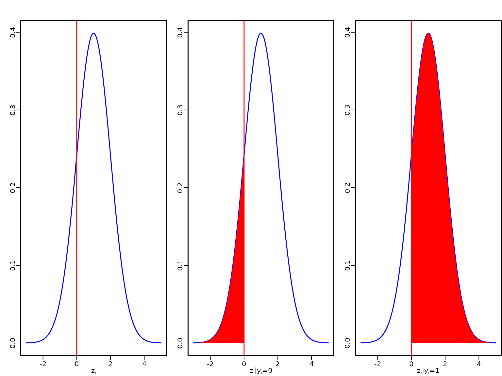
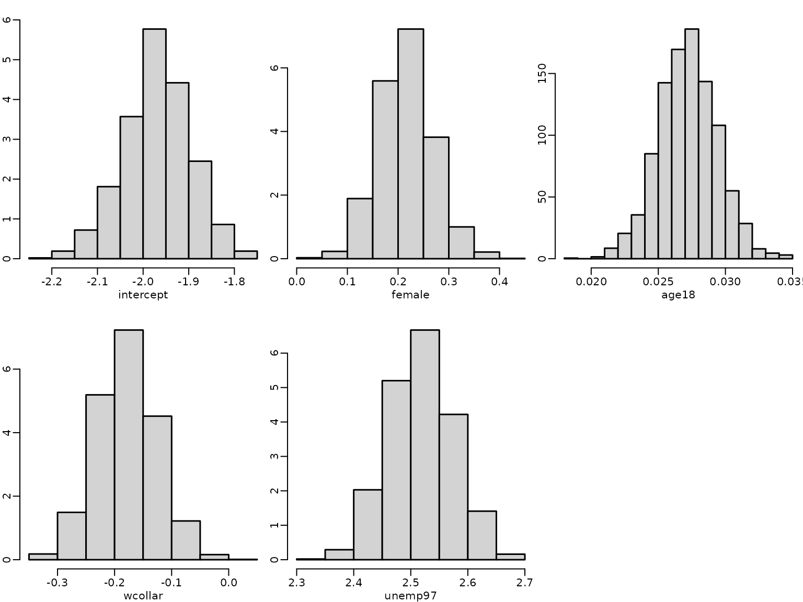
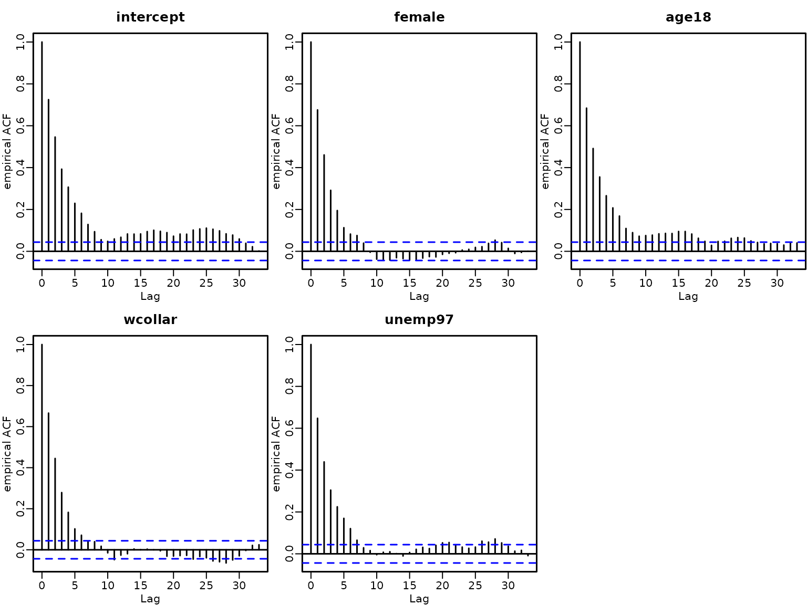
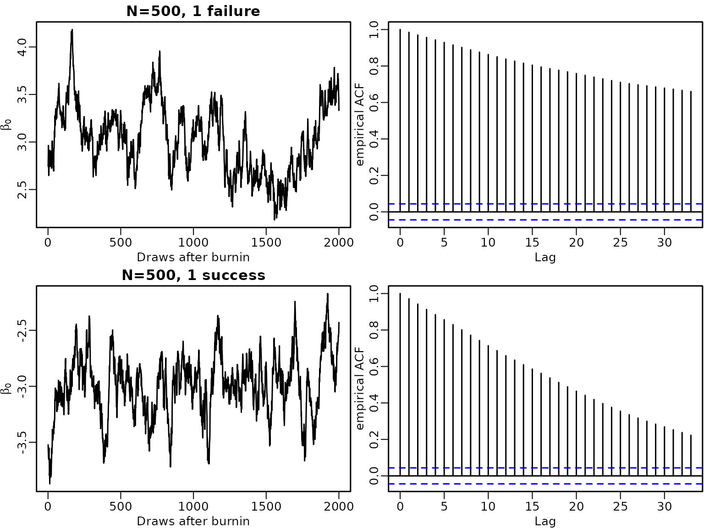
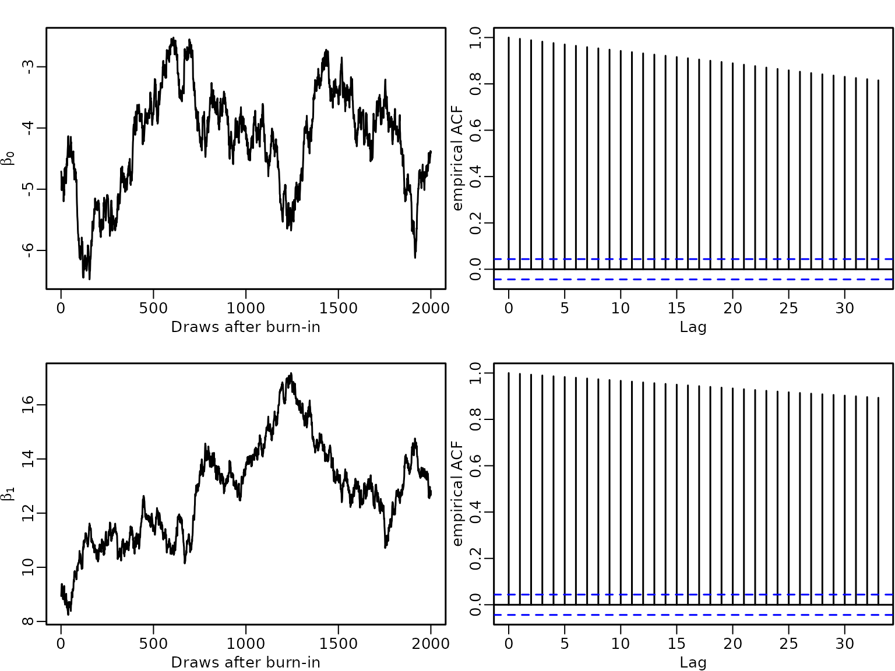
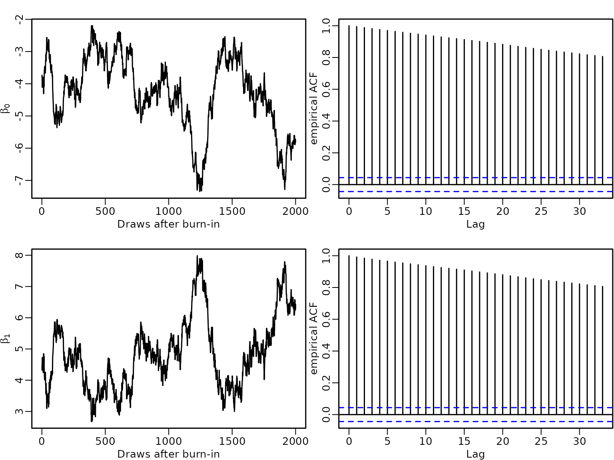
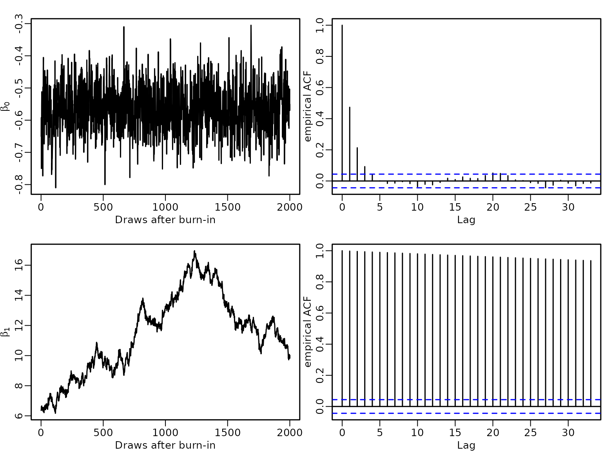
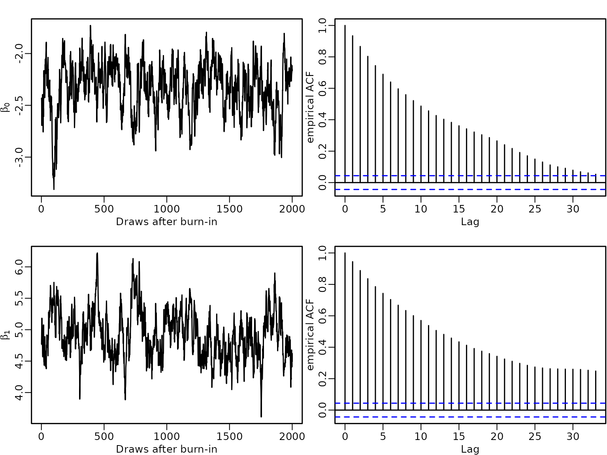

# Chapter 8: Beyond Standard Regression Analysis

## Section 8.1: Binary response variables

### Section 8.1.1: Probit model

#### Figure 8.1: Latent utility and outcome in the probit model

We start by visualizing a latent utility for a linear predictor
$\mathbf{x}{\mathbf{β}}$ with a value of 1.

``` r
curve(dnorm(x, mean = 1), from = -3, to = 5, col = "blue", 
      xlab = expression(z[i]), ylab = "")
abline(v = 0, col = "red")
 
dens <- curve(dnorm(x, mean = 1), from = -3, to = 5, n = 161, col = "blue",
              xlab = expression(paste(z[i], "|", y[i], "=0")), ylab = "")
abline(v = 0, col = "red")
polygon(c(dens$x[dens$x <= 0], 0), c(dens$y[dens$x <= 0], 0),
        col = "red", border = NA)

dens <- curve(dnorm(x, mean = 1), from = -3, to = 5, n = 161, col = "blue",
              xlab = expression(paste(z[i], "|", y[i], "=1")), ylab = "" )
abline(v = 0, col = "red")
polygon(c(dens$x[dens$x >= 0], 0), c(dens$y[dens$x >= 0], 0),
        col = "red", border = NA)
```



#### Example 8.1: Labor market data

We now perform probit regression analysis for the labor market data.

``` r
library("BayesianLearningCode")
data("labor", package = "BayesianLearningCode")
```

We model the income in 1998, binarized into unemployed (zero income) and
employed, as dependent variable, and use as covariates the variables
female (binary), age18 (quantitative, centered at 18 years), wcollar
(binary), and unemployed in 1997 (binary). The baseline person is hence
an 18 year old male blue collar worker who was employed in 1997.

``` r
y.unemp <- labor$income_1998 == "zero"
N.unemp <- length(y.unemp)  # number of observations 
X.unemp <- with(labor, cbind(intercept = rep(1, N.unemp),
                             female = female,
                             age18 = 1998 - birthyear - 18,
                             wcollar = wcollar_1997,
                             unemp97 = income_1997 == "zero")) # regressor matrix
```

#### Example 8.2: Fitting a probit model to the labor market data

The regression coefficients are estimated using data augmentation and
Gibbs sampling. We define a function yielding posterior draws using the
algorithm detailed in Section 8.1.1.

``` r
probit <- function(y, X, b0 = 0, B0 = 10000,
                   burnin = 1000L, M = 20000L) {
  N <- length(y)
  d <- ncol(X) # number of regression effects 

  b0 <- rep(b0, length.out = d) 
  B0.inv <- diag(rep(1 / B0, length.out = d), nrow = d)
  B0inv.b0 <- B0.inv %*% b0

  betas <- matrix(NA_real_, nrow = M, ncol = d)
  colnames(betas) <- colnames(X)
  
  z <- rep(NA_real_, N)

  # Define quantities for the Gibbs sampler
  BN <- solve(B0.inv + crossprod(X))
  ind0 <- (y == 0) # indicators for zeros
  ind1 <- (y == 1) # indicators for ones

  # Set starting values
  beta <- c(qnorm(mean(y)), rep(0, d-1))

  for (m in seq_len(burnin + M)) {
    # Draw z conditional on y and beta
    u <- runif(N)
    eta <- X %*% beta
    pi <- pnorm(eta) 
   
    z[ind0] <- eta[ind0] + qnorm(u[ind0] * (1 - pi[ind0]))
    z[ind1] <- eta[ind1] + qnorm(1 - u[ind1] * pi[ind1])
  
    # Sample beta from the full conditional 
    bN <- BN %*% (B0inv.b0 + crossprod(X, z))
    beta <- t(mvtnorm::rmvnorm(1, mean = bN, sigma = BN))
    
    # Store the beta draws
    if (m > burnin) {
      betas[m - burnin, ] <- beta
    }
 }
 return(betas)
}
```

We specify the prior on the regression effects as a rather flat normal
independence prior and estimate the model parameters.

``` r
set.seed(1234)
M <- 20000
betas <- probit(y.unemp, X.unemp, b0 = 0, B0 = 1000L, burnin = 1000, M = M)
```

To compute summary statistics from the posterior we use the following
function.

``` r
res.mcmc <- function(x, lower = 0.025, upper = 0.975) {
  res <- c(quantile(x, lower), mean(x), quantile(x, upper))
  names(res) <- c(paste0(lower * 100, "%"), "Posterior mean", 
                  paste0(upper * 100, "%"))
  res
}
```

We show posterior means and equal-tailed 95% credible intervals of the
regression effects.

``` r
res_probit.labor <- t(apply(betas, 2, res.mcmc))
knitr::kable(round(res_probit.labor, 3))
```

|           |   2.5% | Posterior mean |  97.5% |
|:----------|-------:|---------------:|-------:|
| intercept | -2.123 |         -1.975 | -1.831 |
| female    |  0.106 |          0.215 |  0.325 |
| age18     |  0.023 |          0.027 |  0.032 |
| wcollar   | -0.293 |         -0.183 | -0.074 |
| unemp97   |  2.412 |          2.523 |  2.637 |

Next, we determine the estimated risk of unemployment for a baseline
person, i.e., a 18 year old male blue collar worker who was employed in
1997, using the posterior mean estimate of the intercept.

``` r
(p_unemploy_base_probit <- round(pnorm(res_probit.labor[1, 2]), 4))
#> [1] 0.0241
```

The estimated risk to be unemployed in 1998 for a baseline person is
very low with a value of 0.0241 and even lower for a white collar
worker. This risk is higher for a female, an older person and
particularly high if the person was unemployed in 1997.

Next, we visualize the estimated posterior distributions for the
regression effects by histograms.

``` r
for (j in seq_len(ncol(betas))) {
  hist(betas[, j], freq = FALSE, main = "", xlab = colnames(betas)[j], 
       ylab = "")
}
```



A plot of the autocorrelation of the draws shows that although there is
some autocorrelation, it vanishes after a few lags.

``` r
for (j in seq_len(ncol(betas))) {
    acf(betas[, j], main = "", xlab = "Lag",
        ylab = "empirical ACF")
    title(colnames(betas)[j])
}
```



We also determine the estimated effective sample sizes (ESSs) to assess
the efficiency of the sampler.

``` r
ESS <- coda::effectiveSize(betas)
IF <- M / ESS
res_eff <- cbind(ESS = round(ESS, digits = 1),
                 IF = round(IF, digits = 2))
knitr::kable(res_eff)
```

|           |    ESS |   IF |
|:----------|-------:|-----:|
| intercept | 2861.8 | 6.99 |
| female    | 3726.1 | 5.37 |
| age18     | 2759.0 | 7.25 |
| wcollar   | 3558.7 | 5.62 |
| unemp97   | 3615.4 | 5.53 |

The estimated effective sample size is at least 2759 for every
regression effect, and hence all estimated inefficiency factors (IFs)
are below 7.25.

The sampler is easy to implement, however there might be problems when
the response variable contains either only very few or very many
successes.

#### Example 8.3: Imbalanced data

To illustrate this issue, we use data where in $N = 500$ trials only 1
failure or only 1 success is observed.

``` r
set.seed(1234)

N <- 500
X <- matrix(1, nrow = N)

y1 <- c(0, rep(1, N-1))
betas1 <- probit(y1, X, b0 = 0, B0 = 10000, burnin = 1000, M = M)

y2 <- c(rep(0, N-1), 1)
betas2 <- probit(y2, X, b0 = 0, B0 = 10000, burnin = 1000, M = M)
```

In both cases the empirical autocorrelation of the draws decreases very
slowly and remains high even for a lag of 40.

``` r
labels <- expression(beta[0])
plot(betas1, type = "l", main = "N=500, 1 failure", xlab = "Draws after burnin",
     ylab = labels)
acf(betas1, ylab = "empirical ACF")

(ESS1 <- coda::effectiveSize(betas1))
#>     var1 
#> 165.9583
(IF1 <- round(M/ESS1, 2))
#>   var1 
#> 120.51

plot(betas2, type = "l", main = "N=500, 1 success", xlab = "Draws after burnin",
     ylab = labels)
acf(betas2, ylab = "empirical ACF")
```



``` r

(ESS2 <- coda::effectiveSize(betas2))
#>     var1 
#> 150.8803
(IF2 <- round(M/ESS2, 2))
#>   var1 
#> 132.56
```

Hence for these data sets the estimated ESS of the intercept has a value
of at most 170, yielding an estimated IF of at most 133.

High autocorrelation in MCMC draws for probit models occurs not only
when either successes or failures are rare, but also when a covariate
(or a linear combination of covariates) perfectly allows to predict
successes and/or failures. Complete separation means that both successes
and failures can be perfectly predicted by a covariate, whereas
quasi-complete separation means that only either successes or failures
can be predicted perfectly.

#### Example 8.4: Complete separation

To illustrate the effect of complete separation on the estimates, we
generate $N = 500$ observations where half of them are successes and the
other half are failures. We add a binary predictor $x$ where for $x = 1$
we observe only successes and for $x = 0$ only failures.

``` r
N <- 500
ns <- 250
x.sep <- rep(c(0, 1), c(ns, N - ns))
y <- rep(c(0, 1), c(ns, N - ns))

table(x.sep, y)
#>      y
#> x.sep   0   1
#>     0 250   0
#>     1   0 250
```

We estimate the model parameters
${\mathbf{β}} = \left( \beta_{0},\beta_{1} \right)\prime$ under the
Normal prior with mean $\mathbf{0}$ and variance matrix
$10000\mathbf{I}$ and run the sampler for $M = 20000$ iterations after a
burn-in of 1000.

From the plot of the empirical ACF of the draws we see that
autocorrelations are close to 1 even at lag 40.

``` r
set.seed(1234)
X.sep <- cbind(rep(1, N), x.sep)
betas.sep <- probit(y, X.sep, b0 = 0, B0 = 10000, burnin = 1000, M = M)

labels <- expression(beta[0], beta[1])
plot(betas.sep[, 1], type = "l", xlab = "Draws after burn-in", ylab = labels[1])
acf(betas.sep[, 1], ylab = "empirical ACF")

plot(betas.sep[, 2], type = "l", xlab = "Draws after burn-in", ylab = labels[2])
acf(betas.sep[, 2], ylab = "empirical ACF")
```



``` r

(ESS.sep <- coda::effectiveSize(betas.sep))
#>             x.sep 
#> 8.375523 8.269881
(IF.sep <- M/ESS.sep)
#>             x.sep 
#> 2387.911 2418.415
```

Hence the estimated ESSs are very low with a value of around 8,
resulting in estimated IFs of about 2400.

#### Example 8.5: Quasi-complete separation

To illustrate quasi-separation we use the same responses as in Example
8.4, but now set $x = 1$ for all successes and additionally for 100
failures. Hence for $x = 0$ always a failure is observed, whereas for
$x = 1$ both successes and failures occur.

``` r
x.qus1 <- rep(c(0, 1), c(ns-100, N - ns+100))
table(x.qus1, y)
#>       y
#> x.qus1   0   1
#>      0 150   0
#>      1 100 250
```

We again estimate the regression effects using data augmentation and
Gibbs sampling.

``` r
set.seed(1234)
X.qus1 <- cbind(rep(1, N), x.qus1)
betas.qus1 <- probit(y, X.qus1, b0 = 0, B0 = 10000, burnin = 1000, M = M)

plot(betas.qus1[, 1], type = "l", xlab = "Draws after burn-in", ylab = labels[1])
acf(betas.qus1[, 1], ylab = "empirical ACF")

plot(betas.qus1[, 2], type = "l", xlab = "Draws after burn-in", ylab = labels[2])
acf(betas.qus1[, 2], ylab = "empirical ACF")
```



``` r

(ESS.qus1 <- coda::effectiveSize(betas.qus1))
#>            x.qus1 
#> 8.529486 8.683472
(IF.qus1 <- M/ESS.qus1)
#>            x.qus1 
#> 2344.807 2303.226
```

Again autocorrelations are very high for both the intercept as well as
the covariate effect resulting in high estimated IFs of about 2320.

We now change the setting so that $x$ takes values of $0$ not only for
failures but also for some successes, whereas $x = 1$ for all successes.

``` r
x.qus2 <- rep(c(0, 1), c(ns+100, N - ns-100))
table(x.qus2, y)
#>       y
#> x.qus2   0   1
#>      0 250 100
#>      1   0 150

set.seed(1234)
X.qus2 <- cbind(rep(1, N), x.qus2)
betas.qus2 <- probit(y, X.qus2, b0 = 0, B0 = 10000, burnin = 1000, M = M)

plot(betas.qus2[, 1], type = "l", xlab = "Draws after burn-in", ylab = labels[1])
acf(betas.qus2[, 1], ylab = "empirical ACF")

plot(betas.qus2[, 2], type = "l", xlab = "Draws after burn-in", ylab = labels[2])
acf(betas.qus2[, 2], ylab = "empirical ACF")
```



``` r

(ESS.qus2 <- coda::effectiveSize(betas.qus2))
#>                  x.qus2 
#> 7748.599768    6.283738
(IF.qus2 <- M/ESS.qus2)
#>                  x.qus2 
#>    2.581112 3182.818740
```

Autocorrelations of the intercept are low and close to zero for small
lags but remain very high even at lag 40 for the covariate effect. Hence
we have a high ESS for the intercept (7749) and a low for the covariate
effect (6), resulting in an estimated IF of 3 for the intercept, but of
3183 for the effect of the covariate.

High autocorrelations typically indicate problems with the sampler. If
there is complete or quasi-complete separation in the data, the
likelihood is monotone and the maximum likelihood estimate does not
exist. In a Bayesian approach using a flat, improper prior on the
regression effects will result in an improper posterior distribution.
Hence, a proper prior is required to avoid improper posteriors in case
of separation and with a tighter prior we can shrink coefficients to
zero.

## Example 8.6: Complete separation: analysis under an informative prior

We now analyze the data of example 8.4. under the more informative prior
$\mathcal{N}(\mathbf{0},\mathbf{I})$. This prior distribution encodes
the prior believe that $\beta_{0}$ and $\beta_{1}$ are in the interval
$( - 1.96,1.96)$\$ with probability \$0.95. We compare the estimation
results to those from example 8.4, where the prior variance was larger
by a factor of 10000.

``` r
set.seed(1234)
betas.sep1 <- probit(y, X.sep, b0 = 0, B0 = 1, burnin = 1000, M = M)

# compare results to the less informative prior
res_betas.sep <- t(apply(betas.sep, 2, res.mcmc))
rownames(res_betas.sep) <- c("Intercept", "X")

ESS.sep <- coda::effectiveSize(betas.sep)
IF.sep <- M/ESS.sep
res.sep <- round(cbind(res_betas.sep, ESS.sep, IF.sep), 2)
colnames(res.sep)[4:5] <- c("Estimated ESS", "Estimated IF")

knitr:: kable(res.sep)
```

|           |   2.5% | Posterior mean | 97.5% | Estimated ESS | Estimated IF |
|:----------|-------:|---------------:|------:|--------------:|-------------:|
| Intercept | -13.35 |          -6.71 | -3.08 |          8.38 |      2387.91 |
| X         |   7.49 |          13.64 | 20.02 |          8.27 |      2418.41 |

``` r

res_betas.sep1 <- t(apply(betas.sep1, 2, res.mcmc))
rownames(res_betas.sep1) <- c("Intercept", "X")

ESS.sep1 <- coda::effectiveSize(betas.sep1)
IF.sep1 <-  M/ESS.sep1
res.sep1 <- round(cbind(res_betas.sep1, ESS.sep1, IF.sep1), 2)
colnames(res.sep1)[4:5] <- c("Estimated ESS", "Estimated IF")

knitr:: kable(res.sep1)
```

|           |  2.5% | Posterior mean | 97.5% | Estimated ESS | Estimated IF |
|:----------|------:|---------------:|------:|--------------:|-------------:|
| Intercept | -2.85 |          -2.35 | -1.92 |        707.91 |        28.25 |
| X         |  4.21 |           4.88 |  5.62 |        604.79 |        33.07 |

We see that the tighter prior shrinks the estimates to zero, estimated
ESSs are higher and estimated IFs are lower.

``` r

plot(betas.sep1[, 1], type = "l", xlab = "Draws after burn-in", ylab = labels[1])
acf(betas.sep1[, 1], ylab = "empirical ACF")

plot(betas.sep1[, 2], type = "l", xlab = "Draws after burn-in", ylab = labels[2])
acf(betas.sep1[, 2], ylab = "empirical ACF")
```



Correspondingly the autocorrelation of the draws are much lower under
the tighter prior.

### Section 8.1.2: Logit model

#### Example 8.7: Labor market data

We now estimate a logistic regression model for the labor market data
using the two-block Polya-Gamma sampler.

``` r
logit <- function(y, X, b0 = 0, B0 = 10000,
                  burnin = 1000L, M = 5000L) {
    
    N <- length(y)
    d <- ncol(X) # number regression effects 

    b0 <- rep(b0, length.out = d) 
    B0.inv <- diag(rep(1 / B0, length.out = d), nrow = d)
    B0inv.b0 <- B0.inv %*% b0

    betas <- matrix(NA_real_, nrow = M, ncol = d)
    colnames(betas) <- colnames(X)

                                        # Define quantities for the Gibbs sampler
    ind0 <- (y == 0) # indicators for zeros
    ind1 <- (y == 1) # indicators for ones
    
                                        # Set starting values
    beta <- rep(0, d)
    z <- rep(NA_real_, N)
    omega <-rep(NA_real_, N)

    for (m in seq_len(burnin + M)) {
                                        # Draw z conditional on y and beta
        eta <- X %*% beta
        pi <- plogis(eta) 
        
        u <- runif(N)
        z[ind0] <- eta[ind0] + qlogis(u[ind0] * (1 - pi[ind0]))
        z[ind1] <- eta[ind1] + qlogis (1 - u[ind1] * pi[ind1])
        
                                        # Draw omega conditional on y, beta and z
        omega <- pgdraw::pgdraw(b = 1, c = z - eta)
        
                                        # Sample beta from the full conditional 
        Xomega <- matrix(omega, ncol = d, nrow = N) * X
        BN <- solve(B0.inv + crossprod(Xomega, X))
        bN <- BN %*% (B0inv.b0 + crossprod(Xomega, z))
        beta <- t(mvtnorm::rmvnorm(1, mean = bN, sigma = BN))
        
                                        # Store the beta draws
        if (m > burnin) {
            betas[m - burnin, ] <- beta
        }
    }
    return(betas)
}
```

We again use the Normal prior with mean $\mathbf{0}$ and covariance
matrix $10000\mathbf{I}$ on the regression effects and estimate the
model. We summarize the posterior effect estimates and determine the
risk of unemployment for a baseline person using the fitted logit model.

``` r
set.seed(1234)
betas_logit <- logit(y.unemp, X.unemp, b0 = 0, B0 = 10000)

res_logit.labor <- t(apply(betas_logit, 2, res.mcmc))
knitr::kable(round(res_logit.labor, 3))
```

|           |   2.5% | Posterior mean |  97.5% |
|:----------|-------:|---------------:|-------:|
| intercept | -4.074 |         -3.674 | -3.302 |
| female    |  0.139 |          0.409 |  0.670 |
| age18     |  0.044 |          0.056 |  0.068 |
| wcollar   | -0.603 |         -0.342 | -0.078 |
| unemp97   |  4.103 |          4.382 |  4.663 |

``` r

(p_unemploy_base_logit <- round(plogis(res_logit.labor[1, 2]), 4))
#> [1] 0.0247
```

The risk of being unemployed 1998 for a male blue collar worker of age
18, who was employed 1997 is very low with a value of 0.0247 and the
risk is even lower for a white collar worker. It is higher for females,
increases with age and is particularly high for persons who were
unemployed 1997.

While the signs of the covariate effects can be interpreted in the same
way for the probit and the logit model, their numerical value will
differ due to the different scale of the link function.

As the logistic distribution has a variance of $\pi^{2}/3$ compared to 1
for the standard Normal distribution, the regression effects in the
logit model are absolutely larger than those in the probit model.
However any probability computed from the two models will be very close,
e.g., the estimated probability to be unemployed for a baseline person
is 0.0241 in the probit model (compared to 0.0247 in the logit model).

By multiplying the estimated coefficients in the probit model by
$\pi/\sqrt{3}$ we can compare them to the estimates of the logit model
and we see that there is not much difference.

``` r
knitr::kable(round(res_probit.labor * pi / sqrt(3), 3))
```

|           |   2.5% | Posterior mean |  97.5% |
|:----------|-------:|---------------:|-------:|
| intercept | -3.850 |         -3.583 | -3.321 |
| female    |  0.191 |          0.389 |  0.589 |
| age18     |  0.042 |          0.050 |  0.058 |
| wcollar   | -0.531 |         -0.331 | -0.134 |
| unemp97   |  4.375 |          4.577 |  4.783 |

## Section 8.2: Count response variables

### Section 8.2.1: Poisson regression models

#### Example 8.8: Road safety data

We fit two different Poisson regression models to the series of monthly
death and seriously injured children aged 6-10 in Linz introduced in
Example 2.1:

1.  a small model with intercept, intervention effect and holiday dummy
    (activated in July/August);

2.  a larger model with intercept, intervention effect, and a seasonal
    dummy variables for all months except december

The sampling performance for these two models is assessed to study how
the acceptance rate deteriorates, when the dimension of regression
effects $d$ increases.

We load the data and extract the observations for children in Linz.

``` r
data("accidents", package = "BayesianLearningCode")
y <- accidents[, "children_accidents"]
e <- accidents[, "children_exposure"]
```

Then we define the regressor matrix.

``` r
X <- cbind(intercept = rep(1, length(y)),
           intervention = rep(c(0, 1), c(7 * 12 + 9, 8 * 12 + 3)),
           holiday = rep(rep(c(0, 1, 0), c(6, 2, 4)), 16))
```

To compute the parameters of the normal proposal density, we use the
Newton-Raphson estimator described in Section 8.2.1.

``` r
gen.proposal.poisson <- function(y, X, e, b0 = 0, B0 = 100, t.max = 20){
  N <- length(y)
  d <- ncol(X)
  betas <- matrix(NA_real_, ncol = t.max, nrow = d)
  beta.new <- matrix(c(log(mean(y)), rep(0, d - 1)), nrow = d) 
  
  b0 <- matrix(rep(b0, length.out = d), nrow = d) 
  B0.inv <-diag(rep(1 / B0, length.out = d), nrow = d)

  for (t in seq_len(t.max)) {
    beta.old <- beta.new
    
    rate <- e * exp(X %*% beta.old)
    score <- t(crossprod(y - rate, X) - t(beta.old - b0) %*% B0.inv)

    H <- -B0.inv
    for (i in seq_len(N)) {
      H <- H - rate[i] * tcrossprod(X[i, ])
    }
    beta.new <- beta.old - solve(H, score)
  }
  qmean <- beta.new
  
  # Determine the variance matrix  
  rate <- e * exp(X %*% qmean)
  H <- -B0.inv
  for (i in seq_len(N)) {
     H <- H - rate[i] * tcrossprod(X[i, ])
  }
  qvar <- -solve(H)
  return(parms.proposal = list(mean = qmean,
                               var = qvar))
}
```

We use a rather flat normal independence prior
$\mathcal{N}(\mathbf{0},100\mathbf{I})$ on the regression effects. First
we determine the parameters of the proposal distribution.

``` r
parms.proposal <- gen.proposal.poisson(y, X, e, b0 = 0, B0 = 100)
parms.proposal
#> $mean
#>            rate
#> [1,] -8.2140876
#> [2,] -0.3608576
#> [3,] -0.7739759
#> 
#> $var
#>              [,1]          [,2]          [,3]
#> [1,]  0.005251979 -0.0049915918 -0.0031889269
#> [2,] -0.004991592  0.0115517153  0.0002195915
#> [3,] -0.003188927  0.0002195915  0.0364108173
```

Next we set up the independence Metropolis-Hastings algorithm to
estimate the model parameters.

``` r
poisson <- function(y, X, e, b0 = 0, B0 = 100, qmean, qvar,
                    burnin = 1000L, M = 10000L) {
  d <- ncol(X)
  beta.post <- matrix(ncol = d, nrow = M)
  colnames(beta.post) <- colnames(X)
  
  acc <- numeric(length = M)
  b0 <- rep(b0, length.out = d)
  B0 <- diag(rep(B0, length.out = d), nrow = d)
  
  beta <- as.vector(mvtnorm::rmvnorm(1, mean = qmean, sigma = qvar))
  
  for (m in seq_len(burnin + M)) {
    beta.old <- beta
    beta.proposed <- as.vector(mvtnorm::rmvnorm(1, mean = qmean, sigma = qvar))
    
    # Compute log proposal density at proposed and old value
    lq_proposed <- mvtnorm::dmvnorm(beta.proposed, mean = qmean, sigma = qvar,
                                    log = TRUE)
    lq_old  <- mvtnorm::dmvnorm(beta.old, mean = qmean, sigma = qvar,
                                log = TRUE)
    
    # Compute log prior of proposed and old value
    lpri_proposed <- mvtnorm::dmvnorm(beta.proposed, mean = b0, sigma = B0,
                                      log = TRUE)
    lpri_old  <- mvtnorm::dmvnorm(beta.old, mean = b0, sigma = B0,
                                  log = TRUE)
    
    # Compute log-likelihood of proposed and old value
    lh_proposed <- dpois(y, e * exp(X %*% beta.proposed), log = TRUE)
    lh_old  <- dpois(y, e * exp(X %*% beta.old), log = TRUE)
    
    maxlik <- max(lh_old, lh_proposed)
    ll <- sum(lh_proposed - maxlik) - sum(lh_old - maxlik)
    
    # Compute acceptance probability and accept or not
    log_acc <- min(0, ll + lpri_proposed - lpri_old + lq_old - lq_proposed)
    
    if (log(runif(1)) < log_acc) {
      beta <- beta.proposed
      accept <- 1
    } else {
      beta <- beta.old
      accept <- 0
    }

    # Store the beta draws
    if (m > burnin) {
        beta.post[m-burnin, ] <- beta
        acc[m-burnin] <- accept
    }
  }
  return(res = list(beta.post = beta.post, accept = mean(acc)))
}
```

We perform MCMC and report the results.

``` r
set.seed(1234)
res1 <- poisson(y, X, e, b0 = 0, B0 = 100,
                qmean = parms.proposal$mean, qvar = parms.proposal$var)

res.poisson1 <- cbind(t(round(apply(res1$beta.post, 2, res.mcmc),3)),
                      "exp(beta)"= round(exp(colMeans(res1$beta.post)),5))
                       
knitr::kable(res.poisson1)
```

|              |   2.5% | Posterior mean |  97.5% | exp(beta) |
|:-------------|-------:|---------------:|-------:|----------:|
| intercept    | -8.363 |         -8.217 | -8.077 |   0.00027 |
| intervention | -0.572 |         -0.361 | -0.145 |   0.69725 |
| holiday      | -1.185 |         -0.794 | -0.432 |   0.45195 |

We see that the risk for a child to be killed or seriously injured is
lower during holiday months as well as after the intervention.

``` r
(base_risk=res.poisson1[1, "exp(beta)"]*10^4 )
#> [1] 2.7

res1$accept
#> [1] 0.9349
```

The baseline risk is 2.7 per 10000 children months and it is reduced to
less than half during holiday months. After the intervention the risk of
being killed or seriously injured of a child in Linz is reduced to 70%
of the baseline risk.

We next fit an alternative model with intercept, intervention effect,
and seasonal dummy variables for all months except December. Hence the
intercept models the risk in December before the intervention.

``` r
seas <- rbind(diag(1, 11), rep(0, 11)) 
seas.dummies <- matrix(rep(t(seas), 16), ncol = 11, byrow = TRUE)
colnames(seas.dummies) <- c("Jan", "Feb", "Mar", "Apr", "May", "Jun", "Jul",
                            "Aug", "Sep", "Oct", "Nov")
X.large <- cbind(X[,-3],
                 seas.dummies)
```

We set the prior parameters and compute parameters of the proposal
distribution.

``` r
parms.proposal2 <- gen.proposal.poisson(y, X.large, e, b0 = 0, B0 = 100)
```

Next we fit the model.

``` r
set.seed(1234)
res2 <- poisson(y, X.large, e, b0 = 0, B0 = 100,
                qmean = parms.proposal2$mean, qvar = parms.proposal2$var)

res.poisson2 <- cbind(t(round(apply(res2$beta.post, 2, res.mcmc),3)),
                      "exp(beta)"= round(exp(colMeans(res2$beta.post)),5))
knitr::kable(res.poisson2)
```

|              |   2.5% | Posterior mean |  97.5% | exp(beta) |
|:-------------|-------:|---------------:|-------:|----------:|
| intercept    | -8.550 |         -8.184 | -7.842 |   0.00028 |
| intervention | -0.579 |         -0.371 | -0.160 |   0.69008 |
| Jan          | -0.397 |          0.088 |  0.552 |   1.09242 |
| Feb          | -1.100 |         -0.536 |  0.014 |   0.58523 |
| Mar          | -0.596 |         -0.090 |  0.410 |   0.91427 |
| Apr          | -0.329 |          0.141 |  0.620 |   1.15126 |
| May          | -0.993 |         -0.436 |  0.102 |   0.64630 |
| Jun          | -0.232 |          0.217 |  0.678 |   1.24237 |
| Jul          | -1.368 |         -0.762 | -0.179 |   0.46667 |
| Aug          | -1.549 |         -0.908 | -0.289 |   0.40320 |
| Sep          | -0.712 |         -0.193 |  0.316 |   0.82408 |
| Oct          | -0.204 |          0.239 |  0.705 |   1.27020 |
| Nov          | -0.643 |         -0.136 |  0.368 |   0.87274 |

``` r

(base_risk=res.poisson2[1, "exp(beta)"]*10^4 )
#> [1] 2.8
```

With 2.8 dead or seriously injured children per 10 000 at risk, the
estimated baseline risk is very similar to that from model 1. Also the
estimated intervention effect is very similar in both models, indicating
a reduction of the risk by a factor of 0.69 in model 2 (compared to 0.70
in model 1). The monthly effects have rather wide 95% HPD intervals that
cover 0 for all months except for July and August. For these two holiday
months they are clearly negative, indicating a considerable reduction of
the risk.

``` r
res2$accept
#> [1] 0.7655
```

The acceptance rate is 0.93 for the smaller model 1 with three
parameters, but only 0.77 for model 2, where 13 parameters have to be
estimated.

### Section 8.2.2: Negative binomial regression

#### Example 8.9: Road safety data

Now we re-analyze the road safety data allowing for unobserved
heterogeneity. We first set up the two versions of the three-block
MH-within-Gibbs sampler.

Note that the negative binomial distribution in R is specified as
$$p\left( y|\alpha,p \right) = \left( \frac{\alpha - 1 + y}{\alpha - 1} \right)p^{\alpha}(1 - p)^{y}$$
or alternatively by the parameters $\alpha$ and its expected value
$$\mu = \alpha(1 - p)/p.$$ The expected value of
$p\left( y|\alpha,\beta \right)$ is given as
$$\mu = \alpha\frac{\frac{1}{1 + \alpha/e\exp( - \mathbf{x}{\mathbf{β}})}}{\frac{\alpha/e\exp( - \mathbf{x}{\mathbf{β}})}{1 + \alpha/e\exp( - \mathbf{x}{\mathbf{β}})}} = e\exp(\mathbf{x}{\mathbf{β}}),$$
and we will use $\alpha$ and $\mu$ to specify the negative binomial
distribution.

Extra Functions for the sampling steps ?ß

``` r
negbin <- function(y, X, e, b0 = 0, B0 = 100, qmean, qvar, pri.alpha,
                   full.gibbs = FALSE, burnin = 1000L, M = 50000L) {
  
  N <- length(y)
  d <- ncol(X)
  beta.post <- matrix(ncol = d, nrow = M)
  colnames(beta.post) <- colnames(X)
  
  b0 <- rep(b0, length.out = d)
  B0 <- diag(rep(B0, length.out = d), nrow = d)
  
  acc.beta <- numeric(length = M)
  
  alpha.post <- rep(NA_real_, M)
  acc.alpha <- rep(NA_real_, M)
  c_alpha <- 0.1
  
  # Set starting values
  beta <- as.vector(mvtnorm::rmvnorm(1, mean = qmean, sigma = qvar))
  alpha <- pri.alpha$shape/pri.alpha$rate
  phi <- rep(1, N)
  
  for (m in seq_len(burnin + M)){
     # Step (a): Draw beta  
     beta.old <- beta
     beta.proposed <- as.vector(mvtnorm::rmvnorm(1, mean = qmean, sigma = qvar))

     # Compute log proposal density at proposed and old value
     lq_proposed <- mvtnorm::dmvnorm(beta.proposed, mean = qmean, sigma = qvar, 
                                     log = TRUE)
     lq_old  <- mvtnorm::dmvnorm(beta.old, mean = qmean, sigma = qvar,
                                 log = TRUE)
            
     # Compute log prior  of proposed and old value
     lpri_proposed <- mvtnorm::dmvnorm(beta.proposed, mean = b0, sigma = B0, 
                                       log = TRUE)
     lpri_old  <- mvtnorm::dmvnorm(beta.old,  mean = b0, sigma = B0, log = TRUE)

     # Compute log likelihood of proposed and old value
     lh_proposed <- dpois(y, e * exp(X %*% beta.proposed), log = TRUE)
     lh_old  <- dpois(y, e * exp(X %*% beta.old), log = TRUE)
    
     maxlik <- max(lh_old, lh_proposed)
     ll <- sum(lh_proposed - maxlik) - sum(lh_old - maxlik)
    
     # Compute acceptance probability and accept or not
     log_acc <- min(0, ll + lpri_proposed - lpri_old + lq_old - lq_proposed)

     if (log(runif(1)) < log_acc) {
        beta <- beta.proposed
        acc.b <- 1
     }else{
        beta <- beta.old
        acc.b <- 0
     }
     linpred <- X %*% beta

     # Step (b): Draw alpha
     alpha.old <- alpha
     alpha.proposed <- alpha.old * exp(c_alpha * rnorm(1))
     
     if (full.gibbs) {
        llik_alpha.proposed <- sum(dgamma(phi, shape = alpha.proposed,
                                          rate = alpha.proposed, log = TRUE))
        llik_alpha.old      <- sum(dgamma(phi, shape = alpha.old,
                                          rate = alpha.old, log = TRUE)) 
     } else {
       llik_alpha.proposed <- sum(dnbinom(y, size = alpha.proposed, 
                                          mu = e * exp(linpred), log = TRUE))
       llik_alpha.old      <- sum(dnbinom(y, size = alpha.old, 
                                          mu = e * exp(linpred), log = TRUE))
     }
     log_acc_alpha <- llik_alpha.proposed - llik_alpha.old +
                       dgamma(alpha.proposed, shape = pri.alpha$shape,
                           rate = pri.alpha$rate, log = TRUE) -
                       dgamma(alpha.old, shape = pri.alpha$shape,
                           rate = pri.alpha$rate,log=TRUE) +
                       log(alpha.proposed) - log(alpha.old)

     if (log(runif(1)) < log_acc_alpha) {
        alpha <- alpha.proposed
        acc.a <- 1
     } else {
        alpha <- alpha.old
        acc.a <- 0
     }
   
    # Step (c) : Draw phi from its full conditional
    phi <- rgamma(N, shape = alpha + y, rate = alpha + e * exp(linpred))
    
    # Save the draws
    if (m > burnin) {
        beta.post[m - burnin, ] <- beta
        acc.beta[m - burnin] <- acc.b
        
        alpha.post[m - burnin] <- alpha
        acc.alpha[m - burnin] <- acc.a
    }
  }
  return(res = list(beta.post = beta.post, acc.beta = acc.beta,
                    alpha.post = alpha.post,acc.alpha = acc.alpha))
}
```

We use the same Normal prior as in the Poisson model for the regression
effects $\mathbf{β}$ and a Gamma prior $\mathcal{G}(2,0.5)$ for $\alpha$
and run both samplers for $M = 50,000$ iterations after a burn-in of
1000.

``` r
set.seed(1234)
pri.alpha <- data.frame(shape = 2, rate = 0.5)
M=50000L

# Full Gibbs sampler
res1 <- negbin(y, X, e, qmean = parms.proposal$mean, qvar = parms.proposal$var,
               pri.alpha = pri.alpha, full.gibbs = TRUE, M =M)

res.negbin.full <- rbind(t(apply(res1$beta.post, 2, res.mcmc)), 
                         res.mcmc(res1$alpha.post))
rownames(res.negbin.full)[4] <- "alpha"

ess.beta1 <- coda::effectiveSize(res1$beta.post)
ess.alpha1 <- coda::effectiveSize(res1$alpha.post)
ineff.res1 <-  M/c(ess.beta1, ess.alpha1)

res.negbin.full <- cbind(res.negbin.full, inefficiency=ineff.res1)
knitr::kable(round(res.negbin.full, 3))
```

|              |   2.5% | Posterior mean |  97.5% | inefficiency |
|:-------------|-------:|---------------:|-------:|-------------:|
| intercept    | -8.361 |         -8.217 | -8.077 |        1.232 |
| intervention | -0.571 |         -0.362 | -0.152 |        1.224 |
| holiday      | -1.194 |         -0.792 | -0.426 |        2.211 |
| alpha        |  6.526 |         12.292 | 21.164 |       73.778 |

``` r

c(mean(res1$acc.beta), mean(res1$acc.alpha))
#> [1] 0.93478 0.70528

# Partially  marginalised sampler               
res2 <- negbin(y, X, e, qmean = parms.proposal$mean, qvar = parms.proposal$var,
               pri.alpha = pri.alpha, full.gibbs = FALSE, M = M)

res.negbin.partial <- rbind(t(apply(res2$beta.post, 2, res.mcmc)),
                            res.mcmc(res2$alpha.post))
rownames(res.negbin.partial)[4] <- "alpha"

ess.beta2 <- coda::effectiveSize(res2$beta.post)
ess.alpha2 <- coda::effectiveSize(res2$alpha.post)
ineff.res2 <-  M/c(ess.beta2, ess.alpha2)

res.negbin.partial<- cbind(res.negbin.partial, inefficiency=ineff.res2)
knitr::kable(round(res.negbin.partial, 3))
```

|              |   2.5% | Posterior mean |  97.5% | inefficiency |
|:-------------|-------:|---------------:|-------:|-------------:|
| intercept    | -8.361 |         -8.217 | -8.078 |        1.224 |
| intervention | -0.574 |         -0.361 | -0.153 |        1.202 |
| holiday      | -1.186 |         -0.789 | -0.424 |        1.420 |
| alpha        |  6.352 |         12.353 | 21.544 |       48.180 |

``` r

c(mean(res2$acc.beta), mean(res2$acc.alpha))
#> [1] 0.93588 0.89602
```

Both samplers yield essentially the same estimation results, which is to
be expected, since both target the same posterior distribution. The
overdispersion parameter $\alpha$ has a posterior mean of $\ 12.3$,
which means that overdispersion is not very pronounced.

The two sampler differ, however particularly w.r.t. the inefficiency of
$\alpha$ which has a value of 73.78 in the full sampler, but is smaller
with a value of 48.18 for the partially marginalised Gibbs sampler.

### Section 8.2.3: Evaluating MCMC samplers

#### Example 8.10 Veryfying the correctness of the full conditional MCMC samper

We extend the sampler in the scheme (a), (b), (c) by adding as a further
step sampling the data from the prior.

``` r
negbin_check_abc <- function(X,e, b0 = 0, B0 = 100, qmean, qvar, pri.alpha,
                   full.gibbs = FALSE, burnin = 1000L, M = 50000L) {
  
  N <- nrow(X)
  d <- ncol(X)
  
  b0 <- rep(b0, length.out = d)
  B0 <- diag(rep(B0, length.out = d), nrow = d)    
  
  beta.post  <- matrix(ncol = d, nrow = M)
  colnames(beta.post) <- colnames(X)
  acc.beta <- numeric(length = M)
  
  alpha.post <- rep(NA_real_, M)
  acc.alpha <- rep(NA_real_, M)
  c_alpha <- 0.1
  
  # Set starting values
  phi <- rep(1, N)  
  beta <- as.vector(mvtnorm::rmvnorm(1, mean = qmean, sigma = qvar))
  alpha <- pri.alpha$shape/pri.alpha$rate
  
  for (m in seq_len(burnin + M)){
    
    # sample new data
    y=rnbinom(N, size = alpha, mu = e * exp(X%*%beta))
    
     # Step (a): Draw beta  
     beta.old <- beta
     beta.proposed <- as.vector(mvtnorm::rmvnorm(1, mean = qmean, sigma = qvar))

     # Compute log proposal density at proposed and old value
     lq_proposed <- mvtnorm::dmvnorm(beta.proposed, mean = qmean, sigma = qvar, 
                                     log = TRUE)
     lq_old  <- mvtnorm::dmvnorm(beta.old, mean = qmean, sigma = qvar,
                                 log = TRUE)
            
     # Compute log prior  of proposed and old value
     lpri_proposed <- mvtnorm::dmvnorm(beta.proposed, mean = b0, sigma = B0, 
                                       log = TRUE)
     lpri_old  <- mvtnorm::dmvnorm(beta.old,  mean = b0, sigma = B0, log = TRUE)

     # Compute log likelihood of proposed and old value
     lh_proposed <- dpois(y, e * exp(X %*% beta.proposed), log = TRUE)
     lh_old  <- dpois(y, e * exp(X %*% beta.old), log = TRUE)
    
     maxlik <- max(lh_old, lh_proposed)
     ll <- sum(lh_proposed - maxlik) - sum(lh_old - maxlik)
    
     # Compute acceptance probability and accept or not
     log_acc <- min(0, ll + lpri_proposed - lpri_old + lq_old - lq_proposed)

     if (log(runif(1)) < log_acc) {
        beta <- beta.proposed
        acc.b <- 1
     }else{
        beta <- beta.old
        acc.b <- 0
     }
     linpred <- X %*% beta

     # Step (b): Draw alpha
     alpha.old <- alpha
     alpha.proposed <- alpha.old * exp(c_alpha * rnorm(1))
     
     if (full.gibbs) {
        llik_alpha.proposed <- sum(dgamma(phi, shape = alpha.proposed,
                                          rate = alpha.proposed, log = TRUE))
        llik_alpha.old      <- sum(dgamma(phi, shape = alpha.old,
                                          rate = alpha.old, log = TRUE)) 
     } else {
       llik_alpha.proposed <- sum(dnbinom(y, size = alpha.proposed, 
                                          mu = e * exp(linpred), log = TRUE))
       llik_alpha.old      <- sum(dnbinom(y, size = alpha.old, 
                                          mu = e * exp(linpred), log = TRUE))
     }
     log_acc_alpha <- llik_alpha.proposed - llik_alpha.old +
                       dgamma(alpha.proposed, shape = pri.alpha$shape,
                           rate = pri.alpha$rate, log = TRUE) -
                       dgamma(alpha.old, shape = pri.alpha$shape,
                           rate = pri.alpha$rate,log=TRUE) +
                       log(alpha.proposed) - log(alpha.old)

     if (log(runif(1)) < log_acc_alpha) {
        alpha <- alpha.proposed
        acc.a <- 1
     } else {
        alpha <- alpha.old
        acc.a <- 0
     }
   
    # Step (c) : Draw phi from its full conditional
    phi <- rgamma(N, shape = alpha + y, rate = alpha + e * exp(linpred))
    
    # Save the draws
    if (m > burnin) {
       
        beta.post[m - burnin, ] <- beta
        acc.beta[m - burnin] <- acc.b
        
        alpha.post[m - burnin] <- alpha
        acc.alpha[m - burnin] <- acc.a
    }
  }
  return(res = list(beta.post = beta.post, acc.beta = acc.beta,
                    alpha.post = alpha.post,acc.alpha = acc.alpha))
}
```

As the data are sampled from the prior distribution, we need a proper
prior. Moreover as we draw the regression effects from a tailored Normal
proposal, we avoid changing this proposal in each step and set the prior
mean to the mean of this proposal and for the prior variance we use the
diagonal elements of the proposal. We generate also draws from the prior
distribution.

``` r
pri.beta <-list(b0=parms.proposal$mean, B0 = diag(parms.proposal$var))
```

We then run the sampler and investigate the draws of intercept and
heterogeneity parameter via Q-Q plots of draws from the prior and the
posterior.

``` r
if (pdfplots) {
  pdf("8-2_1.pdf", width = 8, height = 4)
}
set.seed(123)

res_check_abc<- negbin_check_abc(X, e, b0=pri.beta$b0, B0=pri.beta$B0,pri.alpha,
                                 qmean = parms.proposal$mean, qvar = parms.proposal$var,
                                 full.gibbs = TRUE, M = M)

beta0.prior<- rnorm(M, mean=pri.beta$b0[1], sd=sqrt(pri.beta$B0[1]))
alpha.prior <- rgamma(M,shape=pri.alpha$shape, rate=pri.alpha$rate)

par(mfrow = c(1, 2), mar = c(2.5, 2.5, 1.5, .1), mgp = c(1.5, .5, 0), lwd = 1.5)

qqplot(beta0.prior, res_check_abc$beta.post[, 1], xlab = "Prior",
       ylab = "Posterior", main = "Intercept")
abline(a = 0, b = 1)

qqplot(alpha.prior,res_check_abc$alpha.post,
       xlab = "Prior", ylab = "Posterior", main = "Heterogeneity parameter", 
       xlim=c(0,30), ylim=c(0,30)       )
abline(a = 0, b = 1)
```

 We conclude that
the sampler is correct.

We now change the order of the sampling steps to (c)-(b)-(a).

``` r
negbin_check_cba <- function(X,e, b0 = 0, B0 = 100, qmean, qvar, pri.alpha,
                   full.gibbs = FALSE, burnin = 1000L, M = 50000L) {
  
  N <- nrow(X)
  d <- ncol(X)
  
  b0 <- rep(b0, length.out = d)
  B0 <- diag(rep(B0, length.out = d), nrow = d)
    
  beta.post  <- matrix(ncol = d, nrow = M)
  colnames(beta.post) <- colnames(X)
  acc.beta <- numeric(length = M)
  
  alpha.post <- rep(NA_real_, M)
  acc.alpha <- rep(NA_real_, M)
  c_alpha <- 0.1
  
  # Set starting values
  phi <- rep(1, N)  
  beta <- as.vector(mvtnorm::rmvnorm(1, mean = qmean, sigma = qvar))
  alpha <- pri.alpha$shape/pri.alpha$rate
  
  for (m in seq_len(burnin + M)){
    
    # sample new data
    linpred=X%*%beta
    y=rnbinom(N, size = alpha, mu = e * exp(linpred))
    
    # Step (c) : Draw phi from its full conditional
    phi <- rgamma(N, shape = alpha + y, rate = alpha + e * exp(linpred))
     
     # Step (b): Draw alpha
     alpha.old <- alpha
     alpha.proposed <- alpha.old * exp(c_alpha * rnorm(1))
     
     if (full.gibbs) {
        llik_alpha.proposed <- sum(dgamma(phi, shape = alpha.proposed,
                                          rate = alpha.proposed, log = TRUE))
        llik_alpha.old      <- sum(dgamma(phi, shape = alpha.old,
                                          rate = alpha.old, log = TRUE)) 
     } else {
       llik_alpha.proposed <- sum(dnbinom(y, size = alpha.proposed, 
                                          mu = e * exp(linpred), log = TRUE))
       llik_alpha.old      <- sum(dnbinom(y, size = alpha.old, 
                                          mu = e * exp(linpred), log = TRUE))
     }
     log_acc_alpha <- llik_alpha.proposed - llik_alpha.old +
                       dgamma(alpha.proposed, shape = pri.alpha$shape,
                           rate = pri.alpha$rate, log = TRUE) -
                       dgamma(alpha.old, shape = pri.alpha$shape,
                           rate = pri.alpha$rate,log=TRUE) +
                       log(alpha.proposed) - log(alpha.old)

     if (log(runif(1)) < log_acc_alpha) {
        alpha <- alpha.proposed
        acc.a <- 1
     } else {
        alpha <- alpha.old
        acc.a <- 0
     }
   
    # Step (a): Draw beta  
     beta.old <- beta
     beta.proposed <- as.vector(mvtnorm::rmvnorm(1, mean = qmean, sigma = qvar))

     # Compute log proposal density at proposed and old value
     lq_proposed <- mvtnorm::dmvnorm(beta.proposed, mean = qmean, sigma = qvar, 
                                     log = TRUE)
     lq_old  <- mvtnorm::dmvnorm(beta.old, mean = qmean, sigma = qvar,
                                 log = TRUE)
            
     # Compute log prior  of proposed and old value
     lpri_proposed <- mvtnorm::dmvnorm(beta.proposed, mean = b0, sigma = B0, 
                                       log = TRUE)
     lpri_old  <- mvtnorm::dmvnorm(beta.old,  mean = b0, sigma = B0, log = TRUE)

     # Compute log likelihood of proposed and old value
     lh_proposed <- dpois(y, e * exp(X %*% beta.proposed), log = TRUE)
     lh_old  <- dpois(y, e * exp(X %*% beta.old), log = TRUE)
    
     maxlik <- max(lh_old, lh_proposed)
     ll <- sum(lh_proposed - maxlik) - sum(lh_old - maxlik)
    
     # Compute acceptance probability and accept or not
     log_acc <- min(0, ll + lpri_proposed - lpri_old + lq_old - lq_proposed)

     if (log(runif(1)) < log_acc) {
        beta <- beta.proposed
        acc.b <- 1
     }else{
        beta <- beta.old
        acc.b <- 0
     }
     
    # Save the draws
    if (m > burnin) {
       
        beta.post[m - burnin, ] <- beta
        acc.beta[m - burnin] <- acc.b
        
        alpha.post[m - burnin] <- alpha
        acc.alpha[m - burnin] <- acc.a
    }
  }
  return(res = list(beta.post = beta.post, acc.beta = acc.beta,
                    alpha.post = alpha.post,acc.alpha = acc.alpha))
}
```

We run the sampler under this scheme and show the Q-Q-Plots for the
intercept and the heterogeneity parameter.

``` r
if (pdfplots) {
  pdf("8-2_2.pdf", width = 8, height = 4)
}
set.seed(123)

res_check_cba<- negbin_check_cba(X, e, b0=pri.beta$b0, B0=pri.beta$B0,pri.alpha,
                                 qmean = parms.proposal$mean, qvar = parms.proposal$var,
                                 full.gibbs = TRUE, M = M)
par(mfrow = c(1, 2), mar = c(2.5, 2.5, 1.5, .1), mgp = c(1.5, .5, 0), lwd = 1.5)

qqplot(beta0.prior, res_check_cba$beta.post[, 1], xlab = "Prior",
       ylab = "Posterior", main = "Intercept")
abline(a = 0, b = 1)

qqplot(alpha.prior,res_check_cba$alpha.post,
       xlab = "Prior", ylab = "Posterior", main =  "Heterogeneity parameter",
       xlim=c(0,30), ylim=c(0,30)
       )
abline(a = 0, b = 1)
```


### Example 8.11

We now analyse the partial marginalised Gibbs sampler, first in the
order (a)-(b)-(c)

``` r

if (pdfplots) {
  pdf("8-2_3.pdf", width = 8, height = 4)
}
set.seed(123)
#order (a)-(b)-(c)
res_check_abc<- negbin_check_abc(X, e, b0=pri.beta$b0, B0=pri.beta$B0,pri.alpha,
                                 qmean = parms.proposal$mean, qvar = parms.proposal$var,
                                 full.gibbs = FALSE, M = M)
par(mfrow = c(1, 2), mar = c(2.5, 2.5, 1.5, .1), mgp = c(1.5, .5, 0), lwd = 1.5)

qqplot(beta0.prior, res_check_abc$beta.post[, 1], xlab = "Prior",
       ylab = "Posterior", main = "Intercept")
abline(a = 0, b = 1)

qqplot(alpha.prior,res_check_abc$alpha.post,
       xlab = "Prior", ylab = "Posterior", main  = "Heterogeneity parameter", 
       xlim=c(0,30), ylim=c(0,30)   )
abline(a = 0, b = 1)
```


and then in the order (c)-(b)-(a)

``` r
set.seed(1)
if (pdfplots) {
  pdf("8-2_4.pdf", width = 8, height = 4)
}
set.seed(123)
# order (c)- (b)-(a)
res_check_cba<- negbin_check_cba(X, e, b0=pri.beta$b0, B0=pri.beta$B0,pri.alpha,
                                 qmean = parms.proposal$mean, qvar = parms.proposal$var,
                                 full.gibbs = FALSE, M = M)
par(mfrow = c(1, 2), mar = c(2.5, 2.5, 1.5, .1), mgp = c(1.5, .5, 0), lwd = 1.5)

qqplot(beta0.prior, res_check_cba$beta.post[, 1], xlab = "Prior",
       ylab = "Posterior", main = "Intercept")
abline(a = 0, b = 1)

qqplot(alpha.prior,res_check_cba$alpha.post,
       xlab = "Prior", ylab = "Posterior", main = "Heterogeneity parameter",
       xlim=c(0,30), ylim=c(0,30)  )
abline(a = 0, b = 1)
```


## Section 8.3: Beyond i.i.d. Gaussian error distributions

### Section 8.3.1: Regression analysis with heteroskedastic errors

#### Example 8.12: Star cluster data

The bivariate data set of the star cluster CYG OB1 is available in
package *robustbase* and we load it from this package and visualize it
in a scatter plot:

``` r
data("starsCYG", package = "robustbase")
plot(starsCYG, pch = 19, xlim = c(3, 5), ylim = c(3, 7),
     xlab = "log temperature", ylab = "log light intensity")
```


The four giant stars which can also be identified in the scatter plot
have the following indices in the data set:

``` r
index <- c(11, 20, 30, 34)
```

We fit a standard Bayesian regression analysis under the improper prior
$p\left( \beta_{0},\beta_{1},\sigma^{2} \right) \propto 1/\sigma^{2}$
and determine the mean and pointwise 95%-HPD regions of the posterior
predictive distribution $p\left( y_{i}|x_{i} = x,\mathbf{y} \right)$
using (a) the full data set and (b) the data set where the observations
$y_{11}$, $y_{20}$, $y_{30}$, $y_{34}$ corresponding to the giant stars
are omitted.

The posterior predictive distribution for a single observation $i$ with
covariate value $x_{i}$ given the sample $\mathbf{y}$ with model matrix
$\mathbf{X}$ is available in closed form when using the improper prior
and corresponds to the prediction intervals obtained using OLS
estimation.

``` r
ols_all <- lm(log.light ~ log.Te, data = starsCYG)
xnew <- seq(3, 5, length.out = 100)
preds_all <- predict(ols_all, newdata = data.frame(log.Te = xnew),
                     interval = "prediction")
ols_subset <- lm(log.light ~ log.Te, data = starsCYG[-index, ])
preds_subset <- predict(ols_subset, newdata = data.frame(log.Te = xnew),
                        interval = "prediction")
```

We compare the expected values (full lines) and the pointwise 95%-HPD
regions in the following figure for the model fit using all data (left)
and only the subset without the giant stars (right).

### Figure 8.9: Star cluster data

``` r
plot(starsCYG, pch = 19, xlim = c(3, 5), ylim = c(3, 7),
     xlab = "log temperature", ylab = "log light intensity")
lines(xnew, preds_all[, "fit"])
lines(xnew, preds_all[, "lwr"], lty = 2)
lines(xnew, preds_all[, "upr"], lty = 2)
plot(starsCYG, pch = 19, xlim = c(3, 5), ylim = c(3, 7),
     xlab = "log temperature", ylab = "log light intensity")
lines(xnew, preds_subset[, "fit"])
lines(xnew, preds_subset[, "lwr"], lty = 2)
lines(xnew, preds_subset[, "upr"], lty = 2)
```


#### Example 8.13: Star cluster data - heteroskedastic regression analysis with known outliers

We define the binary indicator indicating outlying observations, i.e.,
in this case observations corresponding to giant stars.

``` r
S <- rep(1L, nrow(starsCYG))
S[index] <- 2L
```

We prepare the model matrix and the vector of the response and define
the dimensions.

``` r
X <- cbind(1, starsCYG$log.Te)
y <- starsCYG$log.light
N <- length(y)
d <- ncol(X)
```

For the heteroskedastic regression, we define weights depending on the
binary indicator which are either 1 or equal to $\phi \ll 1$.

``` r
phi <- 0.001
w <- phi^(S - 1)
```

We include the weights and update the Gibbs sampling scheme for the
linear regression defined in Chapter 6 accordingly.

``` r
set.seed(1)

# define prior parameters of semi-conjugate prior
B0.inv <- diag(rep(1 / 10000, d), nrow = d)
b0 <- rep(0, d)

c0 <- 2.5
C0 <- 1.5

# define quantities for the Gibbs sampler taking the weights into
# account
Xtilde <- sqrt(w) * X
ytilde <- sqrt(w) * y
wXX <- crossprod(Xtilde)
wXy <- t(Xtilde) %*% ytilde
cN <- c0 + N / 2

# define burnin and M
burnin <- 1000
M <- 100000

# prepare storing of results
betas <- matrix(NA_real_, nrow = burnin + M, ncol = d)
sigma2s <- rep(NA_real_, burnin + M)
colnames(betas) <- colnames(X)

# starting value for sigma2
sigma2 <- var(y) / 2

for (m in 1:(burnin + M)) {
    # sample beta from the full conditional
    BN <- solve(B0.inv + wXX / sigma2)
    bN <- BN %*% (B0.inv %*% b0 + wXy / sigma2)
    beta <- t(mvtnorm::rmvnorm(1, mean = bN, sigma = BN))

    # sample sigma^2 from its full conditional
    eps <- ytilde - Xtilde %*% beta
    CN <- C0 + crossprod(eps) / 2
    sigma2 <- rinvgamma(1, cN, CN)

    betas[m, ] <- beta
    sigma2s[m] <- sigma2
}
```

Based on the posterior draws of the parameters we determine draws from
the predictive distributions for new observations with `xnew` values:

``` r
pred_hetero <- sapply(1:M, function(m) {
    rnorm(length(xnew), cbind(1, xnew) %*% betas[m, ], sqrt(sigma2s[m]))
})
plot(starsCYG, pch = 19, xlim = c(3, 5), ylim = c(3, 7),
     xlab = "log temperature", ylab = "log light intensity")
lines(xnew, rowMeans(pred_hetero))
lines(xnew, apply(pred_hetero, 1, quantile, 0.025), lty = 2)
lines(xnew, apply(pred_hetero, 1, quantile, 0.975), lty = 2)
```


#### Example 8.14: Star cluster data - regression analysis with Gaussian two-component mixture errors

We now assume that the indices of the giant stars are not known. We only
assume that a two-component mixture is used as weight distribution where
the weights are given by $w_{i} = \phi^{S_{i} - 1}$ and the indicators
$S_{i}$ are unknown. But we assume that the proportion of giant stars is
known and we assume this to correspond to 10%.

``` r
eta <- 0.1
phi <- 0.001
```

``` r
# define prior parameters of semi-conjugate prior
B0.inv <- diag(rep(1, d), nrow = d)
b0 <- coef(ols_subset)
```

We now modify the Gibbs sampling code to include a sampling step for the
mixture component indicators.

``` r
set.seed(1)

# starting values for beta and sigma2
beta <- coef(ols_subset)
sigma2 <- var(y) / 2

for (m in seq_len(burnin + M)) {
    # mixture component indicator
    Xbeta <- X %*% beta
    posterior <- cbind((1 - eta) * dnorm(y, Xbeta, sqrt(sigma2)),
                       eta * dnorm(y, Xbeta, sqrt(sigma2 / phi)))
    posterior <- posterior / rowSums(posterior)
    S <- 1 + rbinom(nrow(posterior), prob = posterior[, 2],
                    size = 1)

    # re-weight
    w <- phi^(S - 1)
    Xtilde <- sqrt(w) * X
    ytilde <- sqrt(w) * y
    wXX <- crossprod(Xtilde)
    wXy <- t(Xtilde) %*% ytilde

    # sample beta from the full conditional
    BN <- solve(B0.inv + wXX / sigma2)
    bN <- BN %*% (B0.inv %*% b0 + wXy / sigma2)
    beta <- t(mvtnorm::rmvnorm(1, mean = bN, sigma = BN))

    # sample sigma^2 from its full conditional
    eps <- ytilde - Xtilde %*% beta
    CN <- C0 + crossprod(eps) / 2
    sigma2 <- rinvgamma(1, cN, CN)

    betas[m, ] <- beta
    sigma2s[m] <- sigma2
}
```

``` r
preds_mix_1 <- sapply(1:M, function(m) {
    rnorm(length(xnew), cbind(1, xnew) %*% betas[m, ], sqrt(sigma2s[m]))
})
```

We visualize again the mean and the 95%-HPD region together with the
data points and show that the fit now is robust to the outlying
observations.

``` r
plot(starsCYG, pch = 19, xlim = c(3, 5), ylim = c(3, 7),
     xlab = "log temperature", ylab = "log light intensity")
lines(xnew, rowMeans(preds_mix_1))
lines(xnew, apply(preds_mix_1, 1, quantile, 0.025), lty = 2)
lines(xnew, apply(preds_mix_1, 1, quantile, 0.975), lty = 2)
```


We now assume that the indices of the giant stars are not known. We only
assume that a two-component mixture is used as weight distribution where
the weights are given by $w_{i} = \phi^{S_{i} - 1}$ and the indicators
$S_{i}$ are unknown. Now, we also assume that the proportion of giant
stars is unknown.

We need to specify a prior for $\eta$. The usual prior is a beta prior
and we will use a prior which has mean 0.1 and corresponds to a prior
sample size of 10.

``` r
a0 <- 1
d0 <- 9
```

We now modify the Gibbs sampling code to also include a sampling step
for the component size.

``` r
set.seed(1)

# prepare storing of results
etas <- rep(NA_real_, burnin + M)

# starting values for eta, beta and sigma2
eta <- 0.1
beta <- coef(ols_subset)
sigma2 <- var(y) / 2

for (m in seq_len(burnin + M)) {
    # mixture component indicator
    Xbeta <- X %*% beta
    posterior <- cbind((1 - eta) * dnorm(y, Xbeta, sqrt(sigma2)),
                       eta * dnorm(y, Xbeta, sqrt(sigma2 / phi)))
    posterior <- posterior / rowSums(posterior)
    S <- 1 + rbinom(nrow(posterior), prob = posterior[, 2],
                    size = 1)

    # sample eta
    aN <- a0 + sum(S == 2)
    dN <- d0 + sum(S == 1)
    eta <- rbeta(1, aN, dN)

    # re-weight
    w <- phi^(S - 1)
    Xtilde <- sqrt(w) * X
    ytilde <- sqrt(w) * y
    wXX <- crossprod(Xtilde)
    wXy <- t(Xtilde) %*% ytilde

    # sample beta from the full conditional
    BN <- solve(B0.inv + wXX / sigma2)
    bN <- BN %*% (B0.inv %*% b0 + wXy / sigma2)
    beta <- t(mvtnorm::rmvnorm(1, mean = bN, sigma = BN))

    # sample sigma^2 from its full conditional
    eps <- ytilde - Xtilde %*% beta
    CN <- C0 + crossprod(eps) / 2
    sigma2 <- rinvgamma(1, cN, CN)

    betas[m, ] <- beta
    sigma2s[m] <- sigma2
    etas[m] <- eta
}
```

``` r
preds_mix_2 <- sapply(1:M, function(m) {
    rnorm(length(xnew), cbind(1, xnew) %*% betas[m, ], sqrt(sigma2s[m]))
})
plot(starsCYG, pch = 19, xlim = c(3, 5), ylim = c(3, 7),
     xlab = "log temperature", ylab = "log light intensity")
lines(xnew, rowMeans(preds_mix_2))
lines(xnew, apply(preds_mix_2, 1, quantile, 0.025), lty = 2)
lines(xnew, apply(preds_mix_2, 1, quantile, 0.975), lty = 2)
```


Finally, we visualize again the mean and the 95%-HPD region together
with the data points for the three modeling approaches: (1) a
heteroskedastic regression analysis with known outliers, (2) a Gaussian
two-component mixture with known component sizes and (3) a Gaussian
two-component mixture where the component size is unknown.

``` r
plot(starsCYG, pch = 19, xlim = c(3, 5), ylim = c(3, 7),
     xlab = "log temperature", ylab = "log light intensity")
lines(xnew, rowMeans(pred_hetero))
lines(xnew, apply(pred_hetero, 1, quantile, 0.025), lty = 2)
lines(xnew, apply(pred_hetero, 1, quantile, 0.975), lty = 2)
plot(starsCYG, pch = 19, xlim = c(3, 5), ylim = c(3, 7),
     xlab = "log temperature", ylab = "log light intensity")
lines(xnew, rowMeans(preds_mix_1))
lines(xnew, apply(preds_mix_1, 1, quantile, 0.025), lty = 2)
lines(xnew, apply(preds_mix_1, 1, quantile, 0.975), lty = 2)
plot(starsCYG, pch = 19, xlim = c(3, 5), ylim = c(3, 7),
     xlab = "log temperature", ylab = "log light intensity")
lines(xnew, rowMeans(preds_mix_2))
lines(xnew, apply(preds_mix_2, 1, quantile, 0.025), lty = 2)
lines(xnew, apply(preds_mix_2, 1, quantile, 0.975), lty = 2)
```


The plot indicates that all three modeling approaches result in a fit
that is robust to the outlying observations.
