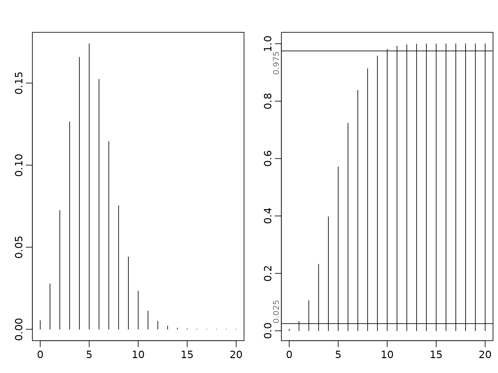
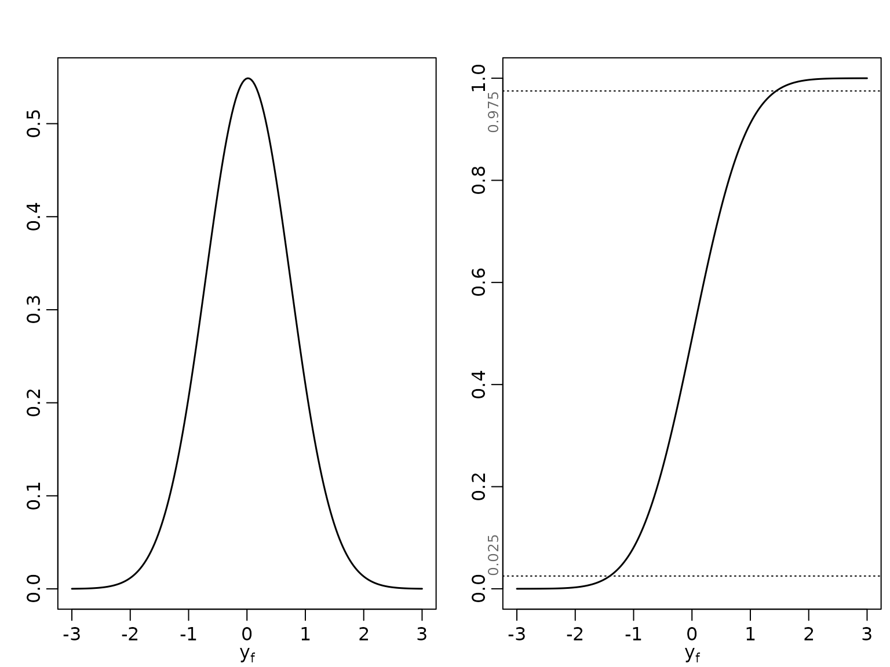
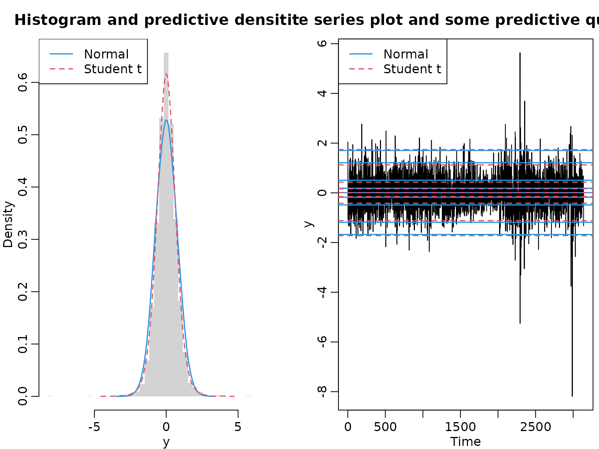
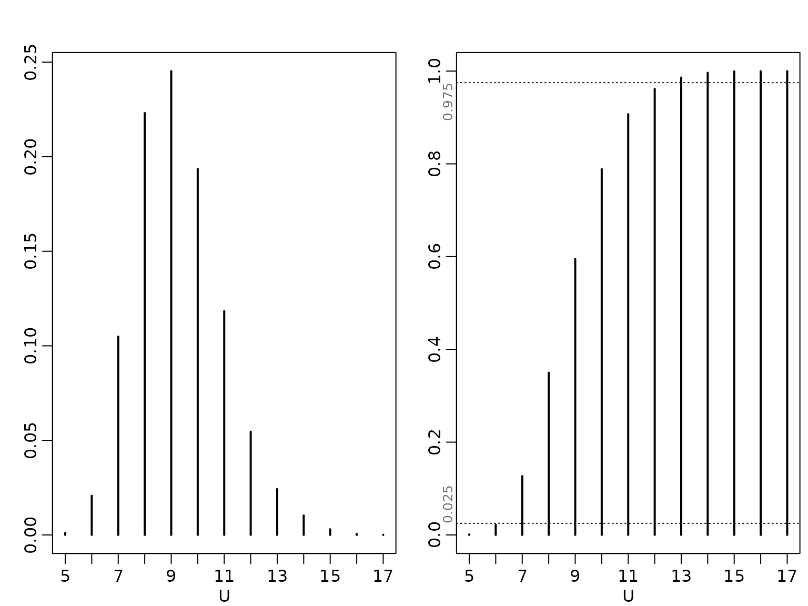

# Chapter 9: Bayesian Predictive Analysis

## Section 9.1

### Example 9.1: Road Safety Data

We load the data and extract the observations for the senior people in
Linz. We then plot the pdf and cdf for the predictive distribution which
corresponds under the flat prior to
$$y_{f}|\mathbf{y} \sim \mathcal{N}B\left( N\bar{y} + 1,N \right).$$

``` r
data("accidents", package = "BayesianLearningCode")
y <- accidents[, "seniors_accidents"]
(aN <- sum(y) + 1)
#> [1] 1009
(bN <- length(y))
#> [1] 192
mu <- aN / bN
yf <- 0:20
plot(yf, dnbinom(yf, size = aN, mu = mu),
     type = "h", xlab = bquote(y[f]), ylab = "", lwd = 2)
plot(yf, pnbinom(yf, size = aN, mu = mu),
     type = "h", xlab = bquote(y[f]), ylab = "", lwd = 2)
probs <- c(0.025, 0.975)
abline(h = probs, lty = 3)
mtext(probs, side = 2, at = probs, adj = c(0, 1), cex = .8, col = "dimgrey")
```



### Example 9.2: Exchange Rate Data

We load the data and then plot the pdf and cdf for the predictive
distribution which corresponds under the improper prior to
$$y_{f}|\mathbf{y} \sim {\mathcal{t}}_{2c_{N}}\left( \bar{y},\frac{Ns_{y}^{2}}{N - 1}\left( 1 + \frac{1}{N} \right) \right).$$

``` r
library("BayesianLearningCode")
data("exrates", package = "stochvol")
y <- 100 * diff(log(exrates$USD / exrates$CHF))
ybar <- mean(y)
N <- length(y)
b0 <- 0
N0 <- 0
c0 <- -1/2
C0 <- 0
BN <- 1 / (N + N0)
bN <- BN * (N * ybar + N0 * b0)
cN <- c0 + N/2
CN <- C0 + .5 * sum((y - ybar)^2) + N0 * N / (2 * (N0 + N)) * (b0 - ybar)^2
x <- seq(-3, 3, length.out = 200)
scale <- sqrt(CN / cN * (BN + 1))
plot(x, dstudt(x, location = bN, scale = scale, df = 2 * cN),
     type = "l", xlab = bquote(y[f]), ylab = "", lwd = 1.5)
plot(x, pstudt(x, location = bN, scale = scale, df = 2 * cN),
     type = "l", xlab = bquote(y[f]), ylab = "", lwd = 1.5)
probs <- c(0.025, 0.975)
abline(h = probs, lty = 3)
mtext(probs, side = 2, at = probs, adj = c(0, 1), cex = .8, col = "dimgrey")
```



We inspect the parameters of the Student-t distribution.

``` r
round(c(mu = bN, sigma2 = scale^2, df = 2 * cN), digits = 3)
#>       mu   sigma2       df 
#>    0.018    0.528 3138.000
```

### Example 9.3: Exchange Rate Data cont’d

To compare with a method that ignores parameter uncertainty, we now plot
the posterior predictive alongside the “classical” forecasting
distribution for varying $N$.

``` r
Ns <- c(5, 10, 30, N)

for (i in seq_along(Ns)) {
  N <- Ns[i]
  yshort <- y[1:N]
  ybar <- mean(yshort)
  BN <- 1 / (N + N0)
  bN <- BN * (N * ybar + N0 * b0)
  cN <- c0 + N/2
  CN <- C0 + .5 * sum((yshort - ybar)^2) + N0 * N / (2 * (N0 + N)) * (b0 - ybar)^2
  scale <- sqrt(CN / cN * (BN + 1))
  plot(x, dnorm(x, ybar, sd(yshort)), lty = 2, type = "l", lwd = 1.5,
       xlab = bquote(y[f]), ylab = "", main = paste("N =", N))
  lines(x, dstudt(x, location = bN, scale = scale, df = 2 * cN), lwd = 1.5)
}
```


### Example 9.4: Road Safety Data cont’d

We verify that a 95% predictive interval is given by \[1, 9\] using the
cdf and compute the effective coverage.

``` r
pnbinom(9, size = aN, mu = mu) - pnbinom(0, size = aN, mu = mu)
#> [1] 0.9522248
```

### Example 9.5: Exchange Rate Data cont’d

We determine the 95% predictive interval using the quantile function.

``` r
round(qstudt(probs, location = bN, scale = scale, df = 2 * cN), digits = 3)
#> [1] -1.408  1.443
```

We now work out the effective coverage of the naive interval which
ignores parameter uncertainty.

``` r
coverage <- rep(NA_real_, length(Ns))
names(coverage) <- Ns
for (i in seq_along(Ns)) {
  N <- Ns[i]
  yshort <- y[1:N]
  quants <- qnorm(probs, mean(yshort), sd(yshort))
  coverage[i] <- diff(pstudt(quants, mean(yshort), sd(yshort) * sqrt(1 + 1/N),
                             2 * (c0 + N/2)))
}
knitr::kable(t(round(coverage, 4)))
```

|      5 |     10 |     30 |   3139 |
|-------:|-------:|-------:|-------:|
| 0.8519 | 0.9055 | 0.9363 | 0.9499 |

### Example 9.8: Sampling-based prediction for the CHF/USD exchange rates

We proceed exactly as in Chapter 4. For the Gaussian distribution, the
posterior of $\sigma^{2}$ is inverse gamma, and we can easily generate
iid draws.

``` r
set.seed(2)
ndraws <- 10000
sigma2draws_normal <- rinvgamma(ndraws, N / 2, sum(y^2) / 2)
```

For the Student-$t$ model, we can use inverse transform sampling. First,
we draw uniformly from the interval spanned by 0 and the maximum of the
non-normalized cumulative posterior. Then, for each draw, we find the
interval of our pointwise cdf approximation of the posterior, and
interpolate linearly between the interval boundaries.

``` r
# We need the nonnormalized cumulative posterior distribution
post_nonnormalized_nonvec <- function(sigma2, y, nu, log = FALSE) {
  logdens <- -length(y) / 2 * log(sigma2) -
    (nu + 1) / 2 * sum(log(1 + y^2 / (nu * sigma2))) - log(sigma2)
  if (log) logdens else exp(logdens)
}
post_nonnormalized <- Vectorize(post_nonnormalized_nonvec, "sigma2")

# Now, we compute the pdf and cdf on a reasonably chosen grid
nu <- 7
sigma2 <- seq(0.25, 0.45, length.out = 3000)
pdf_u <- post_nonnormalized(sigma2, y = y, nu = nu)
pdf_u <- pdf_u / max(pdf_u)
cdf_u <- cumsum(pdf_u) / sum(pdf_u)

# Now we can perform inverse transpose sampling
unifdraws <- runif(ndraws, 0, cdf_u[length(cdf_u)])
leftind <- findInterval(unifdraws, cdf_u)
rightind <- leftind + 1L
distprop <- (unifdraws - cdf_u[leftind]) / (cdf_u[rightind] - cdf_u[leftind])
sigma2draws_t <- sigma2[leftind] + distprop *
  (sigma2[rightind] - sigma2[leftind])
```

Next, we simulate draws from the posterior predictive.

``` r
yf_normal <- rnorm(ndraws, 0, sqrt(sigma2draws_normal))
yf_t <- rstudt(ndraws, 0, sqrt(sigma2draws_t), 7)
```

Now we can compute their empirical quantiles, and those of the data.

``` r
quants <- c(0.01, 0.05, 0.25, 0.4, 0.5, 0.6, 0.75, 0.95, 0.99)
q_normal <- quantile(yf_normal, quants)
q_t <- quantile(yf_t, quants)
q_y <- quantile(y, quants)

knitr::kable(round(t(cbind("Data" = q_y, "Student t" = q_t,
                           "Gaussian" = q_normal)), 3))
```

|           |     1% |     5% |    25% |    40% |   50% |   60% |   75% |   95% |   99% |
|:----------|-------:|-------:|-------:|-------:|------:|------:|------:|------:|------:|
| Data      | -1.687 | -1.078 | -0.416 | -0.137 | 0.005 | 0.159 | 0.435 | 1.158 | 1.864 |
| Student t | -1.721 | -1.119 | -0.421 | -0.149 | 0.004 | 0.164 | 0.432 | 1.125 | 1.741 |
| Gaussian  | -1.676 | -1.185 | -0.487 | -0.177 | 0.008 | 0.185 | 0.507 | 1.211 | 1.704 |

We conclude by visualizing the data and the predictive distributions.

``` r
minmax <- ceiling(10 * max(abs(y))) / 10
grid <- seq(-minmax, minmax, length.out = 50)
hist(y, freq = FALSE, breaks = grid, border = NA,
     main = "Histogram and predictive densitites")
lines(density(yf_normal, adjust = 2), col = 4, lty = 1, lwd = 1.5)
lines(density(yf_t, adjust = 2), col = 2, lty = 2, lwd = 1.5)
legend("topleft", c("Normal", "Student t"), lty = 1:2, col = c(4,2), lwd = 1.5)
ts.plot(y, main = "Time series plot and some predictive quantiles")
abline(h = q_normal, col = 4, lty = 1, lwd = 1.5)
abline(h = q_t, col = 2, lty = 2, lwd = 1.5)
legend("topleft", c("Normal", "Student t"), lty = 1:2, col = c(4,2), lwd = 1.5)
```



### Example 9.9: Predicting yearly maxima for the road safety data

We use a sampling-based approach to obtain draws from posterior
predictive by first drawing from the posterior
$\mu|{\mathbb{y}} \sim \mathcal{G}\left( a_{N},b_{N} \right)$. Then,
using these draws as mean parameters for the Poisson likelihood, we draw
12 times each to obtain yearly predictions. Of these, we take the
maxima.

``` r
set.seed(1)
y <- accidents[, "seniors_accidents"]
aN <- sum(y) + 1
bN <- length(y)
mus <- rgamma(ndraws, aN, bN)
yfs <- matrix(rpois(12 * ndraws, mus), ncol = 12)
Us <- apply(yfs, 1, max)
```

Now we visualize.

``` r
plot(tab <- proportions(table(Us)), xlab = "U", ylab = "")
plot(as.table(cumsum(tab)), type = "h", xlab = "U", ylab = "")
probs <- c(0.025, 0.975)
abline(h = probs, lty = 3)
mtext(probs, side = 2, at = probs, adj = c(0, 1), cex = .8, col = "dimgrey")
```



### Example 9.11

``` r
theta <- 0.5
H <- 10
M <- 10000
```
