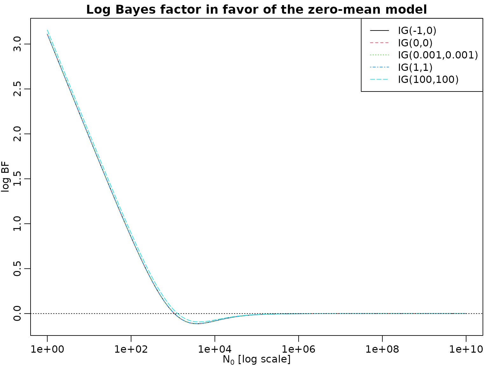
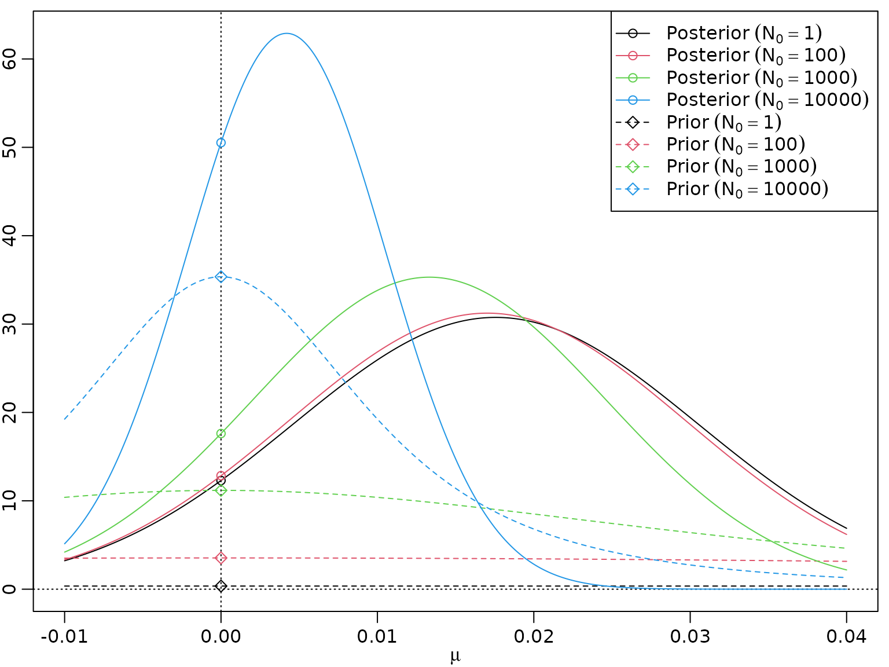
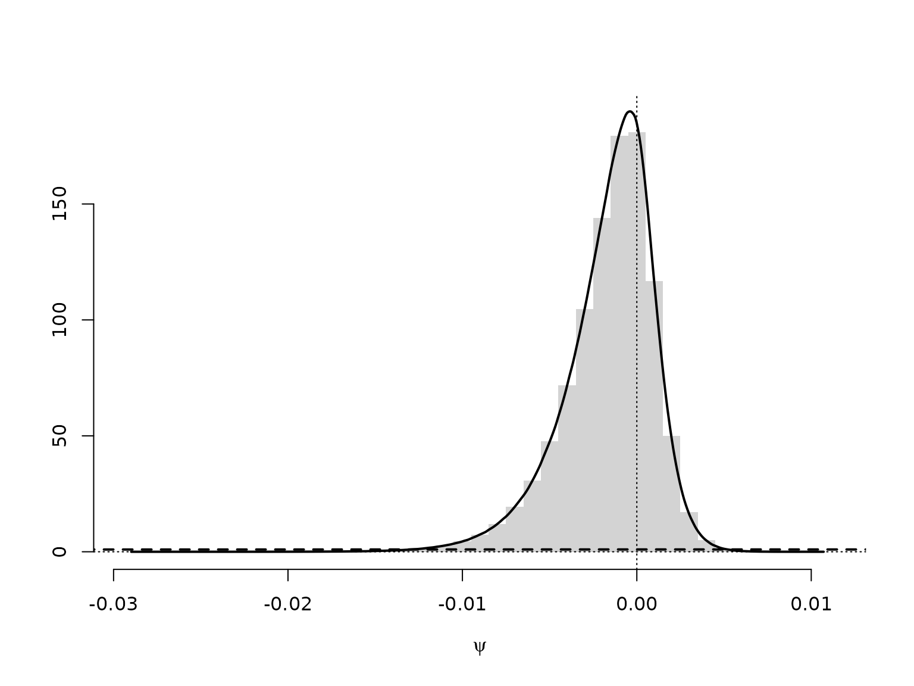

# Chapter 10: Bayesian Model Selection

## Section 10.1: The Foundations of Bayesian Model Selections

### Table 10.1: (Log) Bayes factor and model probabilities

``` r

logBF <- -7:7
BF <- exp(logBF)
PrM1 <- BF / (1 + BF)
PrM2 <- 1 - PrM1
knitr::kable(cbind(BF, logBF, PrM1, PrM2))
```

|           BF | logBF |      PrM1 |      PrM2 |
|-------------:|------:|----------:|----------:|
|    0.0009119 |    -7 | 0.0009111 | 0.9990889 |
|    0.0024788 |    -6 | 0.0024726 | 0.9975274 |
|    0.0067379 |    -5 | 0.0066929 | 0.9933071 |
|    0.0183156 |    -4 | 0.0179862 | 0.9820138 |
|    0.0497871 |    -3 | 0.0474259 | 0.9525741 |
|    0.1353353 |    -2 | 0.1192029 | 0.8807971 |
|    0.3678794 |    -1 | 0.2689414 | 0.7310586 |
|    1.0000000 |     0 | 0.5000000 | 0.5000000 |
|    2.7182818 |     1 | 0.7310586 | 0.2689414 |
|    7.3890561 |     2 | 0.8807971 | 0.1192029 |
|   20.0855369 |     3 | 0.9525741 | 0.0474259 |
|   54.5981500 |     4 | 0.9820138 | 0.0179862 |
|  148.4131591 |     5 | 0.9933071 | 0.0066929 |
|  403.4287935 |     6 | 0.9975274 | 0.0024726 |
| 1096.6331584 |     7 | 0.9990889 | 0.0009111 |

### Example 10.5: CHF exchange rate data - Testing the null hypothesis $`\mu = 0`$

Before producing Figure 10.1, we begin with a concrete example. We load
the data, compute the required parameters, and evaluate the two marginal
likelihoods.

``` r

data("exrates", package = "stochvol")
y <- 100 * diff(log(exrates$USD / exrates$CHF))

c0 <- 1
C0 <- 1
N0 <- 10^(-5:3)

N <- length(y)
cN <- c0 + N  / 2
CN_M1 <- C0 + sum(y^2) / 2
CN_M2 <- C0 + 0.5 * N * (mean((y - mean(y))^2) + N0 / (N0 + N) * mean(y)^2)

(logmarglikM1 <- lgamma(cN) + c0 * log(C0) -
   lgamma(c0) - cN * log(CN_M1) - 0.5 * N * log(2 * pi))
#> [1] -3456.478
(logmarglikM2 <- lgamma(cN) + c0 * log(C0) + 0.5 * log(N0) -
   lgamma(c0) - cN * log(CN_M2) - 0.5 * N * log(2 * pi) - 0.5 * log(N0 + N))
#> [1] -3465.344 -3464.192 -3463.041 -3461.890 -3460.739 -3459.588 -3458.440
#> [8] -3457.329 -3456.493
```

The “direct” formula for the log Bayes factor is even simpler, and we
can check whether we get the same answer.

``` r

(logBF <- 0.5 * (log(N0 + N) - log(N0)) + cN * (log(CN_M2) - log(CN_M1)))
#> [1] 8.86553606 7.71424355 6.56295141 5.41166293 4.26041101 3.10952463 1.96228321
#> [8] 0.85048010 0.01501194
all.equal(logBF, logmarglikM1 - logmarglikM2)
#> [1] TRUE
```

Now we are ready to investigate the sensitivity of the log Bayes factor
with respect to prior hyperparameter choices.

``` r

c0 <- c(-1, 0, 0.001, 1, 100)
C0 <- c(0, 0, 0.001, 1, 100)
N0 <- 10^seq(1, 10, by = 0.1)

logBF <- matrix(NA_real_, nrow = length(N0), ncol = length(c0))
for (i in seq_along(c0)) {
  cN <- c0[i] + N  / 2
  CN_M1 <- C0[i] + sum(y^2) / 2
  CN_M2 <- C0[i] + 0.5 * N * (mean((y - mean(y))^2) + N0 / (N0 + N) * mean(y)^2)
  logBF[, i] <- 0.5 * (log(N0 + N) - log(N0)) + cN * (log(CN_M2) - log(CN_M1))
}
matplot(N0, logBF, log = "x", type = "l",
        xlab = expression(paste(N[0], " [log scale]")), ylab = "log BF")
abline(h = 0, lty = 3)
legend("topright", paste0("IG(", c0, ",", C0, ")"), col = seq_along(c0),
       lty = seq_along(c0))
title("Log Bayes factor in favor of the zero-mean model")
```



## Section 10.2: Bayesian Testing of Hypotheses

### Example 10.6: Labor market data - Testing for heterogeneity of the no-income risk

First, we re-load the data from Chapter 3.

``` r

data("labor", package = "BayesianLearningCode")
labor <- subset(labor,
                income_1997 != "zero" & female,
                c(income_1998, wcollar_1986))
labor <- with(labor,
              data.frame(unemployed = income_1998 == "zero",
                         wcollar = wcollar_1986))
```

Next, we compute the marginal likelihoods for the homogeneity model.

``` r

N <- length(labor$unemployed)
SN <- sum(labor$unemployed)
hN <- SN / N
N0 <- c(2, 10)
a0 <- c(1, 0.5, hN * N0) 
b0 <- c(1, 0.5, N0 * (1 - hN))

aN <- a0 + sum(labor$unemployed)
bN <- b0 + N - sum(labor$unemployed)

logmarglikM1 <- lbeta(aN, bN) - lbeta(a0, b0)
```

And for the heterogeneity model.

``` r

N1 <- with(labor, sum(wcollar))
SN1 <- with(labor, sum(wcollar & unemployed))
N2 <- with(labor, sum(!wcollar))
SN2 <- with(labor, sum(!wcollar & unemployed))
hN <- (SN1 + SN2) / (N1 + N2) # redundant, same as above
a01 <- a02 <- c(1, 0.5, hN * N0) # redundant, same as a0
b01 <- b02 <- c(1, 0.5, N0 * (1 - hN)) # redundant, same as b0

aN1 <- a01 + SN1
bN1 <- b01 + N1 - SN1
aN2 <- a02 + SN2
bN2 <- b02 + N2 - SN2

logmarglikM2 <- lbeta(aN1, bN1) + lbeta(aN2, bN2) -
   lbeta(a01, b01) - lbeta(a02, b02)
```

We can now compute the model probabilities and the log BFs.

``` r

logBF <- logmarglikM1 - logmarglikM2
PrM2 <- 0.5 / (0.5 + 0.5 * exp(logBF))
PrM1 <- 1 - PrM2
#print(xtable::xtable(res, digits = c(0, 2, 2, 5, 5, 5), row.names = FALSE))
knitr::kable(res <- cbind(logmarglikM1, logmarglikM2, logBF, PrM1, PrM2))
```

| logmarglikM1 | logmarglikM2 |     logBF |      PrM1 |      PrM2 |
|-------------:|-------------:|----------:|----------:|----------:|
|    -387.5820 |    -385.9187 | -1.663244 | 0.1593270 | 0.8406730 |
|    -387.5560 |    -385.8867 | -1.669302 | 0.1585173 | 0.8414827 |
|    -387.2933 |    -385.3980 | -1.895305 | 0.1306408 | 0.8693592 |
|    -386.2587 |    -383.4054 | -2.853317 | 0.0545101 | 0.9454899 |

### Example 10.7: Stomach cancer data - Testing for heterogeneity of the mortality rate

We proceed exactly as above, just with different data.

``` r

N1  <- 1668 # number at risk in City A
SN1 <- 2    # cancer deaths in City A
N2  <- 583  # number at risk in City B
SN2 <- 1    # cancer deaths in City B
```

We again begin with the homogeneity model.

``` r

N <- N1 + N2
SN <- SN1 + SN2
hN <- SN / N
N0 <- c(2, 10)
a0 <- c(1, 0.5, hN * N0) 
b0 <- c(1, 0.5, N0 * (1 - hN))

aN <- a0 + SN
bN <- b0 + N - SN

logmarglikM1 <- lbeta(aN, bN) - lbeta(a0, b0)
```

Followed by the heterogeneity model.

``` r

a01 <- a02 <- a0
b01 <- b02 <- b0

aN1 <- a01 + SN1
bN1 <- b01 + N1 - SN1
aN2 <- a02 + SN2
bN2 <- b02 + N2 - SN2

logmarglikM2 <- lbeta(aN1, bN1) + lbeta(aN2, bN2) -
   lbeta(a01, b01) - lbeta(a02, b02)
```

We can now compute the model probabilities and the log BFs.

``` r

logBF <- logmarglikM1 - logmarglikM2
PrM2 <- 0.5 / (0.5 + 0.5 * exp(logBF))
PrM1 <- 1 - PrM2
#print(xtable::xtable(res, digits = c(0, 2, 2, 3, 3, 3), row.names = FALSE))
knitr::kable(res <- cbind(logmarglikM1, logmarglikM2, logBF, PrM1, PrM2))
```

| logmarglikM1 | logmarglikM2 |    logBF |      PrM1 |      PrM2 |
|-------------:|-------------:|---------:|----------:|----------:|
|    -29.08387 |    -34.30308 | 5.219212 | 0.9946175 | 0.0053825 |
|    -26.95877 |    -30.22452 | 3.265757 | 0.9632352 | 0.0367648 |
|    -28.40707 |    -33.09584 | 4.688776 | 0.9908859 | 0.0091141 |
|    -26.84585 |    -29.97906 | 3.133212 | 0.9582421 | 0.0417579 |

### Example 10.8: Testing for a structural break in the road safety data

We load the data.

``` r

data("accidents", package = "BayesianLearningCode")
```

We define the priors hyperparameters and compute the log marginal
likelihood for the exchangable model.

``` r

y <- accidents[, "children_accidents"]
a0_tmp <- c(0.01, 0.1, 0.5, 1, 2)
m0_tmp <- c(1, mean(y), 5, 7, 10)
grid <- expand.grid(a0 = a0_tmp, m0 = m0_tmp)
a0 <- grid$a0
b0 <- grid$a0 / grid$m0
aN <- sum(y) + a0
bN <- length(y) + b0
logmarglikM1 <- matrix(a0 * log(b0) + lgamma(aN) -
                       aN * log(bN) - lgamma(a0) -
                       sum(lgamma(y + 1)),
                       nrow = length(a0_tmp), ncol = length(m0_tmp),
                       dimnames = list(a0 = a0_tmp, m0 = round(m0_tmp, 2)))
knitr::kable(round(logmarglikM1, 2))
```

|      |       1 |    1.84 |       5 |       7 |      10 |
|:-----|--------:|--------:|--------:|--------:|--------:|
| 0.01 | -320.55 | -320.55 | -320.55 | -320.55 | -320.56 |
| 0.1  | -318.50 | -318.47 | -318.51 | -318.53 | -318.56 |
| 0.5  | -317.43 | -317.31 | -317.49 | -317.61 | -317.75 |
| 1    | -317.12 | -316.89 | -317.26 | -317.49 | -317.77 |
| 2    | -316.96 | -316.51 | -317.24 | -317.70 | -318.26 |

And now the same for the model with structural break.

``` r

accidents1 <- window(accidents, end = c(1994, 9))
accidents2 <- window(accidents, start = c(1994, 10))

a01 <- a02 <- a0
b01 <- b02 <- b0

aN1 <- a01 + sum(accidents1[, "children_accidents"])
aN2 <- a02 + sum(accidents2[, "children_accidents"])
bN1 <- b01 + length(accidents1[, "children_accidents"])
bN2 <- b02 + length(accidents2[, "children_accidents"])

logmarglikM2 <- matrix(a01 * log(b01) + lgamma(aN1) +
                       a02 * log(b02) + lgamma(aN2) -
                       aN1 * log(bN1) - lgamma(a01) -
                       aN2 * log(bN2) - lgamma(a02) -
                       sum(lgamma(y + 1)),
                       nrow = length(a0_tmp), ncol = length(m0_tmp),
                       dimnames = list(a0 = a0_tmp, m0 = round(m0_tmp, 2)))
knitr::kable(round(logmarglikM2, 2))
```

|      |       1 |    1.84 |       5 |       7 |      10 |
|:-----|--------:|--------:|--------:|--------:|--------:|
| 0.01 | -321.40 | -321.40 | -321.40 | -321.41 | -321.41 |
| 0.1  | -317.30 | -317.25 | -317.33 | -317.37 | -317.43 |
| 0.5  | -315.17 | -314.94 | -315.31 | -315.54 | -315.81 |
| 1    | -314.58 | -314.12 | -314.85 | -315.31 | -315.86 |
| 2    | -314.30 | -313.38 | -314.83 | -315.75 | -316.86 |

We can now compute log Bayes factors and corresponding model
probabilities (under uniform prior probabilities).

``` r

logBF <- logmarglikM1[, 2] - logmarglikM2[, 2]
PrM2 <- 0.5 / (0.5 + 0.5 * exp(logBF))
PrM1 <- 1 - PrM2
knitr::kable(round(rbind(PrM1, PrM2), 3))
```

|      |  0.01 |   0.1 |   0.5 |     1 |     2 |
|:-----|------:|------:|------:|------:|------:|
| PrM1 | 0.701 | 0.228 | 0.086 | 0.059 | 0.042 |
| PrM2 | 0.299 | 0.772 | 0.914 | 0.941 | 0.958 |

### Example 10.9: CHF exchange rate data - Testing normal versus Student t

After loading the data, we define the degrees of freedom $`\nu`$ and the
prior hyperparameters.

``` r

y <- 100 * diff(log(exrates$USD / exrates$CHF))
N <- length(y)
nu <- 7
c10 <- c30 <- 3
C10 <- 3
C30 <- (nu - 2) / nu * C10
```

We now compute log marginal likelihoods. This is straightforward for the
normal model.

``` r

c1N <- c10 + N / 2
C1N <- C10 + sum(y^2) / 2

logmarglikM1 <- lgamma(c1N) + c10 * log(C10) -
   lgamma(c10) - c1N * log(C1N) - 0.5 * N * log(2 * pi)
```

For the Student $`t`$ model, we need, e.g., numerical integration. Note
that we apply the “log-sum-exp” trick here to normalize the integrand so
that its maximum is 1.

``` r

integrand_nonvec <- function(sigma2, y, c0, C0, nu, const = 0, log = FALSE) {
  N <- length(y)
  logint <- -(N/2 + c0 + 1) * log(sigma2) -
            0.5 * (nu + 1) * sum(log(1 + y^2 / (nu * sigma2))) -
            C0 / sigma2
  if (log) logint + const else exp(logint + const)
}
integrand <- Vectorize(integrand_nonvec, "sigma2")

resolution <- 1000
grid <- seq(0.1, 0.7, length.out = resolution + 1)

logtmp <- integrand(grid, y, c30, C30, nu, log = TRUE)
const <- -max(logtmp)
tmp <- exp(logtmp + const)
plot(grid, tmp, type = 'l')
```


``` r

logarea <- log(sum(diff(grid) * .5 * (head(tmp, -1) + tail(tmp, -1)))) - const

logmarglikM3 <- c30 * log(C30) +
                N * lgamma((nu + 1) / 2) -
                lgamma(c30) -
                N * lgamma(nu / 2) -
                N / 2 * log(nu * pi) +
                logarea
```

We can now compute log Bayes factors and corresponding model
probabilities (under equal prior model probabilities).

``` r

logBF <- logmarglikM1 - logmarglikM3
PrM3 <- 0.5 / (0.5 + 0.5 * exp(logBF))
PrM1 <- 1 - PrM3
knitr::kable(cbind(logML1 = logmarglikM1, logML3 = logmarglikM3,
                   BF = exp(logBF), logBF = logBF, Pr1 = PrM1, Pr3 = PrM3))
```

|    logML1 |    logML3 |  BF |     logBF | Pr1 | Pr3 |
|----------:|----------:|----:|----------:|----:|----:|
| -3456.384 | -3305.694 |   0 | -150.6898 |   0 |   1 |

### Example 10.10: Eye tracking data - Testing homogeneity against unobserved heterogeneity

We begin by loading the data and specifying the hyperparameters.

``` r

data("eyetracking", package = "BayesianLearningCode")
y <- eyetracking$anomalies
N <- length(y)

a0_tmp <- c(0.1, 0.5, 1, 2)
m0_tmp <- c(1, mean(y), 5, 10, 20)
grid <- expand.grid(a0 = a0_tmp, m0 = m0_tmp)
a0 <- grid$a0
m0 <- grid$m0
b0 <- a0 / m0
```

Now we can compute and print the log marginal likelihoods.

``` r

logmarglikM1 <- a0 * log(b0) + lgamma(a0 + sum(y)) -
                lgamma(a0) - (a0 + sum(y)) * log(b0 + N) -
                sum(lgamma(y + 1))

logmarglikM2 <- rep(NA_real_, length(a0))
for (i in seq_along(a0)) {
  logmarglikM2[i] <- N * a0[i] * log(b0[i]) + sum(lgamma(a0[i] + y)) -
                     N * lgamma(a0[i]) - sum(a0[i] + y) * log(b0[i] + 1) -
                     sum(lgamma(y + 1))
}

knitr::kable(matrix(logmarglikM1, nrow = length(a0_tmp), ncol = length(m0_tmp),
             dimnames = list(a0 = a0_tmp, m0 = round(m0_tmp, 2))), digits = 2)
```

|     |       1 |    3.52 |       5 |      10 |      20 |
|:----|--------:|--------:|--------:|--------:|--------:|
| 0.1 | -472.91 | -472.78 | -472.78 | -472.82 | -472.87 |
| 0.5 | -472.25 | -471.62 | -471.64 | -471.81 | -472.07 |
| 1   | -472.45 | -471.20 | -471.25 | -471.59 | -472.11 |
| 2   | -473.31 | -470.81 | -470.92 | -471.60 | -472.63 |

``` r


knitr::kable(matrix(logmarglikM2, nrow = length(a0_tmp), ncol = length(m0_tmp),
             dimnames = list(a0 = a0_tmp, m0 = round(m0_tmp, 2))), digits = 2)
```

|     |       1 |    3.52 |       5 |      10 |      20 |
|:----|--------:|--------:|--------:|--------:|--------:|
| 0.1 | -249.61 | -237.68 | -238.22 | -241.61 | -246.80 |
| 0.5 | -271.04 | -223.77 | -226.24 | -242.34 | -267.54 |
| 1   | -316.77 | -241.38 | -245.87 | -276.12 | -324.87 |
| 2   | -381.56 | -273.80 | -281.39 | -335.39 | -426.86 |

### Example 10.11: Eye tracking data - Testing Poisson vs. negative binomial

In the negative binomial case, if $`a_0`$ is fixed and $`b_0`$ follows a
beta prime prior, we have a closed-form expression for the marginal
likelihood.

``` r

alpha_b0 <- rep(6, length(a0))
beta_b0 <- (alpha_b0 - 1) * m0 / a0
sdb0 <- sqrt(alpha_b0 * (alpha_b0 + beta_b0 - 1) /
             ((beta_b0 - 2) * (beta_b0 - 1)^2))
alpha_bN <- alpha_b0 + N * a0
beta_bN <- beta_b0 + sum(y)

logmarglikM3 <- rep(NA_real_, length(a0))
for (i in seq_along(a0)) {
  logmarglikM3[i] <- lbeta(alpha_bN[i], beta_bN[i]) - lbeta(alpha_b0[i], beta_b0[i]) -
                     N * lgamma(a0[i]) + sum(lgamma(a0[i] + y)) - sum(lgamma(y + 1))
}

knitr::kable(matrix(logmarglikM3, nrow = length(a0_tmp), ncol = length(m0_tmp),
             dimnames = list(a0 = a0_tmp, m0 = round(m0_tmp, 2))), digits = 2)
```

|     |       1 |    3.52 |       5 |      10 |      20 |
|:----|--------:|--------:|--------:|--------:|--------:|
| 0.1 | -241.31 | -238.24 | -238.23 | -239.61 | -242.82 |
| 0.5 | -228.15 | -224.98 | -224.96 | -227.12 | -233.66 |
| 1   | -245.75 | -242.92 | -242.88 | -245.01 | -252.11 |
| 2   | -278.03 | -275.68 | -275.62 | -277.48 | -284.21 |

### Example 10.12: CHF exchange rate data - Savage-Dickey density ratio

``` r

library("BayesianLearningCode")
#> 
#> Attaching package: 'BayesianLearningCode'
#> The following object is masked _by_ '.GlobalEnv':
#> 
#>     labor
y <- 100 * diff(log(exrates$USD / exrates$CHF))

c0R <- 1
c0U <- c0R - 1/2 # This is needed for the SD theorem to be valid!
C0 <- 1
N0s <- N0 <- 10^(seq(2.5, 7, by = .1))

N <- length(y)
bNs <- sum(y) / (N0s + N)
cNR <- c0R + N / 2
cNU <- c0U + N / 2
CNs <- C0 + 0.5 * sum((y - mean(y))^2) + 0.5 * N * N0s * mean(y)^2 / (N0s + N)

(logSD <- dstudt(0, bNs, sqrt(CNs / (cNU * (N0s + N))), df = 2 * cNU, log = TRUE) -
          dstudt(0, 0, sqrt(C0 / (c0U * N0s)), df = 2 * c0U, log = TRUE))
#>  [1] 1.2539440 1.1698030 1.0920726 1.0216664 0.9594487 0.9061529 0.8622889
#>  [8] 0.8280519 0.8032528 0.7872897 0.7791769 0.7776305 0.7811990 0.7884095
#> [15] 0.7979005 0.8085183 0.8193645 0.8298015 0.8394245 0.8480177 0.8555049
#> [22] 0.8619045 0.8672923 0.8717745 0.8754681 0.8784890 0.8809449 0.8829321
#> [29] 0.8845339 0.8858211 0.8868532 0.8876790 0.8883389 0.8888655 0.8892853
#> [36] 0.8896197 0.8898860 0.8900979 0.8902665 0.8904006 0.8905072 0.8905919
#> [43] 0.8906592 0.8907127 0.8907553 0.8907891

plot(N0s, logSD, type = "l", log = "x")
```


Let us double-check this:

``` r

CN_M1 <- C0 + sum(y^2) / 2

logmarglikM1 <- lgamma(cNR) + c0R * log(C0) -
   lgamma(c0R) - cNR * log(CN_M1) - 0.5 * N * log(2 * pi)
logmarglikM2 <- lgamma(cNU) + c0U * log(C0) + 0.5 * log(N0) -
   lgamma(c0U) - cNU * log(CNs) - 0.5 * N * log(2 * pi) - 0.5 * log(N0 + N)

(logBF <- logmarglikM1 - logmarglikM2)
#>  [1] 1.2539440 1.1698030 1.0920726 1.0216664 0.9594487 0.9061529 0.8622889
#>  [8] 0.8280519 0.8032528 0.7872897 0.7791769 0.7776305 0.7811990 0.7884095
#> [15] 0.7979005 0.8085183 0.8193645 0.8298015 0.8394245 0.8480177 0.8555049
#> [22] 0.8619045 0.8672923 0.8717745 0.8754681 0.8784890 0.8809449 0.8829321
#> [29] 0.8845339 0.8858211 0.8868532 0.8876790 0.8883389 0.8888655 0.8892853
#> [36] 0.8896197 0.8898860 0.8900979 0.8902665 0.8904006 0.8905072 0.8905919
#> [43] 0.8906592 0.8907127 0.8907553 0.8907891
all.equal(logSD, logBF)
#> [1] TRUE
```

Here is a visualization.

``` r

mus <- seq(-.01, .02, 0.0001)
plot(NULL, xlim = range(mus), log = "", xlab = expression(mu), ylab = "",
     ylim = range(dstudt(mus,
                         bNs[length(N0s)],
                         sqrt(CNs[length(N0s)] / (cNU * (N0s[length(N0s)] + N))),
                         df = 2 * cNU)))
abline(v = 0, lty = 3)
abline(h = 0, lty = 3)
for (i in seq_along(N0s)) {
  lines(mus, dstudt(mus, 0, sqrt(C0 / (c0R * N0s[i])), df = 2 * c0R),
        lty = 2, col = i)
  lines(mus, dstudt(mus, bNs[i], sqrt(CNs[i] / (cNU * (N0s[i] + N))), df = 2 * cNU),
        lty = 1, col = i)
  points(c(0, 0),
         c(dstudt(0, 0, sqrt(C0 / (c0R * N0s[i])), df = 2 * c0R),
           dstudt(0, bNs[i], sqrt(CNs[i] / (cNU * (N0s[i] + N))), df = 2 * cNU)),
         col = i, pch = c(1, 16))
}
legend("topright",
       paste0(rep(c("Posterior (N0 = ", "Prior (N0 = "), each = length(N0)),
              rep(N0, 2), ")"),
       lty = rep(c(1, 2), each = length(N0)),
       pch = rep(c(16, 1), each = length(N0)), 
       col = rep(seq_along(N0), 2))
```



### Example 10.13: Labor market data - Savage-Dickey density ratio for the no-income-risk homogeneity test

We only need to re-estimate the heterogeneity model which we use to
simulate the prior and the posterior of the no-income-risk difference.

``` r

set.seed(42)
M <- 10000000

a01 <- a02 <- 1
b01 <- b02 <- 1
N1 <- with(labor, sum(wcollar))
SN1 <- with(labor, sum(wcollar & unemployed))
N2 <- with(labor, sum(!wcollar))
SN2 <- with(labor, sum(!wcollar & unemployed))

aN1 <- a01 + SN1
bN1 <- b01 + N1 - SN1
aN2 <- a02 + SN2
bN2 <- b02 + N2 - SN2

psi <- rbeta(M, aN1, bN1) - rbeta(M, aN2, bN2)
mybreaks <- seq(floor(200 * min(psi)) / 200 - 0.0025,
                ceiling(200 * max(psi)) / 200 + 0.0025,
                by = 0.005)
hist(psi, breaks = mybreaks, freq = FALSE, xlab = expression(psi),
     main = "", ylab = "", border = NA)
lines(c(-1, 0, 1), c(0, 1, 0), lty = 2, lwd = 2)
abline(v = 0, lty = 3)
abline(h = 0, lty = 3)

# Estimate density
lines(d <- density(psi), lwd = 2)
```


We can approximate the Bayes factor through the estimated Savage-Dickey
density ratio. Note, though, that this can be a very poor approximation.

``` r

# Evaluate as close a possible to zero (with linear interpolation)
x1 <- sum(d$x < 0) # Find largest x below 0
x2 <- x1 + 1L      # Find smallest x above 0
pos <- -d$x[x1] / (d$x[x2] - d$x[x1])
dpost <- (1 - pos) * d$y[x1] + pos * d$y[x2]

# The prior is a symmetric triangular distribution on [-1, 1], thus p(0) = 1
dprior <- 1

(logSD <- log(dpost) - log(dprior))
#> [1] -1.657269
```

### Example 10.14: Stomach cancer data - Savage-Dickey density ratio for the mortality rate homogeneity test

As above, with different data.

``` r

N1  <- 1668 # number at risk in City A
SN1 <- 2    # cancer deaths in City A
N2  <- 583  # number at risk in City B
SN2 <- 1    # cancer deaths in City B

aN1 <- a01 + SN1
bN1 <- b01 + N1 - SN1
aN2 <- a02 + SN2
bN2 <- b02 + N2 - SN2

psi <- rbeta(M, aN1, bN1) - rbeta(M, aN2, bN2)
mybreaks <- seq(floor(1000 * min(psi)) / 1000 - 0.0005,
                ceiling(1000 * max(psi)) / 1000 + 0.0005,
                by = 0.001)
d <- density(psi)
hist(psi, breaks = mybreaks, freq = FALSE, xlab = expression(psi),
     main = "", ylab = "", ylim = c(0, max(d$y)), border = NA)
lines(d, lwd = 2)
lines(c(-1, 0, 1), c(0, 1, 0), lty = 2, lwd = 2)
abline(v = 0, lty = 3)
abline(h = 0, lty = 3)
```



We can approximate the Bayes factor through the estimated Savage-Dickey
density ratio. Note, though, that this can be a very poor approximation.

``` r

x1 <- sum(d$x < 0) # Find largest x below 0
x2 <- x1 + 1L      # Find smallest x above 0
pos <- -d$x[x1] / (d$x[x2] - d$x[x1])
dpost <- (1 - pos) * d$y[x1] + pos * d$y[x2]
dprior <- 1
(logSD <- log(dpost) - log(dprior))
#> [1] 5.218816
```

### Example 10.15: Road safety data - Lindley’s paradoxon

``` r

a0 <- c(0.01, 0.1, 0.5, 1:5)
res <- rbind(gamma(a0))
colnames(res) <- a0
knitr::kable(res)
```

|     0.01 |      0.1 |      0.5 |   1 |   2 |   3 |   4 |   5 |
|---------:|---------:|---------:|----:|----:|----:|----:|----:|
| 99.43259 | 9.513508 | 1.772454 |   1 |   1 |   2 |   6 |  24 |
