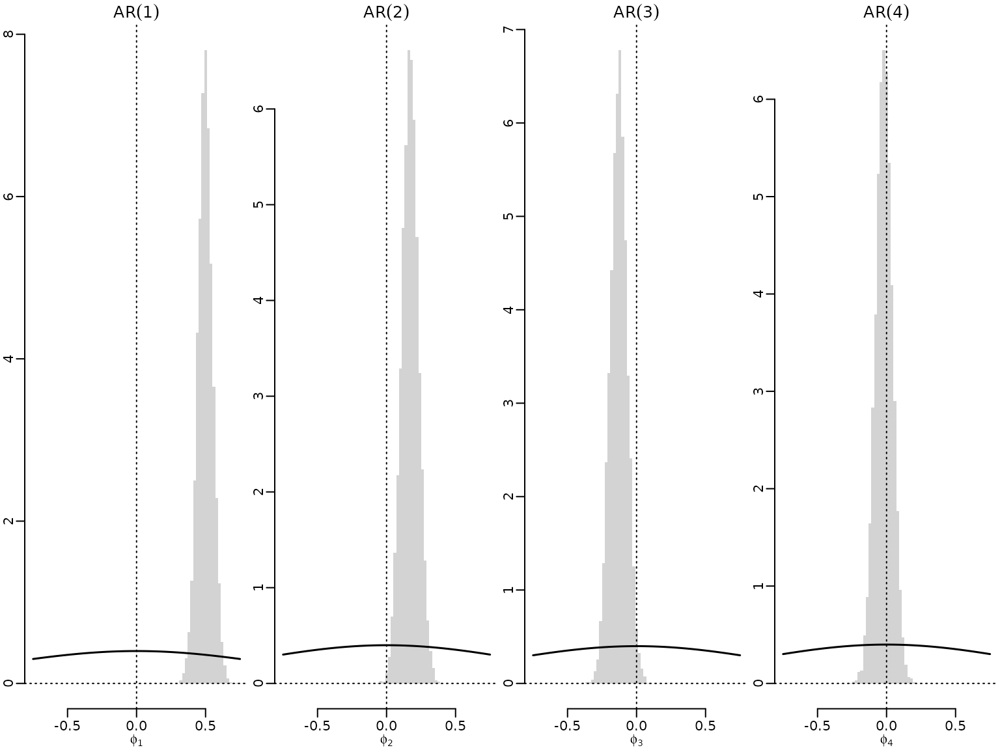

# Chapter 11: Bayesian Model Selection in Regression and Time Series Analysis

## Section 11.4: Model Selection Problems in Time Series Analysis

## Section 11.4.1: Selecting the model order in an AR(p) model

Akin to Chapter 7, we load the US GDP data, restrict our analysis to the
time before the COVID outbreak, and compute log returns.

``` r

data("gdp", package = "BayesianLearningCode")
dat <- gdp[1:which(names(gdp) == "2019-10-01")]
logret <- log(dat[-1]) - log(dat[-length(dat)])
logret <- ts(logret, start = c(1947, 2), end = c(2019, 4),
             frequency = 4)
```

We re-use the regression function defined in Chapter 7, again using the
tools developed in Chapter 6.

``` r

library("BayesianLearningCode")
library("mvtnorm")

regression <- function(y, X, prior = "improper", b0 = 0, B0 = 1, c0 = 0.01,
                       C0 = 0.01, nburn = 1000L, M = 10000L) {
  
  N <- nrow(X)
  d <- ncol(X)
  
  if (length(b0) == 1L) b0 <- rep(b0, d)
  
  if (!is.matrix(B0)) {
    if (length(B0) == 1L) {
      B0 <- diag(rep(B0, d))
    } else {
      B0 <- diag(B0)
    }
  }
  
  if (prior == "improper") {

    fit <- lm.fit(X, y)
    betahat <- fit$coefficients
    SSR <- sum(fit$residuals^2)
    cN <- (N - d) / 2
    CN <- SSR / 2
    bN <- betahat
    BN <- solve(crossprod(X))
    
    sigma2s <- rinvgamma(M, cN, CN)
    betas <- matrix(NA_real_, M, d)
    for (i in seq_len(M)) betas[i, ] <- rmvnorm(1, bN, sigma2s[i] * BN)
  
  } else if (prior == "conjugate") {
    
    B0inv <- solve(B0)
    BNinv <- B0inv + crossprod(X)
    BN <- solve(BNinv)
    bN <- BN %*% (B0inv %*% b0 + crossprod(X, y))
    Seps0 <- crossprod(y) + crossprod(b0, B0inv) %*% b0 -
      crossprod(bN, BNinv) %*% bN
    cN <- c0 + N / 2
    CN <- C0 + Seps0 / 2
    
    sigma2s <- rinvgamma(M, cN, CN)
    betas <- matrix(NA_real_, M, d)
    for (i in seq_len(M)) betas[i, ] <- rmvnorm(1, bN, sigma2s[i] * BN)
  
  } else if (prior == "semi-conjugate") {
    
    # Precompute some values
    B0inv <- solve(B0)
    B0invb0 <- B0inv %*% b0
    cN <- c0 + N / 2
    XX <- crossprod(X)
    Xy <- crossprod(X, y)
    
    # Prepare memory to store the draws
    betas <- matrix(NA_real_, nrow = M, ncol = d)
    sigma2s <- rep(NA_real_, M)
    colnames(betas) <- colnames(X)
    
    # Set the starting value for sigma2
    sigma2 <- var(y) / 2
    
    # Run the Gibbs sampler
    for (m in seq_len(nburn + M)) {
      # Sample beta from its full conditional
      BN <- solve(B0inv + XX / sigma2) 
      bN <- BN %*% (B0invb0 + Xy / sigma2)
      beta <- rmvnorm(1, mean = bN, sigma = BN)
      
      # Sample sigma^2 from its full conditional
      eps <- y - tcrossprod(X, beta)
      CN <- C0 + crossprod(eps) / 2
      sigma2 <- rinvgamma(1, cN, CN)
      
      # Store the results
      if (m > nburn) {
        betas[m - nburn, ] <- beta
        sigma2s[m - nburn] <- sigma2
      }
    }
  }
  list(betas = betas, sigma2s = sigma2s)
}
```

We also need a function to create the AR-specific design matrix (also
re-used from Chapter 7).

``` r

ARdesignmatrix <- function(dat, p = 1) {
  d <- p + 1
  N <- length(dat) - p

  Xy <- matrix(NA_real_, N, d)
  Xy[, 1] <- 1
  for (i in seq_len(p)) {
    Xy[, i + 1] <- dat[(p + 1 - i) : (length(dat) - i)]
  }
  Xy
}
```

Now we are ready to reproduce the results in the book.

### Example 11.8: US GDP data: Choosing the model order via Savage-Dickey density ratios

We obtain draws for four AR models under the semi-conjugate prior.

``` r

set.seed(42)
b0 <- 0
B0 <- 1
res <- vector("list", 4)
for (p in 1:4) {
  y <- tail(logret, -p)
  Xy <- ARdesignmatrix(logret, p)
  res[[p]] <- regression(y, Xy, prior = "semi-conjugate",
                         b0 = b0, B0 = B0, c0 = 2, C0 = 0.001)
}
```

### Figure 11.2: Graphical assessment of the Savage-Dickey density ratio

Now we plot the draws for the leading coefficient, i.e., the coefficient
corresponding to the highest lag in each of the models, along with the
marginal prior.

``` r

mymin <- -.75
mymax <- .75
mybreaks <- seq(mymin, mymax, by = .02)
myats <- seq(mymin, mymax, length.out = 200)
for (p in 1:4) {
  hist(res[[p]]$betas[, p + 1], freq = FALSE, main = bquote(AR(.(p))),
       xlab = bquote(phi[.(p)]), ylab = "", breaks = mybreaks, border = NA)
  abline(v = 0, lty = 3)
  abline(h = 0, lty = 3)
  lines(myats, dnorm(myats, b0, sqrt(B0)), lwd = 1.5)
}
```



``` r

dev.off()
#> null device 
#>           1
```

### Section 11.4.3: Bayesian testing for first-order markov chain models

### Example 11.18: Application to Austrian wage mobility data - homogeneity versus grouped model

We load the data and reduce the observations to workers from the birth
cohort 1946-1960.

``` r

data("labor", package = "BayesianLearningCode")
labor <- subset(labor, birthyear >= 1946 & birthyear <= 1960)
```

We extract the income columns and transform the data to obtain for each
worker the matrix which contains the number of transitions from one
class to the other, i.e., the matrix with values $`N_{i,hk}`$.

``` r

income <- labor[, grepl("^income", colnames(labor))]
income <- sapply(income, as.integer)
colnames(income) <- gsub("income_", "", colnames(income))
getTransitions <- function(x, classes) {
    transitions <- matrix(0, length(classes), length(classes))
    for (i in seq_len(length(x) - 1)) {
        transitions[x[i], x[i + 1]] <- transitions[x[i], x[i + 1]] + 1
    }
    dimnames(transitions) <- list(from = classes, to = classes)
    transitions
}
income_transitions <-
    lapply(seq_len(nrow(income)),
           function(i) getTransitions(income[i, ], classes = 0:5))
```

We determine the marginal likelihood of the first-order Markov chain
model assuming homogeneity and grouping by gender.

``` r

N_hk <- Reduce("+", income_transitions)
Ng_hk <- list(male = Reduce("+", income_transitions[!labor$female]),
              female = Reduce("+", income_transitions[labor$female]))
gammas <- c(1, 4)
K <- nrow(N_hk)
G <- length(Ng_hk)
logmarglikMH <- logmarglikMG <- numeric(2)
for (i in 1:2) {
    gamma <- gammas[i]
    logmarglikMH[i] <- K * (lgamma(K * gamma) - K * lgamma(gamma)) +
        sum(lgamma(gamma + N_hk)) -
        sum(lgamma(rowSums(gamma + N_hk)))
    logmarglikMG[i] <- G * K * (lgamma(K * gamma) - K * lgamma(gamma)) +
        sum(lgamma(gamma + Ng_hk[["male"]])) +
        sum(lgamma(gamma + Ng_hk[["female"]])) -
        sum(lgamma(rowSums(gamma + Ng_hk[["male"]]))) -
        sum(lgamma(rowSums(gamma + Ng_hk[["female"]])))
}
```

We also calculate the log BF and summarize results.

``` r

res <- rbind(MH = c(logmarglikMH, NA, NA),
             MG = c(logmarglikMG, logmarglikMG - logmarglikMH))
colnames(res) <- c("gamma = 1", "gamma = 4",
                   "gamma = 1", "gamma = 4")
knitr::kable(res)
```

|     | gamma = 1 | gamma = 4 | gamma = 1 | gamma = 4 |
|:----|----------:|----------:|----------:|----------:|
| MH  | -13887.79 | -14030.63 |        NA |        NA |
| MG  | -13833.11 | -14096.42 |  54.68241 | -65.79208 |

### Example 11.19: Application to Austrian wage mobility data - restricted models

We continue to compare restricted models to the grouped model. We first
calculate the log BFs for the restricted models.

``` r

logBF_R1G <- logBF_R2G <- numeric(2)
for (i in 1:2) {
    gamma <- gammas[i]
    logBF_R1G[i] <- lbeta(gamma, gamma) -
        lbeta(gamma + Ng_hk[["male"]]["1", "0"],
              gamma + Ng_hk[["male"]]["1", "2"])
    aN1 <- gamma + Ng_hk[["male"]]["1", "0"]
    aN2 <- gamma + Ng_hk[["female"]]["1", "0"]
    bN1 <- sum(gamma + Ng_hk[["male"]]["1", -1])
    bN2 <- sum(gamma + Ng_hk[["female"]]["1", -1])
    logBF_R2G[i] <- lbeta(aN1 + aN2 - 1, bN1 + bN2 - 1) +
        2 * lbeta(gamma, (K - 1) * gamma) -
        lbeta(aN1, bN1) - lbeta(aN2, bN2) -
        lbeta(2 * gamma - 1, 2 * (K - 1) * gamma - 1)
}
```

We obtain the log marginal likelihoods for the restricted models from
the log marginal likelihoods of the grouped models and the log BFs. We
then also summarize the results.

``` r

logmarglikR1 <- logmarglikMG + logBF_R1G
logmarglikR2 <- logmarglikMG + logBF_R2G
res <- rbind(MR1 = c(logmarglikR1, logBF_R1G),
             MR2 = c(logmarglikR2, logBF_R2G))
colnames(res) <- c("gamma = 1", "gamma = 4",
                   "gamma = 1", "gamma = 4")
knitr::kable(res)
```

|     | gamma = 1 | gamma = 4 | gamma = 1 |  gamma = 4 |
|:----|----------:|----------:|----------:|-----------:|
| MR1 | -13708.76 | -13972.84 |  124.3463 | 123.580533 |
| MR2 | -13838.72 | -14102.41 |   -5.6139 |  -5.990161 |
