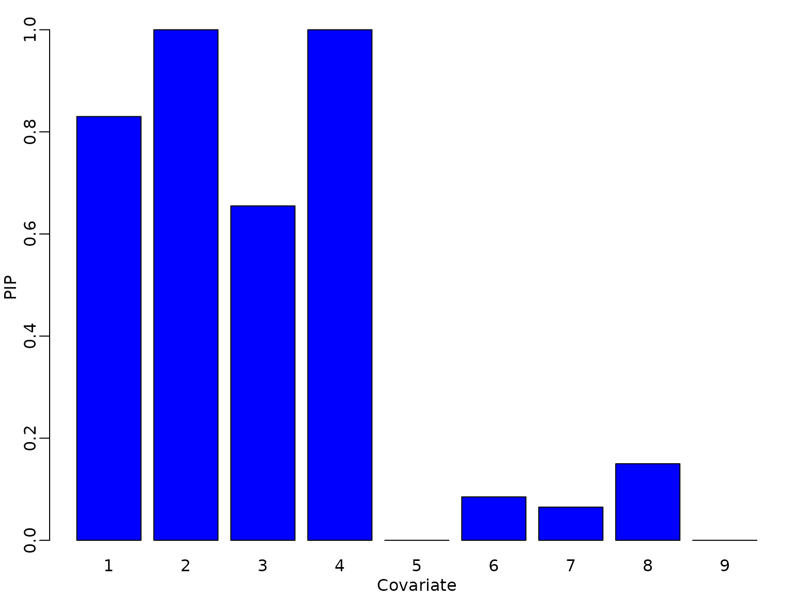

# Chapter 12: Model Assessment and Predictive Model Checking

## Section 12.1: Beyond classical Bayesian model comparison

### Section 12.1.1: Schwarz criterion and BIC

#### Example 12.1: Labor market data: Bayesian variable selection using BIC

We return to the probit analysis of Example 11.11 and run variable
selection using the Schwarz criterion instead of the marginal
likelihood. We first implement this approach.

``` r

modsel_probit_BIC <- function(y, X, burnin = 1000L, M = 5000L){
  n <- dim(X)[1]
  p <- dim(X)[2] # change to X later

  gamma_post <- matrix(ncol = p, nrow = M)
  acc <- numeric(length = M)

  gamma <- matrix(rep(1, p), nrow = 1)
  mod0 <- glm(y ~ X, family = binomial(link = "probit"))
  SC_old <- logLik(mod0) - log(n) * (p + 1) / 2

  for (m in seq_len(burnin + M)) {
    gamma_proposed <- gamma_old <- gamma

    j <- sample(1:p, size = 1)
    gamma_proposed[j] <- 1 - gamma_old[j]

    X_gamma <- X[, gamma_proposed == 1]
    model <- glm(y ~ X_gamma, family = binomial(link = "probit"))
    SC_proposed <- logLik(model) - log(n) * (sum(gamma_proposed) + 1) / 2
    
    # compute acceptance probability and decide on acceptance
    log_acc <- SC_proposed - SC_old

    if (log(runif(1)) < log_acc) {
      gamma <- gamma_proposed
      SC_old <- SC_proposed
      accept <- 1
    } else {
      gamma <- gamma_old
      accept <- 0
    }

    if (m > burnin) {
      gamma_post[m - burnin, ] <- gamma
      acc[m - burnin] <- accept
    }
  }
  return(list(gamma_post = gamma_post, acc = acc))
}
```

We next load the data and as in exercise 11.11. add 5 irrelevant,
standard normal regressors. Then we run the algorithm.

``` r

library("BayesianLearningCode")
data("labor", package = "BayesianLearningCode")
y <- labor$income_1998 == "zero"
N <- length(y)
X_unemp <- with(labor, cbind(female = female,
                             age18 = 1998 - birthyear - 18,
                             wcollar = wcollar_1997,
                             unemp97 = income_1997 == "zero")) # regressor matrix
p_irrel <- 5
set.seed(seed)
X <- cbind(X_unemp, matrix(rnorm(p_irrel * N), ncol = p_irrel))
colnames(X)[4 + (1:p_irrel)] <-
  c("irrel1", "irrel2", "irrel3", "irrel4", "irrel5")

p <- dim(X)[2]
M <- 20000 / mcmcspeedup
res <- modsel_probit_BIC(y, X, M = M)
```

We determine the number of models visited during MCMC, the average model
complexity, i.e. the average number of covariates included in the model
and show the posterior inclusion probabilities.

``` r

if (pdfplots) {
  pdf("12-1_1.pdf", width = 5, height = 6)
}
par(mfrow = c(1, 1), mar = c(2.5, 2.5, 1.5, .5), mgp = c(1.5, .5, 0))

gammas_unique <- unique(res$gamma_post)
num_mod <- dim(gammas_unique)[1]
print(num_mod)
#> [1] 21

k_gamma <- rowSums(res$gamma_post)
print(mean(k_gamma))
#> [1] 3.7335

# PIPs
print(colMeans(res$gamma_post))
#> [1] 0.8995 1.0000 0.7020 1.0000 0.0320 0.0085 0.0065 0.0710 0.0140

barplot(colMeans(res$gamma_post), col = "blue", names.arg = 1:p,
        xlab = "Covariate", ylab = "PIP")
```



To determine the model visited most often we re-use a function which we
defined in Chapter 11.

``` r

number_draws <- function(gamma_post, models) {
  nmod <- dim(models)[1]
  freq <- rep(NA, nmod)
  
  for (j in (1:nmod)) {
    freq[j] <- sum(apply(gamma_post, 1, function(x) identical(x, models[j,])))
  }
  freq
}

freq_gammas <- number_draws(res$gamma_post, gammas_unique)
io <- order(freq_gammas, decreasing = TRUE)

knitr::kable(cbind(gammas_unique, freq_gammas / M)[io[1:5], ],
             digits = cbind(rep(0, p), 4))
```

|     |     |     |     |     |     |     |     |     |        |
|----:|----:|----:|----:|----:|----:|----:|----:|----:|-------:|
|   1 |   1 |   1 |   1 |   0 |   0 |   0 |   0 |   0 | 0.5915 |
|   1 |   1 |   0 |   1 |   0 |   0 |   0 |   0 |   0 | 0.2060 |
|   0 |   1 |   0 |   1 |   0 |   0 |   0 |   0 |   0 | 0.0580 |
|   1 |   1 |   1 |   1 |   0 |   0 |   0 |   1 |   0 | 0.0380 |
|   0 |   1 |   1 |   1 |   0 |   0 |   0 |   0 |   0 | 0.0255 |

### Section 12.1.2: Perspectives on Bayesian model comparison

\[no code\]

## Section 12.2: Comparative model assessment through predictive information criteria

### Section 12.2.1: Measuring predictive loss

\[no code\]

### Section 12.2.2: Akaike information criterion (AIC)

#### Example 12.2: U.S. GDP data: Choosing the model order via AIC and BIC

We need to re-load the function which creates the design matrix.

``` r

ARdesignmatrix <- function(dat, p = 1, conditioninglength = p) {
  d <- p + 1
  N <- length(dat) - p

  Xy <- matrix(NA_real_, N, d)
  Xy[, 1] <- 1
  for (i in seq_len(p)) {
    Xy[, i + 1] <- dat[(p + 1 - i) : (length(dat) - i)]
  }
  Xy[(1 + conditioninglength - p):N, , drop = FALSE]
}
```

Let’s load the data and compute log returns.

``` r

data(gdp, package = "BayesianLearningCode")
logret <- diff(log(gdp))
```

Now we compute five OLS estimates and the corresponding AICs and BICs.

``` r

AIC <- BIC <- rep(NA_real_, 5)
for (i in seq_along(AIC)) {
  y <- tail(logret, -4)
  p <- i - 1     # lag length
  d <- i + 1     # total number of parameters
  N <- length(y) # number of data points used for estimation
  Xy <- ARdesignmatrix(logret, p, conditioninglength = 4)
  fit <- lm(y ~ Xy - 1)
  betahat <- coef(fit)
  sigma2hat <- sum(resid(fit)^2) / length(y)
  minus2timesloglikmax <- N * (1 + log(2 * pi)) + N * log(sigma2hat)
  AIC[i] <- minus2timesloglikmax + 2 * d      # equals bult-in AIC(fit)
  BIC[i] <- minus2timesloglikmax + log(N) * d # equals built-in BIC(fit)
}
knitr::kable(rbind(AIC, BIC), digits = 2)
```

|     |          |          |          |          |          |
|:----|---------:|---------:|---------:|---------:|---------:|
| AIC | -1808.61 | -1828.87 | -1839.65 | -1837.66 | -1836.24 |
| BIC | -1801.15 | -1817.68 | -1824.72 | -1819.01 | -1813.86 |

#### Example 12.6: CHF exchange rate data: Testing normal vs. t using DIC

Let’s load the data first and make some space for the draws under the
three models.

``` r

data("exrates", package = "stochvol")
y <- 100 * diff(log(exrates$USD / exrates$CHF))
X <- 1
N <- length(y)

draws <- vector("list", 3)
```

Under the zero-mean Gaussian model, the posterior of $`\sigma^2`$ is
inverse gamma, and we can easily draw from it.

``` r

c0 <- 2.5
C0 <- 1.5

SSR <- sum(y^2)
cN <- c0 + N / 2
CN <- C0 + SSR / 2

M <- 100000 / mcmcspeedup
draws[[1]]$sigma2s <- rinvgamma(M, cN , CN)
draws[[1]]$nus <- Inf
```

Under the t distribution with 7 degrees of freedom, the posterior of
$`\sigma^2`$ is not available in closed form, but we can draw from it
using data augmentation.

``` r

set.seed(1)
burnin <- 100

# fix df
nu <- 7

# allocate space for storing the draws
draws[[2]]$sigma2s <- rep(NA_real_, M)
draws[[2]]$nus <- nu

# starting value for w
w <- rep(1, N)

# pre-compute cN
cN <- c0 + N / 2

# log likelihood
loglik <- function(y, sigma2, nu) {
  if (is.finite(nu)) {
    length(y) * (lgamma((nu + 1) / 2) - lgamma(nu / 2) - .5 * log(nu)) -
    (nu + 1) / 2 * sum(log(1 + y^2 / nu / sigma2))
  } else {
    sum(dnorm(y, 0, sqrt(sigma2), log = TRUE))
  }
}

for (m in 1:(burnin + M)) {
  # sample sigma^2 from its full conditional (S-DA)
  eps <- sqrt(w) * y
  CN <- C0 + crossprod(eps) / 2
  sigma2 <- rinvgamma(1, cN, CN)

  # sample w (W-DA)
  r <- eps^2 / (w * sigma2)
  w <- rgamma(length(eps), (nu + 1) /2, (nu + r) / 2)

  # store the results
  if (m > burnin) draws[[2]]$sigma2s[m - burnin] <- sigma2
}
```

For sampling also the degrees of freedom under an exponential prior, we
re-run the sampler from Example 8.16, but this time without an
intercept.

``` r

set.seed(1)

# fix tuning parameter for MH
cnu <- 0.3

# fix prior hyperparameters
lambda <- 1 / 7

# allocate space for storing the draws
draws[[3]]$nus <- draws[[3]]$sigma2s <- rep(NA_real_, M)

# starting value for log(nu) and w
w <- rep(1, N)
nu <- 7

accepts <- 0L
for (m in 1:(burnin + M)) {
  # sample sigma^2 from its full conditional (S-DA)
  eps <- sqrt(w) * y
  CN <- C0 + crossprod(eps) / 2
  sigma2 <- rinvgamma(1, cN, CN)

  # sample nu (N-MH)
  nuprop <- exp(rnorm(1, log(nu), cnu))
  logR <- loglik(y, sigma2, nuprop) -
          loglik(y, sigma2, nu) +
          dexp(nuprop, lambda, log = TRUE) -
          dexp(nu, lambda, log = TRUE) +
          log(nuprop) -
          log(nu)
  
  if (log(runif(1)) < logR) {
    nu <- nuprop
    if (m > burnin) accepts <- accepts + 1L
  }
  
  # sample w (W-DA)
  r <- eps^2 / (w * sigma2)
  w <- rgamma(length(eps), (nu + 1) /2, (nu + r) / 2)

  # store the results
  if (m > burnin) {
    draws[[3]]$sigma2s[m - burnin] <- sigma2
    draws[[3]]$nus[m - burnin] <- nu
  }
}
```

We can now estimate the DIC from the draws. First, we define the
deviance function $`D`$.

``` r

D_nonvec <- function(y, sigma2, nu) -2 * loglik(y, sigma2, nu)
D <- Vectorize(D_nonvec, c("sigma2", "nu"))
```

Now, we estimate the average deviance, the effective number of
parameters, and finally DIC.

``` r

res <- matrix(NA_real_, 3, 4)
colnames(res) <- c("DIC", "avgD", "Davg", "pd")
for (i in 1:nrow(res)) {
  res[i, "avgD"] <- mean(D(y, draws[[i]]$sigma2s, draws[[i]]$nus))
  res[i, "Davg"] <- D(y, mean(draws[[i]]$sigma2s), mean(draws[[i]]$nus))
  res[i, "pd"] <-  res[i, "avgD"] - res[i, "Davg"]
  res[i, "DIC"] <- res[i, "avgD"] + res[i, "pd"]
}
knitr::kable(res, digits = 2)
```

|     DIC |    avgD |    Davg |   pd |
|--------:|--------:|--------:|-----:|
| 6906.94 | 6905.93 | 6904.93 | 1.01 |
| 6269.06 | 6266.67 | 6264.29 | 2.39 |
| 6379.78 | 6375.27 | 6370.77 | 4.50 |

For the Gaussian model (only), we can compute the DIC in closed form.

``` r

cN <- c0 + N / 2
CN <- C0 + SSR / 2
Davg <- N * log(2 * pi * CN / (cN - 1)) + (cN - 1) * SSR / CN
avgD <- N * (log(2 * pi * CN) - digamma(cN)) + SSR * cN / CN
pd <- avgD - Davg
# Explicityly: N * (log(cN - 1) - digamma(cN)) + SSR / CN
DIC <- avgD + pd
# N * log(2 * pi * CN * (cN - 1)) - 2 * N * digamma(cN) + (cN + 1) * SSR / CN
knitr::kable(cbind(DIC, avgD, Davg, pd))
```

|      DIC |     avgD |     Davg |       pd |
|---------:|---------:|---------:|---------:|
| 6906.922 | 6905.925 | 6904.927 | 0.997449 |
